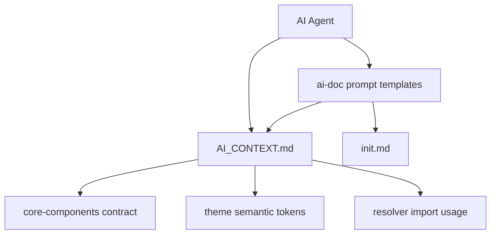

# Design Document

## Overview

**Purpose**: 本特性为 `aero-ui` 组件库落地「AI 友好」能力：产出根目录 `AI_CONTEXT.md` 全局上下文与 `ai-doc/` 组件级 prompt 模板，让 AI 助手（Claude Code / Figma MCP）无需猜测即可生成符合规范的组件代码。

**Users**: AI 助手（Claude Code / Figma MCP，直接读取 `AI_CONTEXT.md` 与 prompt 模板）与组件库维护者（维护这些文档，使其与上游契约保持一致）。

**Impact**: 将「无任何 AI 相关文档」的现状，改造为「一份确定性全局上下文 + 每组件一份 prompt 模板 + 一份初始化说明」的文档资产。本特性为纯文档特性，不产生任何运行时代码、不修改构建管线。

### Goals
- 重写根目录 `AI_CONTEXT.md`，迁移为 aero-ui / Aero / `--aero-*` 命名，含导入路径、组件清单、设计 token 变量、代码生成规则、禁用 API 清单。
- 在 `ai-doc/` 沉淀组件级 prompt 模板（button / input / icon）与初始化说明（init）。
- 内容与上游 core-components / theme / resolver 契约严格一致，不含 `--ep-*`、`.dark` 等过时 API。

### Non-Goals
- 不实现或修改任何组件、主题、i18n、resolver 代码。
- 不引入运行时组件元数据注册。
- 不引入自动化文档生成器或构建期代码扫描工具。
- 不搭建 VitePress 文档站（属 docs-site）。

## Boundary Commitments

### This Spec Owns
- 根目录 `AI_CONTEXT.md`（全局上下文，含五类章节：导入路径 / 组件清单 / 设计 token 变量 / 代码生成规则 / 禁用 API 清单）。
- `ai-doc/init.md`（初始化说明）。
- `ai-doc/button-prompt.md`、`ai-doc/input-prompt.md`、`ai-doc/icon-prompt.md`（组件级 prompt 模板）。
- 上述文档的内容契约与「与上游一致性」的维护责任。

### Out of Boundary
- 组件实现与导出契约（`packages/components/**`，属 core-components）。
- 主题 token 定义与明暗绑定（`packages/theme/**`，属 theme）。
- i18n 机制（`packages/locale/**`，属 i18n）。
- resolver 实现（`packages/resolver/**`，属 resolver）。
- 运行时组件元数据注册、自动化文档生成器、VitePress 文档站。

### Allowed Dependencies
- 上游 `core-components` 契约（组件目录结构、`index.ts` 导出带 `install`、props / emits 类型）—— 作为 AI_CONTEXT.md「组件清单」与 prompt 模板的内容来源。
- 上游 `theme` 契约（`--aero-*` 语义变量类别与明暗类）—— 作为「设计 token 变量」章节内容来源。
- 上游 `resolver` 用法（`AeroResolver`、`<AeroX />` → `aero-ui/components/x`、`aero-ui/resolver` 子路径）—— 作为「导入路径」章节内容来源。
- 约束：只读引用上游契约，不得反向修改或重复定义；不得在文档中出现 steering 未声明或已废弃的 API（`--ep-*`、`.dark`、Options API、硬编码视觉值、基础色板引用、`any`、外部图标库）。

### Revalidation Triggers
- 组件公开导出契约或 props / emits 类型变化（上游 core-components）—— 需更新 AI_CONTEXT.md 组件清单与对应 prompt 模板。
- 语义 `--aero-*` 变量名集合或明暗类名变化（上游 theme）—— 需更新设计 token 章节。
- 按需导入用法或 exports 子路径变化（上游 resolver / foundation）—— 需更新导入路径章节。
- 新增核心组件（后续 spec）—— 需新增对应 prompt 模板并更新组件清单。

## Architecture

### Existing Architecture Analysis
仓库当前无任何 AI 相关文档。但上游契约已就绪：core-components 确立三组件（Button/Input/Icon）的目录与导出契约；theme 确立 `--aero-*` 语义变量与明暗类；resolver brief 确立按需导入用法。本特性在既有契约之上纯增量产出 Markdown 文档，不修改任何既有机制。

### Architecture Pattern & Boundary Map



**Architecture Integration**:
- 选定模式：单一全局上下文（`AI_CONTEXT.md`）+ 每组件 prompt 模板（`ai-doc/`）的分层文档结构。公共约定（命名、token、编码规则、禁用项）收敛到 `AI_CONTEXT.md`；组件级差异收敛到各 prompt 模板。
- 依赖方向（单向，只读引用）：`ai-doc prompt 模板 → AI_CONTEXT.md 公共约定 → 上游 core-components / theme / resolver 契约`。文档只消费上游契约，绝不上游反向依赖文档。
- 既有模式保留：`aero-ui` 包名、`Aero` 前缀、`--aero-*` 语义变量、`.aero-theme-light` / `.aero-theme-dark`、`<script setup lang="ts">` + `defineProps<T>`。
- 新文件必要性：`AI_CONTEXT.md` 是 AI 读取的唯一全局入口；`init.md` 说明加载与选模板方式；三份 prompt 模板分别承载 Button/Input/Icon 的组件级契约，供 AI 直接套用。
- Steering 合规：严格遵守 `tech.md`（只消费 `--aero-*`、禁用 `.dark` / Options API / `any` / 硬编码值）与 `structure.md`（一组件一文件夹、PascalCase 导出、BEM 类名）；这些规则在文档中以「代码生成规则 + 禁用 API 清单」形式固化。

### Technology Stack

| Layer | Choice / Version | Role in Feature | Notes |
|-------|------------------|-----------------|-------|
| 文档格式 | Markdown（`.md`） | AI 上下文与 prompt 模板载体 | 可被 Claude Code / Figma MCP 直接读取 |
| 内容来源 | 上游 design.md 契约 | 组件/token/导入用法的事实来源 | 只读引用，不修改 |

## File Structure Plan

### Directory Structure

```
./
├── AI_CONTEXT.md              # 全局上下文：导入路径 / 组件清单 / 设计 token / 代码生成规则 / 禁用 API 清单
└── ai-doc/
    ├── init.md                # 初始化说明：如何加载 AI_CONTEXT.md 并选择组件 prompt 模板
    ├── button-prompt.md       # AeroButton 组件级 prompt 模板
    ├── input-prompt.md        # AeroInput 组件级 prompt 模板
    └── icon-prompt.md         # AeroIcon 组件级 prompt 模板
```

> 均为新建文件，无既有文件被修改。`AI_CONTEXT.md` 与 `ai-doc/` 落位仓库根目录（对齐上一版结构），便于 AI 工具直接发现。

### 文件职责说明
- `AI_CONTEXT.md` —— 全局、确定性上下文，是 AI 生成代码的唯一全局入口；五个章节分别承载导入路径、组件清单、设计 token 变量、代码生成规则、禁用 API 清单。公共约定只在此处定义一次。
- `ai-doc/init.md` —— 初始化说明，指导 AI 如何加载 `AI_CONTEXT.md`、按需选用组件 prompt 模板，覆盖 Claude Code 与 Figma MCP 两种方式。
- `ai-doc/{button,input,icon}-prompt.md` —— 每个核心组件的 prompt 模板，含该组件 props / emits 契约、`--aero-*` token 用法与代码生成规则；公共约定引用 `AI_CONTEXT.md` 而不重复。

## Requirements Traceability

| Requirement | Summary | 文件 / 章节 | 契约 |
|-------------|---------|-------------|------|
| 1.1 | aero-ui / Aero / `--aero-*` 命名 | `AI_CONTEXT.md` 全篇 | 命名契约 |
| 1.2 | 导入路径说明 | `AI_CONTEXT.md`「导入路径」 | 导入契约 |
| 1.3 | 组件清单 | `AI_CONTEXT.md`「组件清单」 | 清单契约 |
| 1.4 | 设计 token 变量说明 | `AI_CONTEXT.md`「设计 token 变量」 | token 契约 |
| 1.5 | 与上游一致 | `AI_CONTEXT.md` 全篇 | 一致性契约 |
| 2.1–2.4 | 代码生成规则 | `AI_CONTEXT.md`「代码生成规则」 | 规则契约 |
| 3.1–3.3 | 禁用 API 清单 | `AI_CONTEXT.md`「禁用 API 清单」 | 禁用契约 |
| 4.1–4.3 | 组件级 prompt 模板 | `ai-doc/{button,input,icon}-prompt.md` | 模板契约 |
| 5.1–5.2 | 初始化说明 | `ai-doc/init.md` | 说明契约 |
| 6.1–6.2 | 轻量方案范围约束 | 全部文件（范围界定） | 边界契约 |

## Components and Interfaces

本特性无运行时组件，「组件」指构成 AI 上下文的文档资产。

| Component | Domain/Layer | Intent | Req Coverage | Key Dependencies | Contracts |
|-----------|--------------|--------|--------------|------------------|-----------|
| AI_CONTEXT.md | 全局上下文 | 单一 AI 全局入口 | 1.1–1.5, 2.1–2.4, 3.1–3.3 | core-components / theme / resolver 契约（只读） | Content |
| ai-doc/init.md | 初始化说明 | 加载与选模板指引 | 5.1–5.2 | AI_CONTEXT.md | Content |
| ai-doc/button-prompt.md | 组件模板 | AeroButton 生成模板 | 4.1–4.3 | AI_CONTEXT.md + ButtonProps/Emits | Content |
| ai-doc/input-prompt.md | 组件模板 | AeroInput 生成模板 | 4.1–4.3 | AI_CONTEXT.md + InputProps/Emits | Content |
| ai-doc/icon-prompt.md | 组件模板 | AeroIcon 生成模板 | 4.1–4.3 | AI_CONTEXT.md + IconProps | Content |

### 全局上下文

#### AI_CONTEXT.md

| Field | Detail |
|-------|--------|
| Intent | 提供 AI 生成组件代码所需的全部确定性约定，单一全局入口 |
| Requirements | 1.1, 1.2, 1.3, 1.4, 1.5, 2.1, 2.2, 2.3, 2.4, 3.1, 3.2, 3.3 |

**Responsibilities & Constraints**
- 全篇采用 aero-ui / Aero / `--aero-*` 命名，绝不出现 `--ep-*`、`.dark`。
- 五个章节内容以对应上游契约为准，不得臆造或重复定义上游契约。

**Content Contract（章节结构与必需内容）**

1. **项目定位**：说明 aero-ui 是 Vue 3 + TypeScript 组件库，组件前缀 `Aero`，语义 token `--aero-*`，内置明暗主题与按需导入。
2. **导入路径**：
   - 完整注册：`import AeroUI from 'aero-ui'` + `app.use(AeroUI)`。
   - 按需导入：`unplugin-vue-components` + `AeroResolver`，模板直接写 `<AeroButton />` 自动按需引入组件与样式。
   - 子路径导入：`import AeroButton from 'aero-ui/components/button'`（对应 button / input / icon）。
3. **组件清单**：
   - `AeroButton`：`type` / `size` / `disabled` / `loading` / `icon` / `nativeType`，事件 `click`。
   - `AeroInput`：`modelValue` / `placeholder` / `disabled` / `clearable` / `size`，事件 `update:modelValue` / `input` / `change` / `focus` / `blur` / `clear`。
   - `AeroIcon`：`name` / `size` / `color`。
4. **设计 token 变量**：
   - 品牌色 `--aero-primary/success/warning/danger/link-{1..10}`。
   - 中性色 `--aero-text/bg/border/fill-*`。
   - 非颜色语义 `--aero-radius/space/font/typography/opacity/stroke/insets-*`。
   - 明暗切换用 `.aero-theme-light` / `.aero-theme-dark`。
5. **代码生成规则**：`<script setup lang="ts">` + `defineProps<T>`（含 `withDefaults`）+ `defineEmits<T>`；props/emits 类型放同级 `types.ts`；BEM 类名 `aero-*`；样式只消费 `--aero-*`；「一个组件一个文件夹」（`index.ts` / `src/Xxx.vue` / `style/index.scss` / `types.ts` / `__tests__/`）。
6. **禁用 API 清单**：`--ep-*` 变量、`.dark` 主题类、Options API、硬编码视觉值、基础色板引用（`--aero-blue-*` / `$blue-*`）、`any` 类型、外部图标库。

**Contracts**: Content [x]

- Preconditions: 上游 core-components / theme / resolver 契约已确立。
- Postconditions: AI 读取后可确定性地生成符合规范的组件代码，无需猜测。
- Invariants: 全篇不含禁用项；组件/token/导入内容与上游契约一致。

**Implementation Notes**
- Integration: 各章节内容直接映射上游 design.md 契约，公共约定只定义一次。
- Validation: 扫描文档无 `--ep-*` / `.dark` / Options API 字样，组件与 token 清单与上游一致。
- Risks: 上游契约演进导致文档漂移 —— 以 Revalidation Triggers 为准，由校验任务比对。

### 组件模板层

#### ai-doc/{button,input,icon}-prompt.md

| Field | Detail |
|-------|--------|
| Intent | 为每个核心组件提供可直接套用的 prompt 模板 |
| Requirements | 4.1, 4.2, 4.3 |

**Responsibilities & Constraints**
- 每个模板包含：目标组件契约（props / emits）、`--aero-*` token 用法、代码生成规则指引。
- 公共约定（编码规则、禁用项）引用 `AI_CONTEXT.md`，不在模板内重复。
- 模板标题与组件名一一对应（button / input / icon），并指向 `init.md` 的使用方式。

**Content Contract（模板必需小节）**

1. **目标**：要生成 `AeroButton` / `AeroInput` / `AeroIcon` 及其 types / style / test。
2. **Props / Emits 契约**：逐项列出该组件 props（含 `@default`）与事件。
3. **`--aero-*` token 用法**：指出该组件样式应消费的语义变量类别与 BEM 类名约定。
4. **代码生成规则指引**：链接到 `AI_CONTEXT.md` 的代码生成规则与禁用 API 清单。

**Contracts**: Content [x]

- Preconditions: `AI_CONTEXT.md` 已存在且含公共约定。
- Postconditions: AI 套用模板即可生成符合规范的单组件实现。
- Invariants: 模板内的 props / emits 与 core-components `types.ts` 契约一致。

### 初始化说明

#### ai-doc/init.md

| Field | Detail |
|-------|--------|
| Intent | 说明如何加载 AI_CONTEXT.md 并选用组件 prompt 模板 |
| Requirements | 5.1, 5.2 |

**Responsibilities & Constraints**
- 说明 `AI_CONTEXT.md` 是全局上下文入口，`ai-doc/*-prompt.md` 是组件级模板。
- 覆盖 Claude Code（作为项目上下文文件加载）与 Figma MCP（作为提示词素材读取）两种方式。
- 给出「生成新组件 vs 生成现有组件」时的模板选择指引。

**Contracts**: Content [x]

## Error Handling

### Error Strategy
本特性为纯文档，无运行时错误路径。错误处理聚焦「内容漂移」的可诊断失败：文档出现过时 API（`--ep-*`、`.dark`、Options API）、组件/token 清单与上游契约不一致、prompt 模板与组件 `types.ts` 契约漂移。上述任一情况即判定校验失败，定位到具体文件与章节。

### Error Categories and Responses
- **过时 API 泄漏**：文档中出现 `--ep-*`、`.dark`、Options API 等禁用项 —— 校验任务报出文件与行号。
- **契约漂移**：组件清单 / token 清单与上游 design.md 不一致 —— 校验任务报出差集。
- **模板缺失或冗余**：`ai-doc/` 模板与组件清单不一一对应 —— 校验任务报出缺失项。

### Monitoring
无运行时监控；以「文档一致性校验（扫描 + 比对）」作为门禁信号。

## Testing Strategy

本特性为纯文档，测试以「内容校验」为主，逐条对应验收标准。

### 命名与禁用项校验（对应 1.1、3.1、3.2、6.1、6.2）
- 扫描 `AI_CONTEXT.md` 与 `ai-doc/`，断言不出现 `--ep-*`、`.dark`、Options API 字样。
- 断言工作树仅新增文档，无运行时元数据注册或文档生成器相关代码/配置。

### 内容覆盖校验（对应 1.2、1.3、1.4、2.1–2.4）
- 断言 `AI_CONTEXT.md` 含「导入路径 / 组件清单 / 设计 token 变量 / 代码生成规则 / 禁用 API 清单」五个章节。
- 断言导入路径章节覆盖完整注册、按需导入、子路径导入；组件清单含三个组件；token 章节覆盖品牌色/中性色/非颜色语义。

### 上游一致性校验（对应 1.5、4.3）
- 断言组件清单与 core-components props / emits 契约一致；token 清单与 theme 语义变量一致；导入用法与 resolver 用法一致。
- 断言三份 prompt 模板的 props / emits 与组件 `types.ts` 契约一致。

### 模板完整性校验（对应 4.1、5.1、5.2）
- 断言 `ai-doc/` 含 `init.md` 与 `button-prompt.md` / `input-prompt.md` / `icon-prompt.md` 共四份文件。
- 断言 `init.md` 覆盖 Claude Code 与 Figma MCP 两种方式并指向正确的模板文件。

## Supporting References
- 组件 props / emits 精确契约，见 `.kiro/specs/core-components/design.md`「Components and Interfaces」。
- 语义变量完整映射与明暗类，见 `.kiro/specs/theme/design.md`。
- 按需导入用法，见 `.kiro/specs/resolver/design.md`。
- 编码约定与禁用项来源，见 `.kiro/steering/tech.md` 与 `.kiro/steering/structure.md`。
