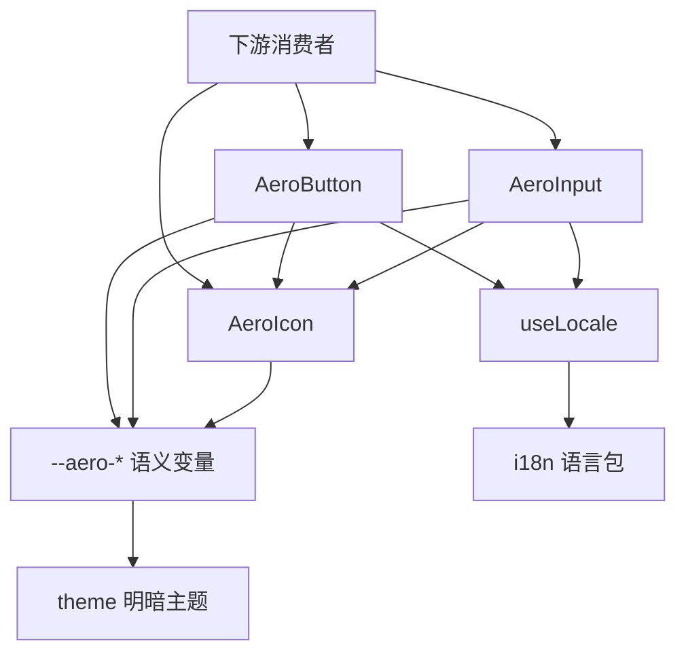

# Design Document

## Overview

**Purpose**: 本特性为 `aero-ui` 组件库重建核心组件层：实现 `AeroButton`、`AeroInput`、`AeroIcon` 三个可复用组件，并确立「一个组件一个文件夹」的组件编写规范，作为后续组件（Tag/Select/Tooltip 等）的样板与契约来源。

**Users**: 组件库维护者（依据统一契约编写后续组件）与下游消费者（通过 `aero-ui` / `aero-ui/components/*` 按需导入 `AeroXxx` 组件并依赖其类型）。

**Impact**: 将当前「无任何组件代码」的空组件层，改造为具备三个核心组件与稳定「目录 / 类型 / 样式 / 测试 / 导出」契约的可复用组件层；组件只消费 `--aero-*` 语义变量（明暗自动生效），内置文案通过 `useLocale` 随语言切换。

### Goals
- 实现 `AeroButton`、`AeroInput`、`AeroIcon` 三个组件及其 types / style / test。
- 确立「一个组件一个文件夹」规范：`index.ts`（导出带 `install` 的组件 + 再导出类型）、`src/Xxx.vue`、`style/index.scss`、`types.ts`、`__tests__/`。
- 组件只消费 `--aero-*` 语义变量，支持明暗主题与 locale。
- 严格遵循 `<script setup lang="ts">` + `defineProps<T>()`，禁用 Options API。

### Non-Goals
- 不实现其它组件（Tag / Select / Tooltip 等，属后续 spec）。
- 不实现 resolver（`AeroResolver`）与按需导入。
- 不迁移或定义主题 token（属 theme）、不实现 i18n 机制（属 i18n）。
- 不搭建 VitePress 文档站与 `AI_CONTEXT.md`。

## Boundary Commitments

### This Spec Owns
- `packages/components/button/`、`packages/components/input/`、`packages/components/icon/` 三个组件文件夹的完整实现（index.ts / src / style / types / __tests__）。
- 组件公开导出契约：每个组件 `index.ts` 导出带 `install` 的 `AeroXxx` 组件对象 + 再导出 `types.ts` 类型。
- 组件 barrel `packages/components/index.ts`：re-export `button` / `input` / `icon` 三个组件（具名导出 `AeroButton` / `AeroInput` / `AeroIcon` 及其类型）。
- 根 barrel `packages/index.ts` 的 re-export 内容：`export * from './components'`、`export * from './locale'`，并提供默认导出 `AeroUI`（含 `install(app)`，`app.use(AeroUI)` 全局注册三个组件）。
- 组件 props / emits 类型契约（`ButtonProps`、`InputProps`、`IconProps` 及对应 Emits 类型）。
- 组件样式（BEM 类名 + `--aero-*` 语义变量消费）与组件单元测试。
- 组件内置文案 key 的补充：在 `packages/locale/lang/zh-cn.ts`、`en.ts` 中追加 `components.*` 命名空间（i18n 已明确该职责归属本 spec）。

### Out of Boundary
- 其它组件（Tag / Select / Tooltip 等）。
- resolver（`AeroResolver`）实现；resolver 不纳入根 barrel（其归属 `aero-ui/resolver` 子路径，由 resolver spec 拥有）。
- 主题 token 定义与迁移（`packages/theme/**`）与基础色板。
- 主题样式的发布与引入：theme 样式由消费者单独 `import 'aero-ui/theme/index.scss'`，不由根 barrel re-export。
- i18n 机制（`packages/locale/index.ts`、`useLocale` 的实现）与运行时语言切换 UI。
- `AI_CONTEXT.md` 与文档站。

### Allowed Dependencies
- `packages/theme/` 产出的语义变量：组件样式只消费 `--aero-*`，明暗切换由 `.aero-theme-light` / `.aero-theme-dark` 承担。
- `packages/hooks/useLocale.ts`（`useLocale`）与 `packages/locale/`（语言包、`LanguagePack` 类型）。
- `packages/components/icon/`（`AeroIcon`）被 `AeroButton`（icon 属性）与 `AeroInput`（clearable 清空图标）依赖。
- foundation 提供的 `aero-ui/*` 路径别名与 `./components/*` exports 子路径、构建与测试工具链。
- 约束：组件不得引用基础色板或硬编码视觉值；不得反向依赖 resolver / 文档站 / AI 文档；不引入 steering 未声明的运行时依赖（如外部图标库）。

### Revalidation Triggers
- 组件公开导出契约变化（`index.ts` 的 `install` 形态、导出符号集合）—— 影响 resolver 与文档站。
- props / emits 类型契约变化（`types.ts`）—— 影响消费者与 `ai-friendliness` 记录。
- 语义 `--aero-*` 变量名集合或明暗类名变化（上游 theme）—— 需重查组件样式引用。
- `useLocale` 返回契约或 `LanguagePack` 形状变化（上游 i18n）—— 需重查文案接入。
- 组件文案 key 命名空间（`components.*`）变化。
- `./components/*` exports 子路径解析目标变化（foundation 侧）。

## Architecture

### Existing Architecture Analysis
仓库当前无任何组件代码，但 upstream 已就绪：foundation 已建立 `aero-ui/*` 别名、`./components/*` exports 直通与构建/测试工具链；theme 已输出 `--aero-*` 语义变量与 `.aero-theme-light` / `.aero-theme-dark`；i18n 已提供 `useLocale` 与 `zh-cn` / `en` 语言包骨架。本设计在既有契约之上增量落地，不修改 foundation / theme / i18n 的既有机制，仅消费其契约并补充组件文案。

### Architecture Pattern & Boundary Map



**Architecture Integration**:
- 选定模式：「一组件一文件夹」分层组件（index / src / style / types / test），组件自持实现、样式、类型与测试，通过 `index.ts` 导出带 `install` 的组件对象。
- 依赖方向（单向）：`组件 → --aero-*（theme）`、`组件 → useLocale（i18n）`、`AeroButton / AeroInput → AeroIcon`。组件之间仅 Button / Input 依赖 Icon（公共叶子），无环、无反向依赖。
- 既有模式保留：`Aero` 组件前缀、`aero-*` DOM 类、`--aero-*` 语义消费、`<script setup lang="ts">` + `defineProps<T>()`、`types.ts` 承载类型契约。
- 新组件必要性：Icon 是 Button（icon 属性）与 Input（clearable）的公共依赖，先于二者的集成而存在。
- Steering 合规：严格遵守 `structure.md`（一组件一文件夹、PascalCase 导出、BEM 类名）与 `tech.md`（`<script setup>` + `defineProps<T>`、只消费 `--aero-*`、`types.ts` 承载类型）。

### Technology Stack

| Layer | Choice / Version | Role in Feature | Notes |
|-------|------------------|-----------------|-------|
| 语言 | TypeScript ~5.4（strict） | props / emits 类型契约 | 无 `any`，类型自 `types.ts` 导出 |
| 框架 | Vue 3.4（`<script setup lang="ts">`） | 组件实现 | `defineProps<T>` + `defineEmits<T>` |
| 样式 | SCSS（`sass`） | BEM 类 + `--aero-*` 消费 | 只引用语义变量 |
| 图标 | 内置最小图标集（内联 SVG） | `AeroIcon` 渲染 | 无外部图标库 |
| 国际化 | vue-i18n（`useLocale`） | 内置文案 | 上游 i18n 提供 |
| 测试 | Vitest + `@vue/test-utils` + jsdom | 组件单测 | 共置 `__tests__` |

## File Structure Plan

### Directory Structure

```
packages/
├── index.ts                  # 根 barrel：export * from './components' + './locale'，默认导出 AeroUI（install 全局注册）
└── components/
    ├── index.ts              # 组件 barrel：re-export button / input / icon
    ├── button/
    │   ├── index.ts          # 导出带 install 的 AeroButton + 再导出 types
    │   ├── src/Button.vue    # <script setup lang="ts"> 实现
    │   ├── style/index.scss  # BEM 类 + --aero-* token
    │   ├── types.ts          # ButtonProps / ButtonEmits（JSDoc @default）
    │   └── __tests__/Button.test.ts
    ├── input/
    │   ├── index.ts          # 导出带 install 的 AeroInput + 再导出 types
    │   ├── src/Input.vue     # <script setup lang="ts"> 实现
    │   ├── style/index.scss  # BEM 类 + --aero-* token
    │   ├── types.ts          # InputProps / InputEmits（JSDoc @default）
    │   └── __tests__/Input.test.ts
    └── icon/
        ├── index.ts          # 导出带 install 的 AeroIcon + 再导出 types
        ├── src/Icon.vue      # <script setup lang="ts"> 实现（内置图标集）
        ├── style/index.scss  # BEM 类 + --aero-* token
        ├── types.ts          # IconProps（JSDoc @default）
        └── __tests__/Icon.test.ts
```

> 组件文件夹采用小写 kebab-case（对齐 `aero-ui/components/button` 发布 specifier），`.vue` 文件与导出组件名采用 PascalCase（`Button.vue` / `AeroButton`）。三个组件遵循同一分层模式。

### Modified Files
- `packages/locale/lang/zh-cn.ts` —— 追加 `components.button.loading`、`components.input.placeholder` 中文文案。
- `packages/locale/lang/en.ts` —— 追加 `components.button.loading`、`components.input.placeholder` 英文文案。
- `packages/index.ts` —— 填充根 barrel：`export * from './components'`、`export * from './locale'`，并提供默认导出 `AeroUI`（含 `install(app)` 全局注册三组件）。（foundation 仅接线为构建入口，本 spec 认领其 re-export 内容。）
- 其余文件均为新建。不改动 foundation / theme / i18n 的既有机制文件（`packages/locale/index.ts`、`useLocale.ts`、`packages/theme/**`、`vite.config.ts`、`package.json`）。

### 文件职责说明
- `index.ts` —— 导入 `src/Xxx.vue` 并为其附加 `install` 方法，导出 `AeroXxx` 组件对象；再导出 `types.ts` 中的类型（`export * from './types'`）。
- `src/Xxx.vue` —— `<script setup lang="ts">` 实现组件模板、props 透传、事件派发与状态（disabled / loading / clearable 等）。
- `style/index.scss` —— 组件的 BEM 类样式，只消费 `--aero-*` 语义变量。
- `types.ts` —— 定义并导出 props / emits 接口，含 JSDoc `@default` 注解。
- `__tests__/Xxx.test.ts` —— 组件单元测试。
- `packages/components/index.ts` —— 组件 barrel：`export * from './button'`、`export * from './input'`、`export * from './icon'`，具名导出 `AeroButton` / `AeroInput` / `AeroIcon` 及其类型。
- `packages/index.ts` —— 根 barrel：`export * from './components'`、`export * from './locale'`，默认导出 `AeroUI`（`install(app)` 全局注册三组件）；theme 样式由消费者单独引入，resolver 不纳入根 barrel。

## System Flows

组件为声明式展示组件，无多步骤业务流程，故省略本节。关键行为（受控值同步、清空、明暗/locale 自动生效）已由「props / emits 契约 + `--aero-*` 级联 + `useLocale` 响应式」表达。

## Requirements Traceability

| Requirement | Summary | Components / 文件 | 契约 |
|-------------|---------|-------------------|------|
| 1.1 | 一组件一文件夹 | 三组件文件夹 | 目录契约 |
| 1.2 | index.ts 导出 + install + 再导出类型 | 三组件 `index.ts` | 导出契约 |
| 1.3 | 完整注册 + 按需注册 | 三组件 `index.ts`（install） | 注册契约 |
| 1.4 | 仅三组件 | 全部文件（范围界定） | 边界契约 |
| 1.5 | 组件 barrel 聚合 re-export | `packages/components/index.ts` | 导出契约 |
| 1.6 | 根 barrel + AeroUI 全局注册 | `packages/index.ts`（AeroUI install） | 注册契约 |
| 2.1–2.6 | AeroButton | `button/`（types / src / style / test） | 组件契约 |
| 3.1–3.5 | AeroInput | `input/`（types / src / style / test） | 组件契约 |
| 4.1–4.4 | AeroIcon | `icon/`（types / src / style / test） | 组件契约 |
| 5.1–5.4 | 样式与语义 token 约束 | 三组件 `style/index.scss` | 样式契约 |
| 6.1–6.3 | locale 支持 | `src/*.vue` + `packages/locale/lang/*` | 文案契约 |
| 7.1–7.4 | 类型安全与编码约定 | 三组件 `src/*.vue` + `types.ts` + `__tests__` | 类型契约 |

## Components and Interfaces

| Component | Domain/Layer | Intent | Req Coverage | Key Dependencies | Contracts |
|-----------|--------------|--------|--------------|------------------|-----------|
| AeroButton | UI | 按钮：类型/尺寸/禁用/加载/图标/点击 | 2.1–2.6 | AeroIcon (P1), --aero-* (P0), useLocale (P1) | API |
| AeroInput | UI | 输入框：受控值/占位符/禁用/清空/事件 | 3.1–3.5 | AeroIcon (P1), --aero-* (P0), useLocale (P1) | API |
| AeroIcon | UI | 图标：按名称渲染内联 SVG | 4.1–4.4 | --aero-* (P0) | API |

### UI 层

#### AeroButton（`packages/components/button/`）

| Field | Detail |
|-------|--------|
| Intent | 提供统一的按钮操作，支持类型、尺寸、禁用、加载中与图标状态 |
| Requirements | 2.1, 2.2, 2.3, 2.4, 2.5, 2.6 |

**Responsibilities & Constraints**
- 渲染 `<button>` 并透传原生属性；`type` / `size` / `disabled` / `loading` / `icon` / `nativeType` 驱动类名与渲染。
- `disabled` 或 `loading` 时不可点击（不触发 click）；`loading` 时展示加载态。
- `icon` 通过 `AeroIcon` 渲染；`nativeType` 控制表单提交语义。
- 样式只用 `--aero-*`；DOM 类为 `aero-button`、`aero-button__loading`、`is-disabled` / `is-loading` / `is-icon-only`。

**Dependencies**
- Outbound: `AeroIcon` — 图标渲染（P1）；`useLocale` — 加载文案（P1）。
- External: `vue` — 组件运行时（P0，external）。

**Contracts**: API [x]

##### API Contract

```typescript
export type ButtonType = 'primary' | 'default' | 'danger' | 'link'
export type ButtonSize = 'large' | 'main' | 'small'
export type ButtonNativeType = 'button' | 'submit' | 'reset'

export interface ButtonProps {
  /** @default 'default' */
  type?: ButtonType
  /** @default 'main' */
  size?: ButtonSize
  /** @default false */
  disabled?: boolean
  /** @default false */
  loading?: boolean
  /** 图标名，经 AeroIcon 渲染 */
  icon?: string
  /** @default 'button' */
  nativeType?: ButtonNativeType
}

export interface ButtonEmits {
  (e: 'click', event: MouseEvent): void
}
```

- Preconditions: 组件经完整注册或局部注册后使用。
- Postconditions: 点击（非禁用/加载中）派发 `click`；`loading` 展示加载态。
- Invariants: `disabled` 与 `loading` 均阻止 `click`；类型契约与 `types.ts` 导出保持一致。

#### AeroInput（`packages/components/input/`）

| Field | Detail |
|-------|--------|
| Intent | 提供统一的表单输入，支持受控值、占位符、禁用与清空 |
| Requirements | 3.1, 3.2, 3.3, 3.4, 3.5 |

**Responsibilities & Constraints**
- 受控值 `modelValue`（`string | number`），用户输入派发 `update:modelValue`、`input`，失焦派发 `change`。
- `placeholder` 未提供时回退到 locale 默认文案（`useLocale` 的 `components.input.placeholder`）。
- `disabled` 时不可编辑；`clearable` 且有值时展示清空入口（经 `AeroIcon` 渲染 `close`），点击清空并派发 `clear` 与 `update:modelValue`。
- DOM 类为 `aero-input`、`aero-input__clear`、`is-disabled` 等，样式只用 `--aero-*`。

**Dependencies**
- Outbound: `AeroIcon` — 清空图标（P1）；`useLocale` — 默认占位符（P1）。
- External: `vue` — 组件运行时（P0，external）。

**Contracts**: API [x]

##### API Contract

```typescript
export type InputSize = 'large' | 'main' | 'small'

export interface InputProps {
  modelValue?: string | number
  placeholder?: string
  /** @default false */
  disabled?: boolean
  /** @default false */
  clearable?: boolean
  /** @default 'main' */
  size?: InputSize
}

export interface InputEmits {
  (e: 'update:modelValue', value: string | number): void
  (e: 'input', value: string | number): void
  (e: 'change', value: string | number): void
  (e: 'focus', event: FocusEvent): void
  (e: 'blur', event: FocusEvent): void
  (e: 'clear'): void
}
```

- Preconditions: 组件经完整注册或局部注册后使用。
- Postconditions: 输入派发 `update:modelValue`；清空派发 `clear` 并同步受控值。
- Invariants: `disabled` 阻止编辑与清空；事件与 `types.ts` 导出保持一致。

#### AeroIcon（`packages/components/icon/`）

| Field | Detail |
|-------|--------|
| Intent | 按图标名渲染内联 SVG，支撑 Button 与 Input 的图标需求 |
| Requirements | 4.1, 4.2, 4.3, 4.4 |

**Responsibilities & Constraints**
- `name` 为内置图标集（最小集：`loading`、`close`、`search`）的 key，渲染对应内联 SVG。
- `size` 控制尺寸（数字按 px，默认 `1em` 继承字号）；`color` 控制颜色，默认 `currentColor`。
- 未知 `name` 渲染为空内容而不抛错。
- 样式只用 `--aero-*`（如需），DOM 类为 `aero-icon`。

**Dependencies**
- Outbound: 无（自持内置图标集）。
- External: `vue` — 组件运行时（P0，external）。

**Contracts**: API [x]

##### API Contract

```typescript
export interface IconProps {
  /** 内置图标集的 key，如 loading / close / search */
  name: string
  /** 尺寸，数字按 px，默认 1em */
  size?: number | string
  /** 颜色，默认 currentColor */
  color?: string
}
```

- Preconditions: 组件经完整注册或局部注册后使用。
- Postconditions: 已知 `name` 渲染对应 SVG；未知 `name` 渲染空内容。
- Invariants: 默认颜色 `currentColor`，默认尺寸 `1em`。

### 导出层（barrel 与全局注册）

#### 组件 barrel `packages/components/index.ts`

| Field | Detail |
|-------|--------|
| Intent | 聚合三个组件，提供 `aero-ui/components` 的具名导出入口 |
| Requirements | 1.5, 1.2, 1.3 |

**Responsibilities & Constraints**
- `export * from './button'`、`export * from './input'`、`export * from './icon'`，具名导出 `AeroButton` / `AeroInput` / `AeroIcon` 及其类型（`ButtonProps` / `InputProps` / `IconProps` 等）。
- 仅聚合三个既有组件的导出，不新增逻辑、不引入样式 side effect。

**Contracts**: Service [x]

##### Service Interface
```typescript
// packages/components/index.ts —— 组件 barrel
export * from './button'   // AeroButton + ButtonProps / ButtonEmits
export * from './input'    // AeroInput + InputProps / InputEmits
export * from './icon'     // AeroIcon + IconProps
```

#### 根 barrel `packages/index.ts` 与 `AeroUI`

| Field | Detail |
|-------|--------|
| Intent | 提供 `aero-ui` 根入口的完整聚合，并默认导出 `AeroUI`（全局注册） |
| Requirements | 1.6, 1.2, 1.3 |

**Responsibilities & Constraints**
- re-export `export * from './components'` 与 `export * from './locale'`。
- 默认导出 `AeroUI`（含 `install(app)`），`install` 内 `app.use(AeroButton)` / `app.use(AeroInput)` / `app.use(AeroIcon)` 全局注册三个组件。
- theme 样式不由根 barrel re-export：消费者单独 `import 'aero-ui/theme/index.scss'`。
- resolver 不纳入根 barrel（`aero-ui/resolver` 子路径由 resolver spec 拥有），根 barrel 职责不依赖 wave 4。

**Contracts**: Service [x]

##### Service Interface
```typescript
// packages/index.ts —— 根 barrel
import { AeroButton } from './components/button'
import { AeroInput } from './components/input'
import { AeroIcon } from './components/icon'

export * from './components'
export * from './locale'

const AeroUI = {
  install(app) {
    app.use(AeroButton)
    app.use(AeroInput)
    app.use(AeroIcon)
  }
}

export default AeroUI
```

- Preconditions: 三个组件 `index.ts` 与 `packages/locale`（i18n）已就绪。
- Postconditions: `import { AeroButton } from 'aero-ui'` 可解析；`import AeroUI from 'aero-ui'; app.use(AeroUI)` 后三个组件全局可用。
- Invariants: 根 barrel 恒为 `aero-ui` 主 specifier 解析目标；resolver 不在根 barrel。

## Error Handling

### Error Strategy
组件为声明式展示组件，无业务异常路径。错误处理聚焦「未知图标名的安全降级」与「类型防错」：`AeroIcon` 对未知 `name` 渲染空内容而不抛错；非法 props 值在编译期由联合类型（`ButtonType` / `ButtonSize` / `InputSize`）拒绝。

### Error Categories and Responses
- **未知图标名**：`AeroIcon` 渲染为空内容，不抛错（需求 4.4）。
- **非法 props 值**：`ButtonType` / `ButtonSize` / `InputSize` 联合类型在编译期拒绝非法取值，无需运行时兜底。
- **缺失文案 key**：经 i18n 的 `fallbackLocale` 回退，仍缺失则返回 key 本身，不抛错（依赖上游 i18n 契约）。

### Monitoring
无运行时监控需求；质量以类型检查（`pnpm typecheck`）、单测（`pnpm test`）与样式扫描通过为信号。

## Testing Strategy

测试重点落在「组件可渲染、状态正确、事件正确、契约合规」的单元验证，逐条对应验收标准。

### 单元测试
- **AeroButton（对应 2.1–2.6、7.4）**：断言默认渲染、`type` / `size` 产生对应类名、`disabled` / `loading` 时不触发 `click`、`nativeType` 映射到原生按钮类型、`icon` 渲染 `AeroIcon`。
- **AeroInput（对应 3.1–3.5、7.4）**：断言受控值同步、输入派发 `update:modelValue` / `input`、失焦派发 `change`、`disabled` 不可编辑、`clearable` 有值时展示清空入口并派发 `clear`。
- **AeroIcon（对应 4.1–4.4、7.4）**：断言已知 `name` 渲染 SVG、`size` / `color` 生效、未知 `name` 渲染空内容不抛错。
- **locale 文案（对应 6.1–6.3）**：断言 `zh-cn` / `en` 语言包含 `components.button.loading` 与 `components.input.placeholder`，且切换语言后组件内置文案更新。

### 集成 / 构建验证
- **导出契约（对应 1.2、1.3）**：断言 `aero-ui/components/button`、`aero-ui/components/input`、`aero-ui/components/icon` 均可按 exports 解析，且导出组件带 `install` 方法。
- **样式契约（对应 5.1、5.2、5.3、5.4）**：扫描组件样式，断言只含 `--aero-*` 变量、无基础色板（`--aero-blue-*` / `$blue-*`）与硬编码视觉值、DOM 类为 BEM 命名；`.aero-theme-dark` 下视觉取值随语义变量变化。

### 边界验证（对应 1.4、7.1、7.3）
- 确认工作树仅含三组件文件夹、无 Options API、组件类型无 `any`、未引入外部图标库与 resolver。

## Supporting References
- 语义变量与明暗类名的精确取值，见 `.kiro/specs/theme/design.md`。
- `useLocale` 与 `LanguagePack` 契约，见 `.kiro/specs/i18n/design.md`。
- `./components/*` exports 直通与 `aero-ui/*` 别名，见 `.kiro/specs/foundation/design.md`。
- 组件目录大小写决策与图标 build-vs-adopt 权衡，见 `research.md`。
