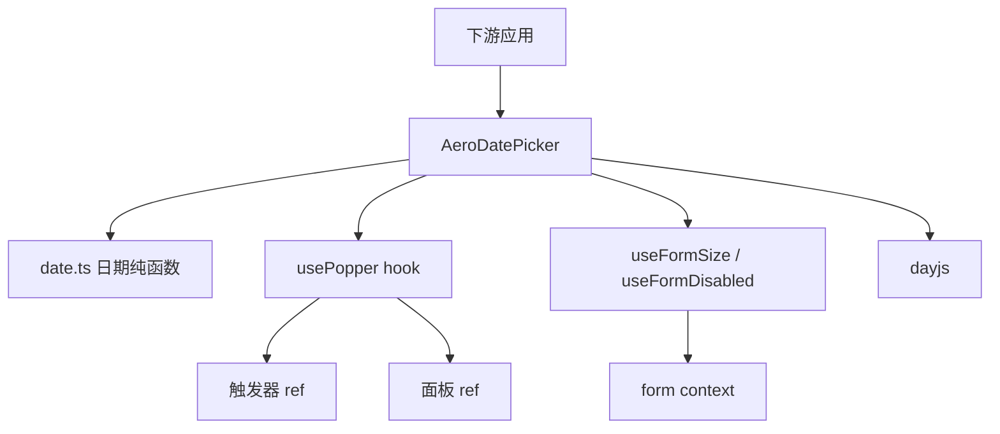
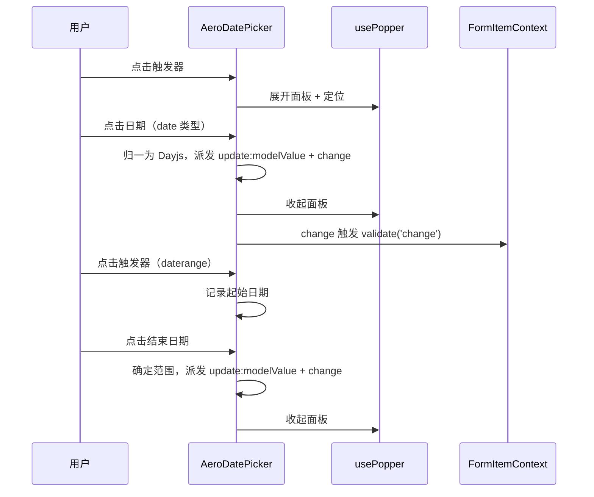

# Design Document

## Overview

本特性为 aero-ui 组件库新增**日期选择框**能力，交付 `AeroDatePicker` 组件，使下游应用能以受控方式通过日历面板选择单个日期（`date`）或日期范围（`daterange`）。同时抽取**通用弹层定位 hook `usePopper`**，作为跨组件基础设施供 `AeroDatePicker` 及后续弹层控件复用。

**Users**：组件库消费者在表单、筛选、日程等场景使用 `aero-date-picker` 组织「有日期语义的输入」。

**Impact**：作为表单控件复用 `form` 契约（`size`/`disabled` 继承 + blur/change 即时校验），与 Input/Select/InputNumber 同一路径；引入 `dayjs` 作为日期处理依赖（element-plus 同款）；`usePopper` 沉淀 select 中手写的弹层定位逻辑为可复用 hook，为后续 time-picker/cascader 奠定基础。

### Goals
- 提供 `AeroDatePicker`，API 对齐 element-plus `el-date-picker` 的 `date`/`daterange` 核心面。
- 日历面板：年月导航 + 日期网格 + 禁用日期 + 范围选择。
- 日期格式化（`format`/`value-format`）、占位、禁用/尺寸、可清空、可编辑。
- 抽通用 `usePopper` hook（定位 + 滚动/resize 收起 + click-outside + Escape）。
- 作为表单控件接入 form 上下文；样式仅消费 `--aero-*` token。

### Non-Goals
- 其它类型（`datetime`/`week`/`month`/`monthrange`/`year`/`datetimerange`）、时间选择、快捷选项 `shortcuts`。
- `select` 弹层定位的回填重构（非阻塞，独立后续优化）。

## Boundary Commitments

### This Spec Owns
- `AeroDatePicker` 组件的实现、类型、样式与测试（`date`/`daterange`）。
- 日历面板的日期网格、年月导航、禁用日期、范围选择的用户可见行为。
- `usePopper` 通用弹层定位 hook（`packages/hooks/use-popper.ts`）的契约与实现。
- dayjs 的引入与日期纯逻辑封装（`src/date.ts`）。
- 表单上下文消费（`size`/`disabled` 继承 + blur/change 校验）；`AeroDatePicker` 公开类型契约。
- 组件/根 barrel 聚合、`AeroUI` 注册、docs-site 双语文档。

### Out of Boundary
- 其它 date-picker 类型、时间选择、`shortcuts` —— 后续 spec。
- `select` 的弹层定位回填 —— 非阻塞后续优化，不在本 spec 内改动 `select`。
- 其它表单控件（TimePicker/Cascader 等）。

### Allowed Dependencies
- `form`：`useFormSize`/`useFormDisabled` + `formItemContextKey`。
- `theme`：仅消费 `--aero-*` 语义 token。
- `dayjs`：日期解析/格式化/月历生成（新增依赖，^1.11.x，构建外部化）。

### Revalidation Triggers
- `form` 的 `formItemContext`/`useFormSize`/`useFormDisabled` 契约形状变化。
- `FormSize` 枚举值增删。
- `usePopper` 契约变化（若 `select` 未来回填消费该 hook，需重新校验 select 集成）。
- `--aero-*` 语义 token 增删或改名。

## Architecture

### Existing Architecture Analysis

`select` 已内嵌弹层定位（`panelStyle` + `updatePanelPosition` + click-outside + Escape + scroll/resize 收起），本 spec 将其**抽取为通用 `usePopper`**，`AeroDatePicker` 作为首个消费者。`form` 的控件集成范式（`useFormSize`/`useFormDisabled` + `formItemContextKey.validate`）已由 Input/Select/InputNumber 确立，本 spec 直接复用。

### Architecture Pattern & Boundary Map



**Architecture Integration**:
- 受控值：`modelValue` 由父组件驱动；组件内部经 `dayjs` 归一为 `Dayjs` 对象做计算，输出时按 `value-format`（或 `Date`）派发。
- `usePopper` 契约：接收触发器/面板 ref，返回定位样式 + 展开/收起状态管理 + click-outside/Escape/滚动收起副作用。
- 依赖方向：`date-picker` → `form`/`theme`/`dayjs`/`hooks`，单向无环。

### Technology Stack

| Layer | Choice / Version | Role in Feature | Notes |
|-------|------------------|-----------------|-------|
| Frontend | Vue 3.4 `<script setup lang="ts">` | 组件实现 | 与既有组件一致 |
| Types | TypeScript strict | 类型契约 | no-any |
| Styles | SCSS + `--aero-*` token | 触发器/面板/日期网格样式 | BEM |
| Date | dayjs ^1.11.x | 日期解析/格式化/月历生成 | 构建外部化 |

新增第三方依赖：`dayjs`。

## File Structure Plan

### Directory Structure

```
packages/components/date-picker/
├── index.ts                     # 导出 AeroDatePicker（带 install）+ re-export types
├── src/
│   ├── DatePicker.vue           # 触发器 + 日历面板 + 表单集成
│   ├── date.ts                  # dayjs 薄封装：解析/格式化/月历生成/范围判断
│   └── DateTable.vue            # 日历日期网格（6×7 + 年月导航 + 禁用/范围态）
├── style/index.scss             # BEM 类 + --aero-* token
├── types.ts                     # DatePickerProps/DatePickerEmits/DatePickerType
└── __tests__/
    ├── DatePicker.test.ts       # 组件行为：单日期/范围/面板/格式化/禁用/事件/表单集成
    └── date.test.ts             # 日期纯函数：解析/格式化/月历/范围
packages/hooks/
└── use-popper.ts                # 通用弹层定位 hook（新增）
```

### Modified Files

- `packages/components/index.ts` — 追加 `export * from './date-picker'`。
- `packages/index.ts` — 追加 `AeroDatePicker` 到 `AeroUI.install`。
- `package.json` — 新增 `dayjs` 依赖。
- `vite.config.ts` — 将 `dayjs` 加入 rollup `external`（对齐 @vueuse/core）。
- `docs/.vitepress/config.mts` — 双语侧边栏新增 date-picker 入口。
- `docs/.vitepress/theme/index.ts` — 注册 `AeroDatePicker` 并引入样式。
- `docs/zh-CN/components/date-picker.md` / `docs/en-US/components/date-picker.md` — 新增双语文档。

## System Flows



Key Decisions：单日期选中即收起并派发；范围选择两段式（起始 → 结束），结束早于起始则重设为起始；blur/change 触发校验均 fire-and-forget（不 await）。

## Requirements Traceability

| Requirement | Summary | Components | Interfaces | Flows |
|-------------|---------|------------|------------|-------|
| 1.1–1.5 | 组件目录/导出/注册契约 | index.ts、barrel | DatePickerProps/Emits | — |
| 2.1–2.5 | 单日期选择 | AeroDatePicker | modelValue、type、format | 单日期流 |
| 3.1–3.5 | 日期范围选择 | AeroDatePicker、date.ts | modelValue、start/end-placeholder | 范围流 |
| 4.1–4.4 | 日历面板 | DateTable、usePopper | visible-change | 面板流 |
| 5.1–5.3 | 日期格式化 | date.ts、AeroDatePicker | format、value-format | — |
| 6.1–6.3 | 禁用日期与整体禁用 | AeroDatePicker、DateTable | disabled-date、disabled、size | — |
| 7.1–7.2 | 可清空与可编辑 | AeroDatePicker | clearable、editable | — |
| 8.1–8.4 | 事件 | AeroDatePicker | update:modelValue/change/clear/visible-change | 选择流 |
| 9.1–9.4 | 通用弹层定位 | usePopper | usePopper 契约 | 面板流 |
| 10.1–10.5 | 表单上下文集成 | AeroDatePicker | useFormSize/useFormDisabled、validate | 校验流 |
| 11.1–11.4 | 样式与 token | style/index.scss | BEM + `--aero-*` | — |
| 12.1–12.4 | 类型安全与测试 | types.ts、__tests__ | — | — |

## Components and Interfaces

| Component | Domain/Layer | Intent | Req Coverage | Key Dependencies (P0/P1) | Contracts |
|-----------|--------------|--------|--------------|--------------------------|-----------|
| AeroDatePicker | UI/日期控件 | 日期选择框：触发器 + 日历面板 + 格式化 + 表单集成 | 2,3,5,6,7,8,10 | form (P0), dayjs (P0), usePopper (P0) | State, Event |
| DateTable | UI/日历面板 | 日期网格 + 年月导航 + 禁用/范围态 | 4,6 | date.ts (P0) | State |
| date.ts | 纯逻辑 | dayjs 薄封装：解析/格式化/月历/范围 | 5,3 | dayjs (P0) | Service |
| usePopper | 通用 hook | 弹层定位 + 收起副作用 | 9 | — | Service |

### UI / 表单控件层

#### AeroDatePicker

| Field | Detail |
|-------|--------|
| Intent | 日期选择框：受控日期值 + 日历面板 + 格式化/禁用/清空 + 表单集成 |
| Requirements | 2.1–2.5, 3.1–3.5, 5.1–5.3, 6.1–6.3, 7.1–7.2, 8.1–8.4, 10.1–10.5 |

**Responsibilities & Constraints**
- 受控组件：`modelValue`（`Date | string | number` 或 `[start, end]`）由父组件驱动；内部经 dayjs 归一计算，输出按 `value-format` 或 `Date` 派发。
- 单日期：点击日期选中并收起；范围：两段式选择，结束早于起始则重设为起始。
- 触发器回显按 `format` 格式化；空值展示占位。
- 表单集成：`disabled` 显式默认 `undefined` 经 `useFormDisabled` 折叠；blur/change 触发 `formItemContext?.validate(...)`。

**Dependencies**
- Outbound: `useFormSize`/`useFormDisabled`（form）— size/disabled 继承（P0）
- Outbound: `formItemContextKey`（form）— 触发即时校验（P0）
- Outbound: `date.ts` — 日期计算（P0）
- Outbound: `usePopper` — 弹层定位（P0）

**Contracts**: State [x] / Event [x]

##### State Contract
- `open: boolean` — 面板展开状态。
- `displayValue: string` — 触发器回显文本（按 `format`）。
- `selectedDay: Dayjs | null` — 归一后的单日期选中值。
- `rangeState: [Dayjs | null, Dayjs | null]` — 范围选择的进行中状态。

##### Event Contract
- `update:modelValue` — 日期变化，载荷 `Date | string | [Date, Date] | [string, string] | undefined`。
- `change` — 日期变化，载荷同上。
- `clear` — 点击清空入口。
- `visible-change` — 面板展开/收起，载荷 `(visible: boolean)`。

**Implementation Notes**
- Integration: 复用 `form` hook 与 `usePopper`，不重造继承/定位逻辑。
- Validation: 面板 teleport 到 body 经 usePopper 定位；日期网格用 dayjs 生成 6×7 矩阵。
- Risks: 时区/格式歧义 → 统一用 dayjs 对象做计算，仅在派发时序列化。

#### DateTable

| Field | Detail |
|-------|--------|
| Intent | 日历日期网格 + 年月导航，渲染选中/禁用/范围态 |
| Requirements | 4.1, 4.2, 6.1 |

**Responsibilities & Constraints**
- 渲染 6×7 日期网格（含前后月补位）；顶部年月导航（上/下月切换）。
- 标注选中、禁用（`disabled-date`）、范围内/起止日期。

**Dependencies**
- Inbound: `date.ts` — 月历生成（P0）

**Contracts**: State [x]

##### State Contract
- `currentMonth: Dayjs` — 当前展示月份。
- 选中/范围状态由父组件（AeroDatePicker）注入。

**Implementation Notes**
- Integration: 作为 AeroDatePicker 的内部子组件，不单独导出。
- Risks: 无。

### 纯逻辑层

#### date.ts

| Field | Detail |
|-------|--------|
| Intent | dayjs 薄封装：解析/格式化/月历生成/范围判断 |
| Requirements | 5.1, 5.2, 5.3, 3.5 |

**Responsibilities & Constraints**
- 纯函数、无副作用，封装 dayjs 调用，避免组件散落日期逻辑。

**Dependencies**
- Outbound: `dayjs` — 日期库（P0）

**Contracts**: Service [x]

##### Service Interface
```typescript
interface DateMath {
  parse(value: Date | string | number): Dayjs;
  format(day: Dayjs, fmt: string): string;
  buildMonth(day: Dayjs): Dayjs[];   // 6×7 日期矩阵
  isSameDay(a: Dayjs, b: Dayjs): boolean;
  isInRange(day: Dayjs, range: [Dayjs, Dayjs]): boolean;
}
```

### 通用 hook

#### usePopper

| Field | Detail |
|-------|--------|
| Intent | 通用弹层定位：定位样式 + 展开/收起 + click-outside/Escape/滚动收起 |
| Requirements | 9.1, 9.2, 9.3, 9.4 |

**Responsibilities & Constraints**
- 接收触发器/面板 ref，返回定位样式与 open 状态管理；展开时按触发器 `getBoundingClientRect` 定位。
- 滚动/resize 时收起；click-outside 与 Escape 关闭。

**Dependencies**
- Inbound: `AeroDatePicker` — 调用（P0）

**Contracts**: Service [x]

##### Service Interface
```typescript
interface UsePopperOptions {
  trigger: Ref<HTMLElement | null>;
  panel: Ref<HTMLElement | null>;
}
interface UsePopperReturn {
  open: Ref<boolean>;
  panelStyle: ComputedRef<{ top: string; left: string; width: string }>;
  openPanel: () => void;
  close: () => void;
  toggle: () => void;
}
```

## Data Models

### Domain Model

- **日期值（value）**：单日期 `Date | string | number`，范围 `[start, end]`；内部统一归一为 `Dayjs`。
- **范围状态**：`[Dayjs | null, Dayjs | null]`，两段式选择的进行中状态。

### 公开类型契约

```typescript
// types.ts（JSDoc @default 齐全，no-any）
export type DatePickerType = 'date' | 'daterange';

export interface DatePickerProps {
  modelValue?: Date | string | number | [Date | string | number, Date | string | number];
  type?: DatePickerType;              // @default 'date'
  format?: string;                    // @default 'YYYY-MM-DD'
  valueFormat?: string;               // @default undefined（未设置派发 Date）
  placeholder?: string;
  startPlaceholder?: string;
  endPlaceholder?: string;
  disabled?: boolean;                 // @default undefined（区分未声明/声明 false）
  size?: 'large' | 'main' | 'small';  // 复用 FormSize 同值语义 @default 'main'
  disabledDate?: (date: Date) => boolean;
  clearable?: boolean;                // @default false
  editable?: boolean;                 // @default true
}

export interface DatePickerEmits {
  (e: 'update:modelValue', value: Date | string | [Date, Date] | [string, string] | undefined): void;
  (e: 'change', value: Date | string | [Date, Date] | [string, string] | undefined): void;
  (e: 'clear'): void;
  (e: 'visible-change', visible: boolean): void;
}
```

## Error Handling

### Error Strategy
- 本组件无服务端/异常分支；错误态来自表单校验（由 `formItemContext.validate` 更新字段状态，由 `AeroFormItem` 展示），组件自身不渲染错误消息。
- 非法日期输入（`editable` 下手动输入无法解析）：失焦时回退显示当前受控值，不派发。
- `disabled-date` 命中的日期在面板中禁用，点击无效。
- 表单上下文缺失时安全降级为独立控件（不报错）。

### Error Categories and Responses
- **用户输入类**：非法日期文本失焦回退（不抛错）；禁用日期不可选。
- **降级类**：`formItemContext`/`formContext` 缺失 → 静默跳过校验，`size`/`disabled` 回退默认。

## Testing Strategy

### Unit Tests（DatePicker.test.ts / date.test.ts）
- 单日期：点击日期更新 `modelValue` 并收起，回显格式化；空值展示占位。
- 范围：两段式选择、结束早于起始重设起始、`start-placeholder`/`end-placeholder`。
- 面板：年月导航切换月份、外部点击/Escape 收起、`visible-change` 派发。
- 格式化：`format` 控制回显、`value-format` 控制派发字符串。
- 禁用：`disabled-date` 禁用日期不可选、整体 `disabled` 不可展开。
- 清空/可编辑：`clearable` 清空并派发 `clear`；`editable=false` 只读。
- 表单集成：继承 `size`/`disabled`（自身→表单项→表单优先级），blur/change 触发校验。
- 日期纯函数：解析/格式化/月历生成/范围判断断言。

### Integration Tests
- 置于 `AeroForm` + `AeroFormItem`（含 `prop` + `rules`）内，选中日期触发字段级即时校验，校验失败时 `AeroFormItem` 展示错误。

### E2E / 文档验证
- `pnpm docs:build` 成功，中英双语 date-picker 页面可访问，内嵌示例渲染正常。
