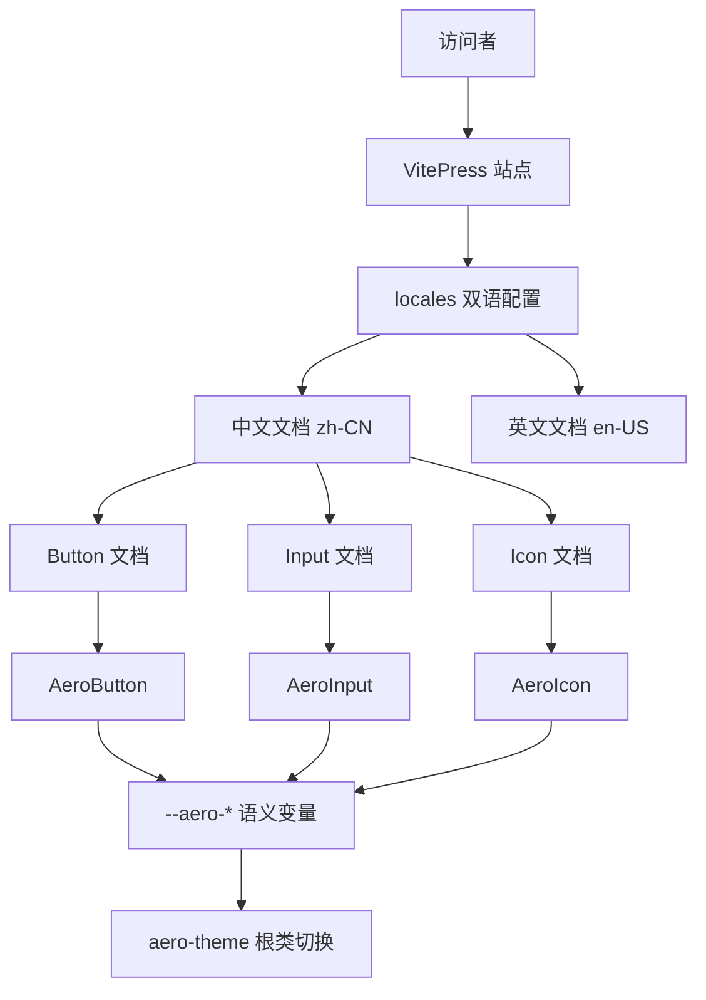
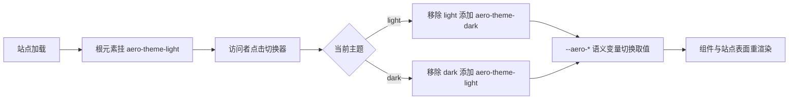

# Design Document

## Overview

**Purpose**: 本特性为 `aero-ui` 组件库重建面向使用者的 VitePress 文档站，让中文与英文开发者都能查看三个核心组件（Button、Input、Icon）的用法示例与 API 说明，形态类似 element-plus 的组件示例网站。

**Users**: 组件库使用者（查看组件用法与 API、预览组件视觉）与组件库维护者（通过 `docs:dev` / `docs:build` / `docs:preview` 开发与发布文档站）。

**Impact**: 将当前「无任何文档站」的现状，改造为具备中英双语镜像（VitePress locales）、首页与导航、每组件独立文档页、以及 `.aero-theme-*` 明暗主题切换的文档站；示例代码以 markdown 内嵌代码块呈现，不拆分独立 demo 文件。

### Goals
- 基于 VitePress 1.x 搭建文档站，配置中英双语 locales（`docs/zh-CN/` 与 `docs/en-US/`），默认语言 zh-CN。
- 提供首页、顶部导航与左侧侧边栏（两种语言各一份对应文案）。
- 为 Button、Input、Icon 各编写一份独立文档页（中英镜像），含 markdown 内嵌示例代码块 + API 表格。
- 接入组件库样式（语义 `--aero-*` 变量）与 `.aero-theme-light` / `.aero-theme-dark` 明暗主题切换。
- 使 `docs:dev` / `docs:build` / `docs:preview` 脚本可运行，构建产出可部署的静态站点。

### Non-Goals
- 不实现交互式 playground；示例以静态代码块 + 内嵌组件渲染呈现。
- 不拆分独立 demo `.vue` 文件。
- 不为三个核心组件之外的组件编写文档（后续随组件 spec 补齐）。
- 不实现/修改组件逻辑（core-components）、主题 token（theme）或组件库 i18n 机制（i18n）。
- 不将 VitePress 站点的双语与组件库 vue-i18n 耦合。

## Boundary Commitments

### This Spec Owns
- `docs/.vitepress/config.mts` —— VitePress 站点配置（标题、locales、nav、sidebar、appearance 关闭）。
- `docs/.vitepress/theme/` —— 主题扩展：全局注册组件、接入组件库样式、实现明暗主题切换。
- `docs/zh-CN/` 与 `docs/en-US/` 下的首页与组件文档 markdown（button / input / icon）。
- 文档站与组件库的集成契约：通过 `aero-ui` 别名消费组件导出，通过 `aero-ui/theme/*` 与组件 `style/index.scss` 消费样式，通过 `.aero-theme-*` 根类切换明暗。

### Out of Boundary
- 组件实现与组件导出契约（`packages/components/**`，属 core-components）。
- 语义 token 定义与明暗绑定（`packages/theme/**`，属 theme）。
- 组件库 i18n 机制与语言包（`packages/locale/**`，属 i18n）。
- `AI_CONTEXT.md` 与 AI 友好约定（属 ai-friendliness）。
- 构建管线、路径别名与 exports 映射本身的定义（`package.json` / `tsconfig.json` / `vite.config.ts`，属 foundation）。
- 交互式 playground、独立 demo 文件、三个核心组件之外的组件文档。

### Allowed Dependencies
- VitePress 1.x（`vitepress`）与 `sass`（已在 workspace 可用或作为文档站依赖声明）。
- `core-components` 产出的组件导出契约：`aero-ui/components/button`、`aero-ui/components/input`、`aero-ui/components/icon` 导出带 `install` 的组件 + `types.ts` 类型；以及各组件 `style/index.scss`。
- `theme` 产出的主题入口与语义变量：`aero-ui/theme/index.scss`（含 `.aero-theme-light` / `.aero-theme-dark` 与 `--aero-*`）。
- `foundation` 产出的 `aero-ui` / `aero-ui/*` 路径别名与 `package.json` 中的 `docs:dev` / `docs:build` / `docs:preview` 脚本。
- 约束：不得修改组件/主题/i18n 的既有文件；不得引入 steering 未声明的运行时依赖；不得使用 `.dark` 类。

### Revalidation Triggers
- 组件导出契约变化（`aero-ui/components/*` 导出符号、`install` 形态）—— 需重查主题扩展中的注册。
- 组件 props / emits 类型契约变化（`types.ts`）—— 需同步更新文档 API 表格。
- 组件样式入口或 `--aero-*` 语义变量集合变化（theme / core-components 侧）—— 需重查样式引入与主题切换。
- 明暗切换类名（`.aero-theme-light` / `.aero-theme-dark`）变化。
- `aero-ui` / `aero-ui/*` 别名映射目标或 docs 脚本语义变化（foundation 侧）。
- VitePress 主版本升级（1.x → 2.x）导致 locales / appearance 配置形态变化。

## Architecture

### Existing Architecture Analysis
仓库当前无文档站，但 upstream 已就绪：foundation 已声明 `docs:dev` / `docs:build` / `docs:preview` 脚本并建立 `aero-ui` / `aero-ui/*` 别名；core-components 已提供三个组件及导出契约；theme 已提供 `--aero-*` 语义变量与 `.aero-theme-*` 明暗主题。本设计在既有契约之上新增 `docs/` 站点，只消费契约、不反向修改任何 upstream 文件。与上一版 ep-craft 的 VitePress 双语文档站相比，本设计将目录从旧的中/英镜像迁移为 VitePress locales 的 `zh-CN` / `en-US` 结构，并改用 `.aero-theme-*` 而非 `.dark` 做明暗切换。

### Architecture Pattern & Boundary Map



**Architecture Integration**:
- 选定模式：VitePress 站点 + 主题扩展（theme entry 注册组件、接入样式、实现主题切换）+ 双语 locales 内容镜像。文档站是组件库契约的「只读消费者」，依赖方向单向：`文档站 → 组件导出契约 / 主题样式`。
- 领域边界：站点框架与导航（config + theme）、组件文档内容（每组件一页）为两个可独立演进的内容面，但共享同一 `config.mts` 与 `theme` 扩展。
- 既有模式保留：`aero-ui` 源码别名消费、`--aero-*` 语义消费、`.aero-theme-light` / `.aero-theme-dark` 明暗切换、`Aero` 组件前缀。
- 新组件必要性：无新增业务组件，仅新增主题扩展中的「明暗切换器」这一站点级 UI 元素。
- Steering 合规：严格遵守 `product.md` / `tech.md`（VitePress 文档站、`--aero-*`、`.aero-theme-*`、禁用 `.dark`）与 `structure.md`（`docs/` 目录承载 VitePress 站点）。

### Technology Stack

| Layer | Choice / Version | Role in Feature | Notes |
|-------|------------------|-----------------|-------|
| 站点框架 | VitePress 1.x | 文档站骨架与静态生成 | locales + nav + sidebar |
| 语言 | TypeScript | 站点配置与主题扩展类型 | `config.mts` / `theme/index.ts` |
| 样式 | SCSS（`sass`） + CSS 变量 | 站点自定义样式与 `--aero-*` 消费 | 只引用语义变量 |
| 组件接入 | `aero-ui` 源码别名 | 注册并渲染 `AeroButton` / `AeroInput` / `AeroIcon` | 经 `vite.resolve.alias` 解析 |
| 主题切换 | `.aero-theme-light` / `.aero-theme-dark` 根类 | 明暗模式切换 | 禁用 VitePress 默认 `.dark` |

## File Structure Plan

### Directory Structure

```
docs/
├── .vitepress/
│   ├── config.mts                 # 站点配置：标题、locales、nav、sidebar、appearance 关闭、vite alias
│   └── theme/
│       ├── index.ts               # 主题扩展：注册组件、接入样式、覆盖布局注入主题切换器
│       ├── ThemeSwitch.vue        # 明暗主题切换器（切 .aero-theme-light / .aero-theme-dark）
│       └── style.css              # 站点自定义样式（切换器样式等）
├── zh-CN/
│   ├── index.md                   # 中文首页（hero + 简介 + 快速入口）
│   └── components/
│       ├── button.md              # Button 中文文档（示例代码块 + API 表格）
│       ├── input.md               # Input 中文文档
│       └── icon.md                # Icon 中文文档
└── en-US/
    ├── index.md                   # 英文首页
    └── components/
        ├── button.md              # Button 英文文档
        ├── input.md               # Input 英文文档
        └── icon.md                # Icon 英文文档
```

> 中英两套 `index.md` 与 `components/*.md` 采用同一结构、同一 API 契约，仅文案语言不同；组件文档页通过 markdown 内嵌代码块展示示例，并在 markdown 中直接使用 `<AeroButton>` 等已注册组件渲染实际效果。

### Modified Files
- 无既有文件被修改。所有文件均为新建。`package.json` 中的 `docs:dev` / `docs:build` / `docs:preview` 脚本由 foundation 声明，本 spec 只消费、不修改；`aero-ui` 别名由 foundation 建立，本 spec 仅在 VitePress 侧声明解析映射。

### 文件职责说明
- `.vitepress/config.mts` —— 定义站点标题、`locales`（zh-CN 为默认、en-US）、每种语言的 `nav` 与 `sidebar`、`appearance: false`，以及 `vite.resolve.alias` 将 `aero-ui` / `aero-ui/*` 映射到 `packages/`。
- `.vitepress/theme/index.ts` —— 引入默认主题，`app.use` 全局注册 `AeroButton` / `AeroInput` / `AeroIcon`，显式引入 `aero-ui/theme/index.scss` 与三个组件的 `style/index.scss`，并覆盖 Layout 插槽注入 `ThemeSwitch.vue`。
- `.vitepress/theme/ThemeSwitch.vue` —— 在根 `<html>` 元素上切换 `.aero-theme-light` / `.aero-theme-dark`，默认 light，提供切换入口。
- `.vitepress/theme/style.css` —— 站点级自定义样式（如切换器按钮样式），仅使用 `--aero-*` 语义变量，不硬编码视觉值。
- `zh-CN/**` / `en-US/**` —— 双语内容镜像；`index.md` 为首页，`components/*.md` 为各组件文档页。

## System Flows

站点为内容型站点，唯一非平凡的交互是「明暗主题切换」，以过程图说明。



关键决策：默认挂 `.aero-theme-light`（与 `:root` 默认一致）；切换器只操作 `.aero-theme-*` 两个类，绝不写 `.dark`；`--aero-*` 语义变量随根类变化取值，驱动组件与站点表面视觉。

## Requirements Traceability

| Requirement | Summary | Components / 文件 | 契约 |
|-------------|---------|-------------------|------|
| 1.1–1.4 | 框架与双语 locales | `.vitepress/config.mts`（locales、默认语言） | 站点配置契约 |
| 2.1–2.4 | 首页与导航 | `zh-CN/index.md`、`en-US/index.md`、`config.mts`（nav/sidebar） | 导航契约 |
| 3.1–3.5 | 组件文档页 | `zh-CN/components/*.md`、`en-US/components/*.md` | 文档内容契约 |
| 4.1–4.4 | 样式与明暗主题接入 | `.vitepress/theme/index.ts`、`ThemeSwitch.vue`、`style.css` | 主题契约 |
| 5.1–5.4 | docs 脚本与构建 | `package.json`（foundation 声明）+ `docs/` 产物 | 构建契约 |
| 6.1–6.4 | 范围与边界约束 | 全部文件（范围界定） | 边界契约 |

## Components and Interfaces

| Component | Domain/Layer | Intent | Req Coverage | Key Dependencies | Contracts |
|-----------|--------------|--------|--------------|------------------|-----------|
| 站点配置 | 配置层 | 双语 locales + 导航 + 主题配置 | 1.1–1.4, 2.2–2.4, 4.2 | VitePress 1.x | Config |
| 主题扩展 | 接入层 | 注册组件、接入样式、明暗切换 | 3.5, 4.1–4.4 | aero-ui 别名、theme/组件样式 | Integration |
| 主题切换器 | UI | 切 `.aero-theme-*` 根类 | 4.2–4.4 | `--aero-*` 语义变量 | API |
| 首页文档 | 内容层 | 组件库简介与快速入口 | 2.1, 2.4 | config（locales） | Content |
| 组件文档页 | 内容层 | 每组件示例 + API 表格 | 3.1–3.5 | 组件 `types.ts` 契约 | Content |

### 配置层

#### `.vitepress/config.mts`

| Field | Detail |
|-------|--------|
| Intent | 定义站点标题、双语 locales、导航与主题配置 |
| Requirements | 1.1, 1.2, 1.3, 1.4, 2.2, 2.3, 2.4, 4.2 |

**Responsibilities & Constraints**
- 配置 `locales`：默认 `zh-CN`（`lang: zh-CN`、`label: 中文`）、`en-US`（`lang: en-US`、`label: English`），并各自指定 `title`、`themeConfig.nav` 与 `themeConfig.sidebar`。
- 设置 `appearance: false`，禁用 VitePress 默认 `.dark` 外观。
- 配置 `vite.resolve.alias`：`aero-ui` → `packages/index.ts`、`aero-ui/*` → `packages/*`，使文档站可解析组件源码。

**Contracts**: Config [x]

##### Config Contract
- 默认语言：`zh-CN`；语言列表：`zh-CN`、`en-US`。
- 每种语言的 sidebar 包含「组件」分组，下辖 `button` / `input` / `icon` 三个文档页。
- `appearance` 必须为 `false`（不使用 `.dark`）。

### 接入层

#### `.vitepress/theme/index.ts`

| Field | Detail |
|-------|--------|
| Intent | 将组件注册进 VitePress、接入组件库样式、注入主题切换器 |
| Requirements | 3.5, 4.1, 4.2, 4.3, 4.4 |

**Responsibilities & Constraints**
- 引入 VitePress 默认主题并 `app.use` 注册 `AeroButton` / `AeroInput` / `AeroIcon`。
- 显式引入 `aero-ui/theme/index.scss` 与三个组件的 `style/index.scss`。
- 覆盖 Layout 插槽，注入 `ThemeSwitch.vue`，使每个页面顶部出现明暗切换入口。

**Dependencies**
- Outbound: `AeroButton` / `AeroInput` / `AeroIcon`（P1）；`aero-ui/theme/index.scss` 与组件 `style/index.scss`（P0）。
- External: `vitepress`（P0，站点运行时）。

**Contracts**: Integration [x]

##### Integration Contract
- 注册后 markdown 中 `<AeroButton>`、`<AeroInput>`、`<AeroIcon>` 可直接渲染，样式正确。
- 切换器对根元素仅操作 `.aero-theme-light` / `.aero-theme-dark`。

### UI 层

#### `ThemeSwitch.vue`

| Field | Detail |
|-------|--------|
| Intent | 提供明暗主题切换入口，切 `.aero-theme-*` 根类 |
| Requirements | 4.2, 4.3, 4.4 |

**Responsibilities & Constraints**
- 初始状态为 light（根元素挂 `.aero-theme-light`）。
- 点击在 light / dark 间切换：切换 dark 时移除 `.aero-theme-light` 并添加 `.aero-theme-dark`，反之亦然。
- 不写入 `.dark` 类；切换器样式只使用 `--aero-*` 语义变量。

**Contracts**: API [x]

##### API Contract
- 无对外 props/emits（站点级 UI，内部管理根类状态）。

### 内容层

#### 首页与组件文档页（`zh-CN/**` / `en-US/**`）

| Field | Detail |
|-------|--------|
| Intent | 承载组件库简介、导航与各组件示例/API 内容 |
| Requirements | 2.1, 2.4, 3.1, 3.2, 3.3, 3.4, 3.5 |

**Responsibilities & Constraints**
- 首页（`index.md`）含组件库名称、简介与指向组件文档的快速入口。
- 组件文档页（`components/*.md`）结构统一：标题 + 简介 + 用法示例（markdown 内嵌代码块 + 内嵌组件渲染）+ API 表格。
- API 表格与组件 `types.ts` 契约一致：Button（type/size/disabled/loading/icon/nativeType + click）、Input（modelValue/placeholder/disabled/clearable/size + update:modelValue/input/change/focus/blur/clear）、Icon（name/size/color）。
- 中英两套内容仅语言不同，结构与 API 契约一致。

**Contracts**: Content [x]

## Error Handling

### Error Strategy
文档站为内容型站点，无业务异常路径。错误处理聚焦「构建/解析失败的可诊断性」与「内容边界防越界」：组件导入/样式解析失败由 VitePress/Vite 编译错误定位到具体文件；越界内容（playground、额外组件文档、独立 demo 文件）由验证任务做范围扫描拦截。

### Error Categories and Responses
- **构建/编译失败**：VitePress 或 Vite 报告别名解析失败、SCSS 编译错误或 markdown 错误，指向文件与行号。
- **组件契约漂移**：文档 API 表格与组件 `types.ts` 不一致时，以 `types.ts` 为准手工校准（无运行时兜底）。

### Monitoring
无运行时监控需求；质量以「`docs:build` 退出码 + 范围扫描通过」为信号。

## Testing Strategy

测试重点落在「站点可构建、双语可用、组件可渲染、明暗可切换、范围合规」的冒烟验证，逐条对应验收标准。

### 构建冒烟（对应 1.1–1.4, 5.1–5.4）
- 执行 `pnpm docs:build`，退出码 0，产物非空，且包含 `zh-CN` 与 `en-US` 两套页面产物。
- `docs:dev` 可启动本地开发服务器，`docs:preview` 可预览构建产物。

### 双语与导航（对应 2.1–2.4, 1.2–1.4）
- 断言默认语言为 `zh-CN`；访问 `/zh-CN/` 与 `/en-US/` 分别呈现中文与英文首页与导航文案。
- 断言 sidebar 在两种语言下均列出 button / input / icon 三个组件文档入口。

### 组件文档（对应 3.1–3.5）
- 断言存在 `button.md` / `input.md` / `icon.md`（中英各一份），且页面包含 markdown 内嵌示例代码块与 API 表格。
- 断言内嵌组件（`<AeroButton>` 等）在文档页中实际渲染且样式正确。

### 明暗主题（对应 4.1–4.4）
- 断言站点默认挂 `.aero-theme-light`；切换器点击后根元素在 `.aero-theme-light` / `.aero-theme-dark` 间切换。
- 断言切换后组件视觉随 `--aero-*` 语义变量取值变化，且站点未出现 `.dark` 类。

### 边界验证（对应 6.1–6.4）
- 断言工作树仅含三个核心组件文档、无 playground、无独立 demo `.vue` 文件、双语仅由 VitePress locales 承担（不依赖 vue-i18n）。

## Supporting References
- 组件导出契约与 props/emits 类型，见 `.kiro/specs/core-components/design.md`「Components and Interfaces」。
- `.aero-theme-*` 明暗主题与 `--aero-*` 语义变量契约，见 `.kiro/specs/theme/design.md`。
- `aero-ui` / `aero-ui/*` 别名与 docs 脚本契约，见 `.kiro/specs/foundation/design.md`。
- 双语文档站结构与主题切换的权衡决策，见 `research.md`。
