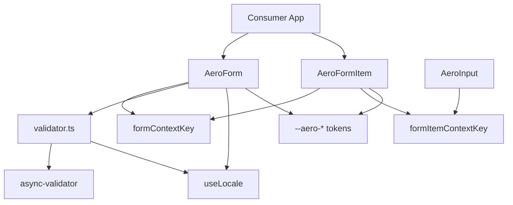
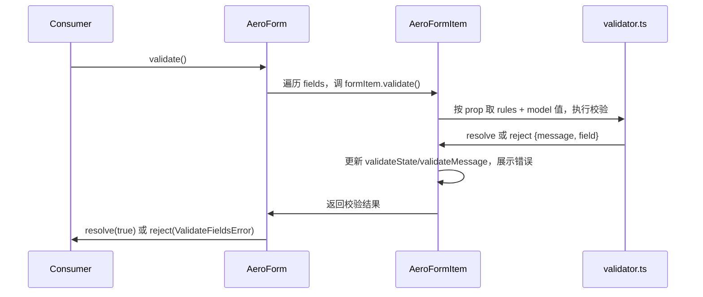

# Design Document — form

## Overview

本特性为 aero-ui 组件库新增**表单能力**：`AeroForm`（表单容器）与 `AeroFormItem`（表单项）两个可复用组件。消费者以统一的声明式方式组织表单、绑定数据模型、展示标签，并处理最繁琐的字段校验与错误展示，API 面对齐 element-plus 的 `el-form`/`el-form-item`。

目标用户是使用 aero-ui 构建内部/商业 Web 应用的开发者；他们通过 `model`/`rules` 声明式配置、`validate` 等编程式方法，以及表单级 `size`/`disabled` 的自动继承，减少重复样板代码。

本特性会改造现有 `AeroInput`，使其消费表单上下文（size/disabled 继承），并补充 locale 校验文案。

### Goals
- 交付 `AeroForm` + `AeroFormItem`，API 面对齐 element-plus（model/rules/label-width/label-position/inline/size/disabled/show-message/status-icon）。
- 提供完整声明式校验：required/min/max/len/pattern/type/validator/asyncValidator，触发时机 blur/change/submit，以及 validate/validateField/resetFields/clearValidate/scrollToField。
- 表单级 `size`/`disabled` 自动向内部控件传递（`AeroInput` 改造）。
- 校验文案 locale 化（zh-cn/en），错误态走 `--aero-*` 语义 token。

### Non-Goals
- 不实现 Select/Checkbox/Radio/Switch 等表单控件（后续 spec）。
- 不实现 `deepRules`、嵌套数组表单、动态增减表单项等高级校验特性。
- 不实现交互式 playground、SSR/水合、i18n 运行时高级定制。
- 不改 docs-site 文档站（docs-site 是独立 spec，作为本特性的 downstream 触发更新）。

## Boundary Commitments

### This Spec Owns
- `AeroForm`、`AeroFormItem` 组件及其类型、样式、测试。
- 表单校验引擎适配（async-validator 引擎 + 严格类型封装）与字段聚合校验机制。
- 表单级上下文契约（`formContextKey`/`formItemContextKey` + `useFormSize`/`useFormDisabled`）与 `AeroInput` 的消费改造。
- locale 校验文案（`zh-cn`/`en` 的 `components.form.*`）。
- barrel 聚合与 `AeroUI` 全局注册。

### Out of Boundary
- 表单控件（Select/Checkbox/Radio/Switch 等）—— 后续 spec；本 spec 仅确立 FormItem 对子控件的 context 契约供未来控件接入。
- docs-site 文档站（双语文档/示例）—— 独立 spec，本 spec 完成后触发其更新。
- resolver 无代码改动（泛型 kebab-case 映射自动覆盖 `AeroForm`→`form`、`AeroFormItem`→`form-item`）。
- 高级校验特性（deepRules、嵌套数组、动态表单）。

### Allowed Dependencies
- `core-components`：复用 `AeroIcon`（错误/清空图标）、改造 `AeroInput`（消费 context）。
- `theme`：消费 `--aero-danger-*`、`--aero-border-*`、`--aero-text-*`、`--aero-radius-*` 等语义 token。
- `i18n`/`hooks`：消费 `useLocale` 获取校验文案。
- `foundation`：构建管线（async-validator 走默认 bundle）。
- 外部库：`async-validator@^4.2.5`（仅此一个新运行时依赖，bundle 进产物）。

### Revalidation Triggers
- `FormContext`/`FormItemContext` 接口形态变更 → 触发 Input 及未来控件消费方重新核对。
- `FormRules`/`FormItemRule` 公共类型变更 → 触发消费者类型兼容核对。
- size/disabled 继承优先级调整 → 触发 Input 及未来控件重新核对。
- 校验错误信息结构（`ValidateFieldsError`）变更 → 触发下游 `validate` 调用方核对。

## Architecture

### Existing Architecture Analysis

- 组件层为扁平「一个组件一个文件夹」（`packages/components/{button,input,icon}`），每组件 `index.ts`（带 `install` 的 `AeroX` + re-export types）、`src/Xxx.vue`、`style/index.scss`、`types.ts`、`__tests__/`。
- `useLocale` 位于 `packages/hooks/`，组件通过它取文案；i18n 单例位于 `packages/locale/`。
- barrel 链：`packages/index.ts` → `packages/components/index.ts` → 各组件；`AeroUI.install` 逐个 `app.use`。
- resolver 为泛型 `AeroXxx`→`aero-ui/components/{kebab}` 映射，无组件白名单。
- 构建：Vite lib 模式，`external: ['vue','@vueuse/core','vue-i18n']`，`preserveModules: true`。

### Architecture Pattern & Boundary Map



**Architecture Integration**:
- **Selected pattern**: 容器/项分离 + `provide/inject` 上下文 + 字段注册聚合校验（对齐 element-plus）。
- **Domain/feature boundaries**: `form`（容器与上下文契约 owner）、`form-item`（字段展示/校验状态）、`validator`（引擎适配）、`input`（上下文消费者）。
- **Existing patterns preserved**: 组件文件夹结构、barrel 聚合、`install` 导出契约、BEM + `--aero-*`、strict/no-any。
- **New components rationale**: `validator.ts` 隔离 async-validator 的弱类型边界；`constants.ts`/`use-form.ts` 收敛 context 契约避免循环依赖。
- **Steering compliance**: 组件仅 `<script setup>` + `defineProps<T>()`；只消费语义 token；类型 no-any。

### Technology Stack

| Layer | Choice / Version | Role in Feature | Notes |
|-------|------------------|-----------------|-------|
| Frontend | Vue 3.4 + TS strict | 组件实现 | `<script setup lang="ts">` |
| Validation | async-validator `^4.2.5` | 校验引擎 | bundle 进产物（不 externalize） |
| Styling | SCSS + `--aero-*` | 表单/错误态样式 | BEM |
| i18n | vue-i18n + `useLocale` | 校验默认文案 | 补 `components.form.*` key |
| Build | Vite 5 lib + vite-plugin-dts | 双格式 + 类型 | 无需改 `external` |

## File Structure Plan

### Directory Structure
```
packages/components/
├── form/                         # AeroForm 表单容器（含 context 契约 owner）
│   ├── index.ts                  # export AeroForm(install) + re-export types + context/hooks
│   ├── types.ts                  # FormProps/FormEmits/FormRules/FormItemRule/FormSize/ValidateFieldsError
│   ├── src/
│   │   ├── Form.vue              # 容器实现：provide formContext、字段注册、validate/reset 方法
│   │   ├── constants.ts          # formContextKey/formItemContextKey + FormContext/FormItemContext 类型
│   │   ├── use-form.ts           # useFormSize/useFormDisabled（自身→formItem→form 继承）
│   │   └── validator.ts          # async-validator 适配：严格类型→RuleItem、错误归一化
│   ├── style/index.scss          # .aero-form BEM 样式
│   └── __tests__/
│       ├── Form.test.ts          # 容器 props/方法/事件/字段聚合
│       └── validator.test.ts     # 规则适配与错误信息结构
├── form-item/                    # AeroFormItem 表单项
│   ├── index.ts                  # export AeroFormItem(install) + re-export types
│   ├── types.ts                  # FormItemProps/FormItemEmits/FormItemValidateState
│   ├── src/FormItem.vue          # 项实现：inject formContext、provide formItemContext、label/错误展示
│   ├── style/index.scss          # .aero-form-item BEM 样式（含错误态/必填星号）
│   └── __tests__/FormItem.test.ts
└── input/
    └── src/Input.vue             # 改造：消费 useFormSize/useFormDisabled
```

### Modified Files
- `packages/components/input/src/Input.vue` — 引入 `useFormSize`/`useFormDisabled`，size/disabled 改为「自身 prop → 表单上下文 → 默认值」。
- `packages/components/input/types.ts` — `InputSize` 与 `FormSize` 对齐（`'large' | 'main' | 'small'`），无行为变更。
- `packages/components/index.ts` — 追加 `export * from './form'` 与 `export * from './form-item'`。
- `packages/index.ts` — `AeroUI.install` 追加 `app.use(AeroForm)`、`app.use(AeroFormItem)`；新增 import。
- `packages/locale/lang/zh-cn.ts` — 补 `components.form.rules.*` 默认校验文案。
- `packages/locale/lang/en.ts` — 同上（en）。
- `package.json` — `dependencies` 追加 `async-validator`。

> `vite.config.ts` 无需修改：async-validator 不在 `external` 列表中，默认 bundle。

## System Flows

### 校验流程（validate）



**Key decisions**: 字段级校验状态收敛于 FormItem；Form 仅聚合结果并触发 `validate` 事件；`trigger` 决定 blur/change 时是否即时校验。

## Requirements Traceability

| Requirement | Summary | Components | Interfaces | Flows |
|-------------|---------|------------|------------|-------|
| 1.1–1.5 | 目录/导出/barrel 契约 | form, form-item | `AeroForm`/`AeroFormItem` install 契约 | — |
| 2.1–2.9 | Form 容器 props/方法/事件 | form | `FormProps`/`FormEmits`/`FormContext` | 校验流程 |
| 3.1–3.7 | FormItem props/插槽/方法/错误展示 | form-item | `FormItemProps`/`FormItemContext` | — |
| 4.1–4.7 | 校验行为 | form, form-item, validator | `FormRules`/`FormItemRule`/`ValidateFieldsError` | 校验流程 |
| 5.1–5.4 | size/disabled 上下文传递 | form, form-item, input, use-form | `useFormSize`/`useFormDisabled` | — |
| 6.1–6.5 | 语义 token + BEM | form, form-item | SCSS 类名/token | — |
| 7.1–7.3 | locale 校验文案 | form, validator, locale | `useLocale`/`components.form.*` | — |
| 8.1–8.4 | 类型安全/编码约定/测试 | 全部 | `types.ts` 严格类型 | — |

## Components and Interfaces

| Component | Domain/Layer | Intent | Req Coverage | Key Dependencies | Contracts |
|-----------|--------------|--------|--------------|------------------|-----------|
| AeroForm | 表单容器 | 承载 model/rules/布局，聚合校验，提供上下文 | 2, 4, 5, 7 | theme/i18n(P1), validator(P0) | State |
| AeroFormItem | 表单项 | label/字段校验/错误展示，提供字段上下文 | 3, 4, 5 | AeroIcon(P2), form context(P0) | State |
| validator.ts | 校验适配 | 严格类型→async-validator，错误归一化 | 4, 7 | async-validator(P0), useLocale(P1) | Service |
| use-form.ts | 上下文 hook | size/disabled 继承优先级 | 5 | constants(P0) | State |
| AeroInput | 输入控件 | 消费表单 size/disabled 上下文 | 5 | use-form(P1) | State |

### 表单容器

#### AeroForm

| Field | Detail |
|-------|--------|
| Intent | 承载表单 model/rules/布局与 size/disabled，聚合字段校验并触发事件 |
| Requirements | 2.1–2.9, 4.1–4.7, 5.1–5.3 |

**Responsibilities & Constraints**
- 提供 `formContextKey` 上下文（reactive：model/rules/size/disabled/labelWidth/labelPosition/inline/showMessage/statusIcon + validate/validateField/resetFields/clearValidate/scrollToField）。
- 持有 `fields: FormItemContext[]`，FormItem 挂载时 `addField`、卸载时 `removeField`。
- `validate` 聚合遍历 fields 调用各 `formItem.validate`，失败 reject `ValidateFieldsError`，成功触发 `validate` 事件。

**Dependencies**
- Outbound: `validator.ts` — 委托单字段校验（P0）
- Outbound: `useLocale` — 默认校验文案（P1）
- External: `async-validator` — 校验引擎（P0，bundle）

**Contracts**: State [x] / Service [ ]

##### State Management
- State model: `model`（响应式表单对象）、`rules`、`fields`（字段上下文集合）、`size`/`disabled`。
- Persistence & consistency: 无持久化；`model` 由消费者持有，`resetFields` 恢复至注册时的初始快照。
- Concurrency strategy: `validate` 聚合字段 Promise，统一 resolve/reject。

**Implementation Notes**
- Integration: `provide(formContextKey, reactive(context))`；`AeroUI.install` 注册。
- Validation: `validate` 无 `prop` 的字段不纳入校验与重置。
- Risks: 字段注册/注销生命周期需防泄漏（`onBeforeUnmount` 调 `removeField`）。

### 表单项

#### AeroFormItem

| Field | Detail |
|-------|--------|
| Intent | 组织单字段 label/内容/错误展示，提供字段级校验状态与上下文 |
| Requirements | 3.1–3.7, 4.1, 5.1–5.3 |

**Responsibilities & Constraints**
- inject `formContextKey`、provide `formItemContextKey`（prop/validate/resetField/clearValidate/validateState/validateMessage/size/disabled）。
- 渲染 label（含必填星号）、默认内容插槽、错误消息与错误态边框。
- 字段级 `validate` 委托 `form` 的校验能力（读 model[prop] + rules），更新 `validateState`（`'' | 'error'`）与 `validateMessage`。

**Dependencies**
- Inbound: `AeroForm` — 注入 formContext（P0）
- Outbound: `AeroIcon` — 状态图标（P2）
- External: `--aero-danger-*`/`--aero-border-*` token（P1）

**Contracts**: State [x]

##### State Management
- State model: `validateState`、`validateMessage`、`size`/`disabled`（继承）、`prop`。
- Persistence & consistency: 校验状态为组件内响应式，随校验结果更新。
- Concurrency strategy: 单字段校验，串行 Promise。

**Implementation Notes**
- Integration: `prop` 必填才纳入校验/重置；无 `prop` 仅作纯展示项。
- Validation: 错误态用 `--aero-danger-6` 边框 + `--aero-text-*` 文案。
- Risks: 必填星号与 `required`/`rules` 的判定需一致。

### 校验适配

#### validator.ts

| Field | Detail |
|-------|--------|
| Intent | 将 aero 严格 `FormItemRule` 适配为 async-validator 规则并归一化错误 |
| Requirements | 4.1–4.7, 7.1 |

**Dependencies**
- External: `async-validator`（P0）
- Outbound: `useLocale`（P1，默认消息）

**Contracts**: Service [x]

##### Service Interface
```typescript
export function validateFieldValue(
  value: unknown,
  rules: FormItemRule[],
  fieldLabel?: string,
): Promise<void>; // reject 时携带 { message: string; field?: string }

export interface ValidateFieldsError {
  [prop: string]: Array<{ message: string; field: string }>;
}
```

- Preconditions: `rules` 非空；`value` 为 `model[prop]` 当前值。
- Postconditions: 通过则 resolve；失败则 reject，错误信息结构与 `ValidateFieldsError[prop]` 一致。
- Invariants: 规则缺失 `message` 时用 locale 默认文案；`trigger` 不匹配时跳过该校验。

**Implementation Notes**
- Integration: 内部做受控 `as` 边界把严格类型转 async-validator `RuleItem`，公共层 no-any。
- Validation: 逐规则收集错误，首个错误或全部错误决定 reject 内容（对齐 element-plus 默认单错误语义可配置）。
- Risks: async-validator 弱类型仅在 `validator.ts` 内被接触，禁止泄入 `types.ts`。

## Data Models

### Domain Model
- **Form**：聚合根，持有 `model`、`rules`、`fields`；不变量——`rules` 的 key 与 `model` 的字段对应，`prop` 缺失的字段不参与校验。
- **FormItem**：值对象/字段视图，持有 `prop`、`validateState`、`validateMessage`、继承的 `size`/`disabled`。
- **FormItemRule**：校验规则值对象（required/min/max/len/pattern/type/enum/validator/asyncValidator/message/trigger）。

### Data Contracts & Integration
- **FormRules**：`Record<string, FormItemRule | FormItemRule[]>`。
- **ValidateFieldsError**：`{ [prop]: Array<{ message: string; field: string }> }` —— 与 element-plus 的 `validate` reject 形状对齐。

## Error Handling

### Error Strategy
- 校验失败为**预期业务错误**：`validate` 返回 Promise，失败 reject `ValidateFieldsError`，不抛未捕获异常。
- 校验结果以字段为粒度呈现：FormItem 进入错误态、展示错误消息；Form 触发 `validate(prop, isValid, message)` 事件。
- 无 `prop` 字段、空规则、`trigger` 不匹配均安全跳过（fail-fast 于边界、graceful 于空值）。

### Error Categories and Responses
- **字段校验错误**（required/min/max/pattern/type/自定义）→ 字段级错误消息，locale 默认文案兜底。
- **编程错误**（未在 Form 内使用 FormItem）→ 校验跳过并保持安全（inject 失败返回 undefined）。

## Testing Strategy

### Unit Tests
- `Form.test.ts`：`validate` 聚合多字段成功/失败；`resetFields` 恢复初始值并清校验；`clearValidate` 清指定/全部；`validateField` 单字段；`validate` 事件载荷（prop/isValid/message）。
- `FormItem.test.ts`：`prop` 缺失不参与校验；`required` 星号渲染；错误态 `validateState`/`validateMessage` 更新；label/error 插槽；字段级 `resetField`/`clearValidate`。
- `validator.test.ts`：规则适配（required/min/max/len/pattern/type/validator/asyncValidator）各自通过/失败；缺 `message` 走 locale 默认文案；`trigger` 过滤；`ValidateFieldsError` 结构。
- `use-form.test.ts`（可并入）：size/disabled 优先级（自身→formItem→form→默认）。
- `Input.test.ts`（补）：置于 form 上下文中时 size/disabled 继承。

### Integration Tests
- Form + FormItem + Input 组合：表单级 `disabled` 使 Input 自动禁用、字段级覆盖表单级、Input 自身 props 最高优先。
- 校验触发时机：blur/change 即时校验 vs submit 全量校验。
- locale 切换后默认错误文案随语言更新。

### E2E/UI Tests
- 关键用户路径：渲染表单 → 填写/留空字段 → 提交 → 校验失败展示错误 → 修正 → 校验通过 → 重置恢复初始值。本项依赖 docs-site 示例页（后续 spec），本 spec 以组件级集成测试覆盖。

## Optional Sections

### Performance & Scalability
- 字段级校验按需执行（`trigger` 控制），避免未触发字段的冗余计算；`validate` 聚合时各字段 Promise 串行/并行由实现决定，字段数量级为表单常规规模，无额外性能目标。
