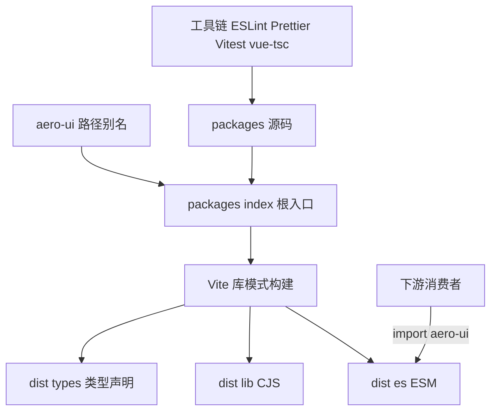

# Design Document

## Overview

**Purpose**: 本特性为被清空的仓库重建一个可构建、可测试、可发布的 Vue 3 + TypeScript 组件库骨架，向下游 spec（theme / i18n / core-components / resolver）提供稳定的构建契约、路径别名与导出映射。

**Users**: 组件库维护者（通过 `pnpm build`/`typecheck`/`lint`/`test` 等命令工作）与下游消费者（通过 `aero-ui` specifier 按需解析产物）。

**Impact**: 将当前「仅有 `.kiro/`、`.claude/`、`CLAUDE.md`、`base/`」的空仓库，改造为具备双格式构建管线（ESM/CJS + d.ts）与完整工具链的可开发骨架。

### Goals
- 产出可直接 `pnpm install && pnpm build` 的空组件库骨架。
- 固化包名 `aero-ui`、组件前缀 `Aero`、CSS 变量前缀 `--aero-*`。
- 齐备 lint / format / test / typecheck 脚本。
- 建立 `aero-ui` 路径别名与 exports 映射，使源码导入与发布 specifier 行为一致。

### Non-Goals
- 不实现任何具体组件（Button/Input/Icon 等）。
- 不迁移或实现主题 token（`base/` → `packages/theme/`）。
- 不实现国际化字典与 resolver。
- 不搭建 VitePress 文档站与 AI 文档。

## Boundary Commitments

### This Spec Owns
- 包级配置：`package.json`（`aero-ui`）、`pnpm-workspace.yaml`、`tsconfig.json`、`vite.config.ts`、`.eslintrc.cjs`、`.prettierrc.json`、`.gitignore`。
- 构建契约：Vite 5 library mode 双格式输出（`dist/es` / `dist/lib`）+ `vite-plugin-dts` 类型产物（`dist/types`）；`cssCodeSplit: true` 使逐组件样式编译为独立 CSS（`packages/components/*/style/index.scss` → `dist/**/components/*/style/index.css`），供 resolver 按需引入。
- 导出映射：根入口 `.` 与子路径（`./components/*`、`./components/*/style/*`、`./resolver`、`./theme/*`、`./locale`、`./locale/lang/*`、`./hooks`）的 exports 契约，由 foundation 独家拥有（单一事实来源：`package.json`）；下游 spec（i18n / core-components / resolver）不得自行改写 exports。
- 路径别名：`aero-ui` → `packages/index.ts`、`aero-ui/*` → `packages/*`。
- 空入口 `packages/index.ts`（仅创建文件并接线为 Vite 构建入口；不填充任何 re-export 内容，根 barrel 的 re-export 归 core-components spec 拥有）。
- 质量门禁脚本：typecheck / lint / format / test。

### Out of Boundary
- 组件实现（`packages/components/**` 的具体组件代码、样式、类型、测试）。
- 主题 token 迁移（`base/` 目录的 SCSS 原始变量）。
- 国际化（`packages/locale/**` 字典与 `vue-i18n` 集成）。
- resolver（`AeroResolver`）实现。
- 根 barrel 的 re-export 内容（`packages/index.ts` 中的组件 barrel、theme index、locale index 与 `AeroUI` 默认导出 install）——归 core-components spec 拥有。
- 文档站与 `AI_CONTEXT.md`。

### Allowed Dependencies
- 运行时 peer 依赖：`vue`（external，不打进产物）。
- 构建期依赖：`@vitejs/plugin-vue`、`vite-plugin-dts`、`vite`、`typescript`、`vue-tsc`、`sass`、`vitest`、`@vue/test-utils`、`jsdom`、`eslint` + `eslint-plugin-vue`、`prettier`。
- 已声明但本 spec 不引用的运行时依赖 `@vueuse/core`、`vue-i18n`（作为 external 与 deps 声明，供下游 spec 使用，不实现其功能）。
- 约束：不得将任何组件/主题/国际化源码带入 foundation 阶段；`base/` 目录保持只读。

### Revalidation Triggers
- 根入口 `packages/index.ts` 的导出契约变化（新增/移除公开导出）。
- exports 映射子路径或产物目录命名（`dist/es`、`dist/lib`、`dist/types`）变化。
- 路径别名 `aero-ui` / `aero-ui/*` 的映射目标变化。
- 构建 external 列表变化（新增/移除运行时依赖）。
- Node / pnpm 版本要求（engines）变化。
- 工具链脚本语义变化（typecheck/lint/test 的覆盖范围）。

## Architecture

### Existing Architecture Analysis
仓库当前为空，无既有架构需兼容。git 历史中的 `ep-craft` 脚手架已提供与 steering `tech.md` 一致的构建方案（Vite 5 library mode + `vite-plugin-dts` + `preserveModules`），本设计直接复用并迁移命名为 `aero-ui`。`base/` 目录是唯一现存资产，属 `theme` spec，foundation 不触碰。

### Architecture Pattern & Boundary Map



**Architecture Integration**:
- 选定模式：单包 Vite library mode（`packages/index.ts` 为唯一构建入口），Rollup `preserveModules` 按源码结构输出，`vite-plugin-dts` 生成类型。与 steering `tech.md` 一致。
- 依赖方向：`packages/index.ts`（根 barrel）→ 各域目录（components/hooks/locale/theme/resolver）；各域之间不互相 import；组件只消费 `--aero-*` 语义 token（该约束由后续 spec 落地）。foundation 阶段只有根入口，方向约束为后续 spec 保留。
- 既有模式保留：单包发布、双格式产物、`vue` external、`aero-ui` 别名镜像发布 specifier。
- 新组件必要性：无新增业务组件，仅引入构建配置与根入口契约。
- Steering 合规：严格遵守 `product.md`/`tech.md`/`structure.md` 的命名（`aero-ui`/`Aero`/`--aero-*`）与「单包、domain-grouped `packages/`」结构。

### Technology Stack

| Layer | Choice / Version | Role in Feature | Notes |
|-------|------------------|-----------------|-------|
| 语言 | TypeScript ~5.4（strict） | 类型安全基线 | `strict: true`，`moduleResolution: Bundler` |
| 框架 | Vue 3.4（`@vitejs/plugin-vue` 5） | 编译 `.vue` SFC | foundation 阶段无组件源码 |
| 构建 | Vite 5 library mode | 产出 ESM/CJS 双格式 | `preserveModules: true` |
| 类型产物 | `vite-plugin-dts` 3.x | 生成 `dist/types` d.ts | `entryRoot: 'packages'` |
| 样式 | SCSS（`sass`） | 保留 `.scss` 支持 | foundation 阶段无样式源码 |
| 包管理 | pnpm（workspace） | 依赖与工作区 | `pnpm-workspace.yaml` 含 `packages`、`docs` |
| 运行时 | Node >=18 | 开发/构建环境 | 见 `engines` |
| 质量 | ESLint 8 + `eslint-plugin-vue`、Prettier 3、Vitest 1 + `@vue/test-utils` + jsdom | lint/format/test | 见 `scripts` |

## File Structure Plan

### Directory Structure

```
aero-ui/
├── package.json              # 包名 aero-ui、scripts、exports、peer/deps、engines、sideEffects
├── pnpm-workspace.yaml        # 工作区：packages、docs
├── tsconfig.json              # strict + paths 别名（aero-ui → packages/index.ts）
├── vite.config.ts             # Vite 库模式 + vite-plugin-dts + vitest 内联配置
├── .eslintrc.cjs              # ESLint 8 + @typescript-eslint + vue3-recommended
├── .prettierrc.json           # Prettier 3 格式化规则
├── .gitignore                 # 忽略 node_modules、dist
├── packages/
│   └── index.ts               # 空入口（根 barrel 占位导出 + 下游扩展点注释）
├── docs/                      # VitePress 占位目录（本 spec 不填充内容）
└── base/                      # 暂存原始 token（只读，theme spec 迁移）
```

> 域目录（`packages/components/`、`packages/hooks/`、`packages/locale/`、`packages/theme/`、`packages/resolver/`）由各自下游 spec 创建；foundation 不提前建目录，以守住边界（需求 5）。

### Modified Files
- 无既有文件被修改。所有文件均为新建。`base/color.scss`、`base/number.scss` 保持只读，不被 foundation 触及。

### 文件职责说明
- `package.json` —— 包身份、脚本、exports 映射、依赖清单、engines、files、sideEffects。
- `tsconfig.json` —— 类型检查基线 + `aero-ui` 路径别名。
- `vite.config.ts` —— 双格式构建、dts 生成、external、vitest 配置。
- `.eslintrc.cjs` / `.prettierrc.json` —— lint / format 规则。
- `packages/index.ts` —— 库根入口，可被后续 spec 扩展而不改变构建契约。

## Requirements Traceability

| Requirement | Summary | Components / 配置 | 契约 |
|-------------|---------|-------------------|------|
| 1.1 | 包名 `aero-ui` | `package.json`（name） | 导出映射契约 |
| 1.2 | 组件前缀 `Aero` | 命名约定（structure.md） | 公开导出契约 |
| 1.3 | token 前缀 `--aero-*` | 命名约定（structure.md） | 样式变量契约 |
| 2.1 | `pnpm install` 成功 | `package.json`（engines/deps） | 依赖契约 |
| 2.2 | ESM/CJS 双格式 | `vite.config.ts`（build） | 构建产物契约 |
| 2.3 | d.ts 类型声明 | `vite.config.ts`（dts） | 类型产物契约 |
| 2.4 | `vue` external | `vite.config.ts`（external） | 打包边界契约 |
| 2.5 | files/exports 发布 | `package.json`（files/exports） | 发布契约 |
| 3.1 | exports 映射 | `package.json`（exports） | 导出映射契约 |
| 3.2 | 路径别名 | `tsconfig.json`（paths） | 别名契约 |
| 3.3 | import 与发布一致 | `tsconfig.json` + `package.json` | 模块解析契约 |
| 3.4 | 空入口 | `packages/index.ts` | 根 barrel 契约 |
| 4.1 | typecheck 通过 | `tsconfig.json` + `vue-tsc` | 质量门禁 |
| 4.2 | lint 覆盖 | `.eslintrc.cjs` | 质量门禁 |
| 4.3 | format 覆盖 | `.prettierrc.json` | 质量门禁 |
| 4.4 | test 可执行 | `vite.config.ts`（test） | 测试门禁 |
| 5.1–5.4 | 边界与约束 | 全部文件（范围界定） | 边界契约 |

## Components and Interfaces

foundation 无业务组件，本节的「组件」指构成骨架的配置单元与契约载体。

| Component | Domain/Layer | Intent | Req Coverage | Key Dependencies | Contracts |
|-----------|--------------|--------|--------------|------------------|-----------|
| 根入口 | 源码入口 | 库公开 API 的 barrel 占位 | 3.4, 1.1 | 无 | Service |
| 构建配置 | 构建 | 双格式产物 + dts + external | 2.2, 2.3, 2.4, 4.4 | Vite / dts 插件 | Service |
| 导出映射 | 包契约 | 定义可解析入口与子路径 | 3.1, 2.5, 1.1 | 产物目录 | API |
| 路径别名 | 类型/解析 | 源码 import 镜像发布 specifier | 3.2, 3.3 | tsconfig paths | API |
| 工具链配置 | 质量 | lint/format/typecheck/test 门禁 | 4.1, 4.2, 4.3, 4.4 | ESLint/Prettier/vue-tsc | Service |

### 源码入口

#### 根入口 `packages/index.ts`

| Field | Detail |
|-------|--------|
| Intent | 库的根 barrel：占位导出 + 下游扩展点 |
| Requirements | 1.1, 3.4 |

**Responsibilities & Constraints**
- 作为 Vite library mode 的唯一构建入口。
- foundation 阶段为空（仅占位导出/注释）；其 re-export 内容（组件 barrel、theme index、locale index、`AeroUI` 默认导出 install）归 core-components spec 拥有，foundation 不填充，避免两个 spec 争用该文件。
- 不直接实现任何组件/主题/国际化逻辑。

**Contracts**: Service [x]

##### Service Interface
```typescript
// 根入口在 foundation 阶段的契约形态：无业务导出，仅保留占位
export {};
// core-components spec 扩展为：export * from './components'; export * from './theme'; ...
```
- Preconditions: 文件存在且可被 TypeScript 解析。
- Postconditions: `pnpm build` 产出非空 `dist/es` / `dist/lib` / `dist/types` 产物。
- Invariants: 根入口始终是 `aero-ui` 主 specifier 的解析目标。

### 构建配置

#### `vite.config.ts`

| Field | Detail |
|-------|--------|
| Intent | 定义双格式构建、dts 生成、external 与测试配置 |
| Requirements | 2.2, 2.3, 2.4, 4.4 |

**Responsibilities & Constraints**
- `build.lib.entry = packages/index.ts`，`formats: ['es', 'cjs']`。
- `rollupOptions.external: ['vue', '@vueuse/core', 'vue-i18n']`，`vue` 不进产物。
- `preserveModules: true`、`preserveModulesRoot: 'packages'`，输出 `dist/es`（`.mjs`）与 `dist/lib`（`.cjs`）。
- `cssCodeSplit: true`：逐组件 SCSS（`packages/components/*/style/index.scss`）编译为独立 CSS，随 `preserveModules` 输出到 `dist/**/components/*/style/index.css`，供 resolver 的 `sideEffects` 按需引入。
- `vite-plugin-dts`：`entryRoot: 'packages'`、`outDir: 'dist/types'`、exclude `__tests__`。
- 内联 vitest：globals + jsdom + v8 coverage（`packages/components/**`）。

**Contracts**: Service [x]

### 导出映射

#### `package.json` 的 exports

| Field | Detail |
|-------|--------|
| Intent | 声明可解析入口与子路径的 types/import/require 三分支 |
| Requirements | 3.1, 2.5, 1.1 |

##### API Contract
| Specifier | types | import | require |
|-----------|-------|--------|---------|
| `.` | `dist/types/index.d.ts` | `dist/es/index.mjs` | `dist/lib/index.cjs` |
| `./components/*` | `dist/types/components/*/index.d.ts` | `dist/es/components/*/index.mjs` | `dist/lib/components/*/index.cjs` |
| `./components/*/style/*` | — | `dist/es/components/*/style/*.css` | `dist/lib/components/*/style/*.css` |
| `./resolver` | `dist/types/resolver/index.d.ts` | `dist/es/resolver/index.mjs` | `dist/lib/resolver/index.cjs` |
| `./locale` | `dist/types/locale/index.d.ts` | `dist/es/locale/index.mjs` | `dist/lib/locale/index.cjs` |
| `./locale/lang/*` | `dist/types/locale/lang/*.d.ts` | `dist/es/locale/lang/*.mjs` | `dist/lib/locale/lang/*.cjs` |
| `./hooks` | `dist/types/hooks/index.d.ts` | `dist/es/hooks/index.mjs` | `dist/lib/hooks/index.cjs` |
| `./theme/*` | — | `dist/theme/*`（直通） | — |
| `./package.json` | — | `./package.json`（直通） | — |

> 样式发布存在两种不冲突的范式：`./theme/*` 走 `.scss` 直通（`dist/theme/*`，由消费者自编译）；`./components/*/style/*` 走编译后 `.css`（`cssCodeSplit` 产物，由 resolver 按需引入）。二者各有消费者，互不影响。

### 路径别名

#### `tsconfig.json` 的 paths

| Field | Detail |
|-------|--------|
| Intent | 使源码 import 镜像发布 specifier |
| Requirements | 3.2, 3.3 |

##### API Contract
| Alias | Target |
|-------|--------|
| `aero-ui` | `packages/index.ts` |
| `aero-ui/*` | `packages/*` |

## Error Handling

### Error Strategy
foundation 阶段无运行时业务逻辑，错误处理聚焦于**构建/质量门禁的可诊断失败**：任一脚本（typecheck/lint/build/test）非零退出即视为门禁失败，输出定位到具体文件/规则/类型的错误信息。

### Error Categories and Responses
- **类型错误**：`vue-tsc --noEmit` 非零退出，指向具体文件与行号。
- **规范错误**：ESLint 报告规则名与位置，`lint:fix` 可自动修复。
- **构建错误**：Vite/Rollup 报告入口缺失、external 配置错误或 dts 生成失败。
- **测试失败**：Vitest 报告失败用例与断言差异。

### Monitoring
无运行时监控需求；质量门禁在本地与 CI 中以命令退出码作为唯一信号。

## Testing Strategy

foundation 阶段无组件用例，测试重点落在「骨架可构建、可校验」的冒烟验证，逐条对应验收标准。

### 冒烟 / 集成验证
- **构建产物完整性（对应 2.2、2.3）**：执行 `pnpm build` 后断言 `dist/es/index.mjs`、`dist/lib/index.cjs`、`dist/types/index.d.ts` 均存在。
- **external 边界（对应 2.4）**：断言 `dist` 产物中不包含 `vue` 运行时源码（`vue` 被外部化）。
- **类型检查（对应 4.1）**：`pnpm typecheck` 以退出码 0 通过。
- **规范校验（对应 4.2、4.3）**：`pnpm lint` 与 `pnpm format` 以退出码 0 通过（无文件变更或变更符合规则）。
- **测试运行器可执行（对应 4.4）**：`pnpm test` 以退出码 0 通过（空测试集）。

### 后续预留
组件级单元测试（Vitest + `@vue/test-utils` + jsdom）的目录与配置已就绪，由 `core-components` spec 在其组件文件夹内补充 `__tests__/*.test.ts`。

## Supporting References
- `package.json` exports 完整映射与依赖清单的逐项取值，见 `research.md` 与 git 历史提交 `2c2a723` 的原始配置。
- 构建配置细节（`preserveModules`、`entryFileNames`、`vite-plugin-dts` 参数）见 `research.md`「上一版脚手架构建方案」。
