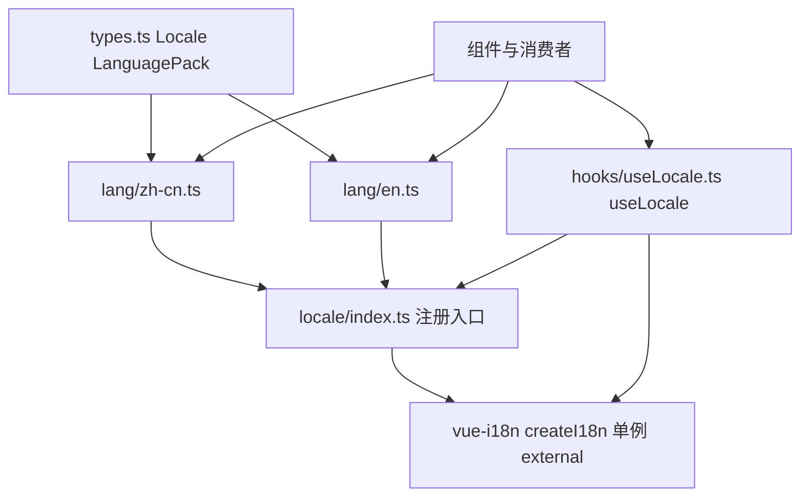
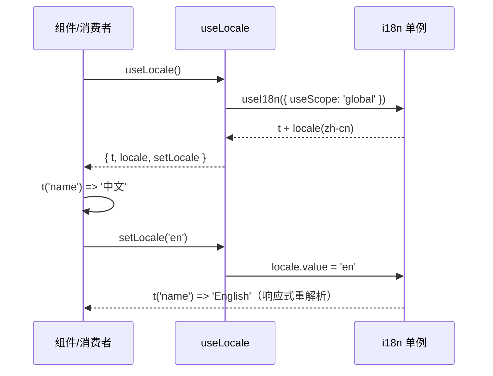

# Design Document

## Overview

**Purpose**: 本特性为 `aero-ui` 组件库重建国际化机制，向下游 `core-components` 提供统一的 locale 注册入口与切换入口（`useLocale`），使组件可获取内置文案（无障碍描述、占位符默认值等），消费者可按需复用 `zh-cn` / `en` 两套语言包。

**Users**: 组件开发者（通过 `useLocale` 获取翻译函数 `t` 并切换语言）与下游消费者（按需引入语言包，或通过导出入口使用默认语言）。

**Impact**: 将当前「无任何 locale 代码」的空仓库，改造为具备 `vue-i18n` 集成、`zh-cn` / `en` 语言包、locale 注册与切换入口的 i18n 机制；`vue-i18n` 作为 external 依赖不打包进产物。

### Goals
- 基于 `vue-i18n` 建立全局 i18n 实例，默认语言 `zh-cn`。
- 提供 `zh-cn` / `en` 两套独立语言包文件，可独立引用与按需加载。
- 提供 `useLocale` hook，返回响应式 `t` / `locale` 与切换入口 `setLocale`。
- 建立类型安全语言包契约（`LanguagePack` / `Locale`）。
- 依赖 foundation 已暴露的 `./locale`、`./locale/lang/*`、`./hooks` exports 子路径（foundation 负责映射，本 spec 只消费、不修改 `package.json`），使 locale 机制可被发布消费者解析。

### Non-Goals
- 不实现任何具体组件文案的全量翻译（语言包仅含骨架占位）。
- 不实现运行时语言切换 UI。
- 不引入 ConfigProvider 级 per-component locale 覆盖（属 core-components 后续扩展）。
- 不实现组件、主题、resolver、AI 文档。

## Boundary Commitments

### This Spec Owns
- `packages/locale/types.ts` —— `Locale` 类型与 `LanguagePack` 契约。
- `packages/locale/lang/zh-cn.ts`、`packages/locale/lang/en.ts` —— 中文/英文语言包。
- `packages/locale/index.ts` —— locale 注册入口：`createI18n` 全局实例、默认 `zh-cn`、导出语言包/类型/默认语言。
- `packages/hooks/useLocale.ts` —— `useLocale` composable（`t` / `locale` / `setLocale`）。
- `packages/hooks/index.ts` —— hooks barrel，re-export `useLocale`（hooks 域当前仅 `useLocale` 一个 composable，theme 为纯 CSS、无 `useTheme`，故 barrel 内容由本 spec 提供）。

### Out of Boundary
- `package.json` 及其 exports 契约（含 `./locale`、`./locale/lang/*`、`./hooks` 子路径映射）—— 归 foundation 所有，本 spec 只消费、不修改。
- 组件实现（`packages/components/**` 的任何组件、样式、类型、测试）。
- 具体组件文案（Button/Input/Icon 等的文案 key 与译文），由 `core-components` 补充。
- 运行时语言切换 UI（下拉选择、按钮等界面）。
- 主题 token（`packages/theme/**`）与 resolver（`AeroResolver`）。
- `AI_CONTEXT.md` 与 VitePress 文档站。

### Allowed Dependencies
- 运行时依赖：`vue`、`vue-i18n`（均 external，不进产物）；`vue-i18n` 由 foundation 已在 `package.json` 声明为运行时依赖。
- 构建/工具链依赖（foundation 已就绪）：Vite 5 library mode、`vite-plugin-dts`、Vitest、`@vue/test-utils`、jsdom、TypeScript strict。
- 路径别名：`aero-ui/*` → `packages/*`（foundation 已配置），用于 `useLocale` 与语言包间互引。
- 约束：不得引入任何组件/主题/resolver 源码；`useLocale` 依赖方向为 hooks → locale（单向，不反向）。

### Revalidation Triggers
- `Locale` 语言标识集合变化（新增语言、移除语言）。
- `LanguagePack` 契约形状变化（影响 core-components 补充文案的方式）。
- `useLocale` 返回契约（`t` / `locale` / `setLocale`）变化。
- 默认语言（`zh-cn`）或 `fallbackLocale` 变化。
- foundation 暴露的 `./locale` / `./locale/lang/*` / `./hooks` exports 映射变化（影响本 spec 的消费入口）。
- `vue-i18n` 大版本升级（组合式 API 语义变化）。

## Architecture

### Existing Architecture Analysis
仓库当前为空，无既有 locale 代码需兼容。steering `tech.md` 已将 `vue-i18n` 列为运行时依赖并纳入 external 列表；`structure.md` 将语言包归入 `packages/locale/`、`useLocale.ts` 归入 `packages/hooks/`。foundation 已提供构建契约、`aero-ui/*` 路径别名与 exports 映射（含 `./locale` / `./locale/lang/*` / `./hooks` 子路径）。本设计在 foundation 之上增量落地，不改动 `package.json` 及其 exports 契约，仅消费 foundation 已暴露的子路径。

### Architecture Pattern & Boundary Map



**Architecture Integration**:
- 选定模式：`packages/locale/index.ts` 通过 `createI18n({ legacy: false, locale: 'zh-cn', fallbackLocale: 'en', messages })` 创建全局单例；`useLocale` 基于 `useI18n({ useScope: 'global' })` 暴露响应式 `t` / `locale`。
- 依赖方向：`types.ts` → `lang/*.ts` → `locale/index.ts` ← `hooks/useLocale.ts`。即 hooks 依赖 locale，locale 内部 types → lang → index，无反向依赖、无环。
- 既有模式保留：语言包独立文件按需加载、`vue-i18n` external、`aero-ui/*` 别名镜像发布 specifier。
- 新组件必要性：仅新增 `useLocale` composable 与 locale 入口，无 UI 组件。
- Steering 合规：遵守 `product.md`（i18n-ready）、`tech.md`（vue-i18n + external）、`structure.md`（`packages/locale/` 语言包 + `packages/hooks/useLocale.ts`）。

### Technology Stack

| Layer | Choice / Version | Role in Feature | Notes |
|-------|------------------|-----------------|-------|
| 语言 | TypeScript ~5.4（strict） | 类型安全基线 | `LanguagePack` / `Locale` 类型契约 |
| 框架 | Vue 3.4（组合式 API） | `useLocale` 响应式 | `WritableComputedRef<Locale>` |
| i18n | vue-i18n 9.x（external） | 翻译运行时 | `createI18n` + `useI18n({ useScope: 'global' })` |
| 构建 | Vite 5 library mode | 双格式 + external | `vue-i18n` 不进产物 |
| 测试 | Vitest + `@vue/test-utils` + jsdom | useLocale 与语言包单测 | colocated `__tests__` |

## File Structure Plan

### Directory Structure

```
packages/
├── locale/
│   ├── index.ts          # locale 注册入口：createI18n 单例、默认 zh-cn、导出语言包/类型/默认语言
│   ├── types.ts          # Locale 类型 + LanguagePack 契约
│   └── lang/
│       ├── zh-cn.ts      # 中文语言包（默认导出 LanguagePack）
│       └── en.ts         # 英文语言包（默认导出 LanguagePack）
└── hooks/
    ├── index.ts          # hooks barrel：re-export useLocale（内容归本 spec）
    └── useLocale.ts      # useLocale composable：t / locale / setLocale
```

> `packages/locale/` 与 `packages/hooks/` 由本 spec 首次创建；`packages/hooks/` 当前仅 `useLocale` 一个 composable（theme 为纯 CSS、无 `useTheme`），故由本 spec 提供 `index.ts` barrel 内容；`./hooks` 的 exports 映射归 foundation。

### Modified Files
- 本 spec 不修改 `package.json`：`./locale`、`./locale/lang/*`、`./hooks` 的 exports 映射由 foundation 提供，本 spec 只消费、不修改。
- 其余文件均为新建（含 `packages/hooks/index.ts` hooks barrel）；不改动 `packages/index.ts`（根 barrel 的 re-export 归下游集成阶段，避免与 core-components/theme 并发改动冲突）。

### 文件职责说明
- `packages/locale/types.ts` —— 定义 `Locale = 'zh-cn' | 'en'` 与 `LanguagePack` 接口（含 `name` 字段 + 开放命名空间索引，预留组件文案扩展）。
- `packages/locale/lang/zh-cn.ts` / `en.ts` —— 各自默认导出一个 `LanguagePack`（本 spec 仅含 `name` 占位：`中文` / `English`）。
- `packages/locale/index.ts` —— 创建 `i18n` 单例、导出 `defaultLocale`、语言包与类型，作为 locale 注册入口。
- `packages/hooks/useLocale.ts` —— 实现 `useLocale`，返回响应式 `t` / `locale` / `setLocale`。
- `packages/hooks/index.ts` —— hooks barrel，re-export `useLocale`（内容归本 spec；`./hooks` 的 exports 映射归 foundation，本 spec 不修改 `package.json`）。

## System Flows

### locale 获取与切换



**Key Decisions**:
- 切换入口为 `setLocale('en')`（内部改写响应式 `locale.value`），`t` 依赖 `locale`，故切换后自动重解析，无需手动刷新组件。
- `useLocale` 从 `aero-ui/locale` 导入，确保 `createI18n` 单例副作用先于 `useI18n` 执行，避免全局 composer 未注册。

## Requirements Traceability

| Requirement | Summary | Components | 契约 |
|-------------|---------|------------|------|
| 1.1 | 支持 `zh-cn` / `en` | `types.ts`（Locale） | 类型契约 |
| 1.2 | 独立语言包文件、按需加载 | `lang/zh-cn.ts`、`lang/en.ts` | 语言包契约 |
| 1.3 | 类型安全语言包契约 | `types.ts`（LanguagePack） | 类型契约 |
| 2.1 | 基于 vue-i18n 的全局 i18n 实例 | `locale/index.ts`（createI18n） | 注册入口契约 |
| 2.2 | 默认语言 `zh-cn` | `locale/index.ts`（defaultLocale） | 注册入口契约 |
| 2.3 | vue-i18n external 不进产物 | `vite.config.ts`（external，foundation 已就绪） | 构建契约 |
| 2.4 | 公开导出入口 | `locale/index.ts`（导出语言包/类型/默认语言） | 导出契约 |
| 3.1 | useLocale 返回 t + locale | `hooks/useLocale.ts` | Hook 契约 |
| 3.2 | 切换语言后 t 返回新文案 | `hooks/useLocale.ts`（响应式 locale） | Hook 契约 |
| 3.3 | 缺失 key 回退不抛错 | `locale/index.ts`（fallbackLocale）+ vue-i18n missing | 回退契约 |
| 4.1–4.3 | 边界与依赖约束 | 全部文件（范围界定） | 边界契约 |

## Components and Interfaces

本 spec 无 UI 组件，以下「组件」指构成 i18n 机制的契约载体。

| Component | Domain/Layer | Intent | Req Coverage | Key Dependencies | Contracts |
|-----------|--------------|--------|--------------|------------------|-----------|
| 语言包类型 | 类型 | `Locale` 与 `LanguagePack` 契约 | 1.1, 1.3 | 无 | Service |
| 中文语言包 | 数据 | `zh-cn` 文案数据 | 1.2 | LanguagePack | Service |
| 英文语言包 | 数据 | `en` 文案数据 | 1.2 | LanguagePack | Service |
| locale 注册入口 | 集成 | i18n 单例 + 默认语言 + 导出 | 2.1, 2.2, 2.4, 3.3 | vue-i18n | Service |
| useLocale hook | 逻辑 | 翻译函数与切换入口 | 3.1, 3.2 | locale 入口 + vue-i18n | Service |

### 类型

#### `Locale` 与 `LanguagePack`（`packages/locale/types.ts`）

| Field | Detail |
|-------|--------|
| Intent | 语言标识与语言包结构契约 |
| Requirements | 1.1, 1.3 |

**Responsibilities & Constraints**
- `Locale` 为受支持语言的联合类型，扩展语言时在此收敛。
- `LanguagePack` 为接口：`name` 标识语言自身名称；开放命名空间索引供 core-components 后续补充组件文案。

**Contracts**: Service [x]

##### Service Interface
```typescript
export type Locale = 'zh-cn' | 'en'

export interface LanguagePack {
  /** 语言自身名称，用于展示与调试 */
  name: string
  /** 预留：组件文案命名空间，具体 key 由 core-components 补充 */
  [namespace: string]: string | string[] | Record<string, unknown>
}
```
- Preconditions: 语言包对象可被 TypeScript 严格模式解析。
- Postconditions: 新增/变更语言时仅需修改 `Locale` 联合与对应语言包文件。
- Invariants: 每个受支持语言必须存在一个满足 `LanguagePack` 的语言包文件。

### 数据

#### 中文语言包 `zh-cn.ts` / 英文语言包 `en.ts`

| Field | Detail |
|-------|--------|
| Intent | 提供各自语言的文案数据 |
| Requirements | 1.2 |

**Responsibilities & Constraints**
- 各自默认导出一个 `LanguagePack`，本 spec 仅含 `name`（`zh-cn` → `中文`，`en` → `English`）。
- 语言包独立文件、可独立 import，满足按需加载（需求 1.2）。

**Contracts**: Service [x]

##### Service Interface
```typescript
// zh-cn.ts
export default { name: '中文' } satisfies LanguagePack
// en.ts
export default { name: 'English' } satisfies LanguagePack
```
- Preconditions: 文件位于 `packages/locale/lang/`，被 `locale/index.ts` 汇总。
- Postconditions: `import zhCn from 'aero-ui/locale/lang/zh-cn'` 可解析并拿到语言包。
- Invariants: 语言包文件名与 `Locale` 取值一一对应。

### 集成

#### locale 注册入口 `packages/locale/index.ts`

| Field | Detail |
|-------|--------|
| Intent | 创建 i18n 单例、默认语言、公开导出 |
| Requirements | 2.1, 2.2, 2.4, 3.3 |

**Responsibilities & Constraints**
- 通过 `createI18n` 创建全局实例，`legacy: false`、`locale: 'zh-cn'`、`fallbackLocale: 'en'`、`messages: { 'zh-cn': zhCn, en }`。
- 导出 `defaultLocale`、`i18n` 实例、语言包与类型，作为 locale 注册入口。
- 不在此实现任何组件文案或 UI。

**Dependencies**
- Outbound: `lang/zh-cn.ts`、`lang/en.ts` — 消息数据（P0）；`types.ts` — 类型（P0）。
- External: `vue-i18n` — `createI18n` 运行时（P0，external 不进产物）。

**Contracts**: Service [x]

##### Service Interface
```typescript
export const defaultLocale: Locale = 'zh-cn'

export const i18n: I18n<...> = createI18n({
  legacy: false,
  locale: defaultLocale,
  fallbackLocale: 'en',
  messages: { 'zh-cn': zhCn, en },
})

export { zhCn, en }
export type { Locale, LanguagePack }
```
- Preconditions: `vue-i18n` 已声明为运行时依赖（foundation 已配置）。
- Postconditions: 模块加载即完成全局 composer 注册，`useLocale` 可读取全局作用域。
- Invariants: `defaultLocale` 始终指向 `Locale` 中的默认语言 `zh-cn`。

### 逻辑

#### `useLocale`（`packages/hooks/useLocale.ts`）

| Field | Detail |
|-------|--------|
| Intent | 暴露翻译函数 `t`、当前语言 `locale` 与切换入口 `setLocale` |
| Requirements | 3.1, 3.2 |

**Responsibilities & Constraints**
- 基于 `useI18n({ useScope: 'global' })` 获取响应式 `t` / `locale`。
- 从 `aero-ui/locale` 导入，确保 i18n 单例副作用先执行。
- `setLocale(lang)` 改写 `locale.value`，`t` 随 `locale` 响应式重解析。

**Dependencies**
- Outbound: `locale/index.ts` — i18n 单例与类型（P0）。
- External: `vue-i18n` — `useI18n`（P0，external）。

**Contracts**: Service [x]

##### Service Interface
```typescript
export function useLocale(): {
  t: (key: string) => string
  locale: WritableComputedRef<Locale>
  setLocale: (lang: Locale) => void
}
```
- Preconditions: 调用环境已加载 `vue-i18n` 且 locale 入口已初始化。
- Postconditions: `setLocale('en')` 后，`t('name')` 返回 `English`；`t('name')` 默认（`zh-cn`）返回 `中文`。
- Invariants: `locale` 取值始终属于 `Locale` 联合；缺失 key 不抛错（回退默认语言或返回 key）。

## Error Handling

### Error Strategy
i18n 机制无业务异常路径，错误处理聚焦「翻译回退」与「类型防错」：缺失 key 不抛错（回退）；非法语言值在编译期由 `Locale` 联合类型拒绝。

### Error Categories and Responses
- **缺失翻译 key**：`t('missing.key')` 经 `fallbackLocale: 'en'` 回退，仍缺失则由 vue-i18n 默认 `missing` 行为返回 key 本身，不抛错（需求 3.3）。
- **非法语言值**：`setLocale` 入参类型为 `Locale`，`'zh-cn' | 'en'` 之外的值在编译期即报错，无需运行时兜底。
- **全局 composer 未注册**：`useLocale` 从 `aero-ui/locale` 导入单例，保证 `createI18n` 先于 `useI18n` 执行；若人为绕过该入口，vue-i18n 会给出明确告警。

### Monitoring
无运行时监控需求；质量以类型检查（`pnpm typecheck`）与单测通过为信号。

## Testing Strategy

测试重点落在「机制可翻译、可切换、可回退」的单元验证，逐条对应验收标准。

### 单元测试
- **语言包结构（对应 1.1、1.2、1.3）**：断言 `zh-cn` / `en` 语言包默认导出均含 `name` 字段，且 `Locale` 联合包含二者。
- **useLocale 返回契约（对应 3.1）**：`useLocale()` 返回含 `t`、`locale`、`setLocale` 的对象，默认 `locale` 为 `zh-cn`。
- **翻译正确性（对应 3.2）**：默认 `t('name') === '中文'`；`setLocale('en')` 后 `t('name') === 'English'`。
- **缺失 key 回退（对应 3.3）**：`t('不存在.key')` 不抛错，返回 key 本身或回退值。

### 集成 / 构建验证
- **external 边界（对应 2.3）**：`pnpm build` 后断言 `dist` 产物中不包含 `vue-i18n` 运行时源码（external 生效）。
- **导出入口（对应 2.4）**：断言 `aero-ui/locale` 与 `aero-ui/hooks`（barrel，`packages/hooks/index.ts` re-export `useLocale`，与 foundation 的 `./hooks` barrel 映射一致）可按 exports 映射解析。
- **默认语言（对应 2.2）**：断言 locale 入口默认语言为 `zh-cn`。

### 边界验证（对应 4.1–4.3）
- 确认工作树中语言包仅含骨架占位，无任何具体组件文案、无切换 UI、无组件/主题/resolver 代码。

## Supporting References
- `LanguagePack` 扩展方向与 per-component locale 覆盖（ConfigProvider 方案）见 `research.md`「上一版 locale 方案」。
- exports 子路径（`./locale`、`./locale/lang/*`、`./hooks`）逐项取值见 foundation `design.md` 的 exports 契约表，由 foundation 负责映射，本 spec 只消费。
