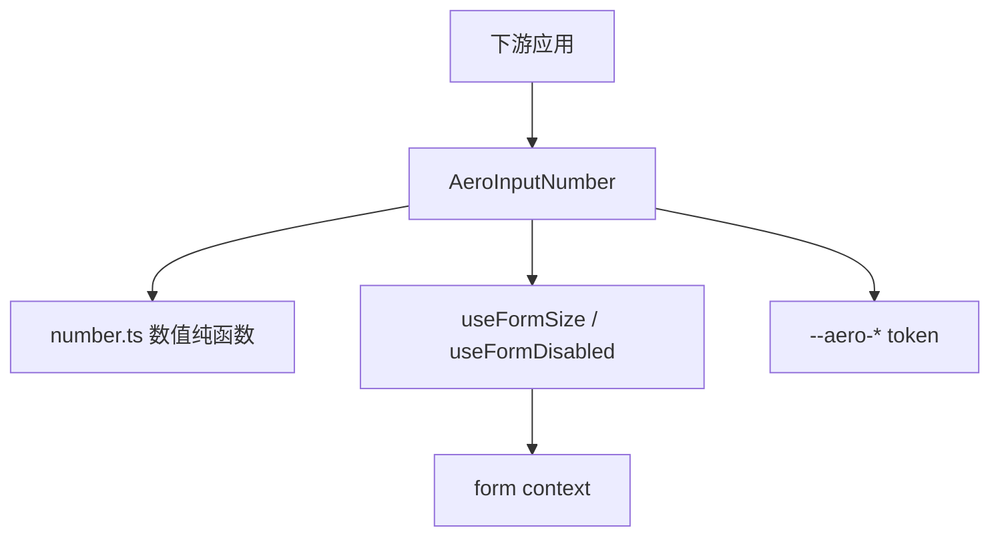
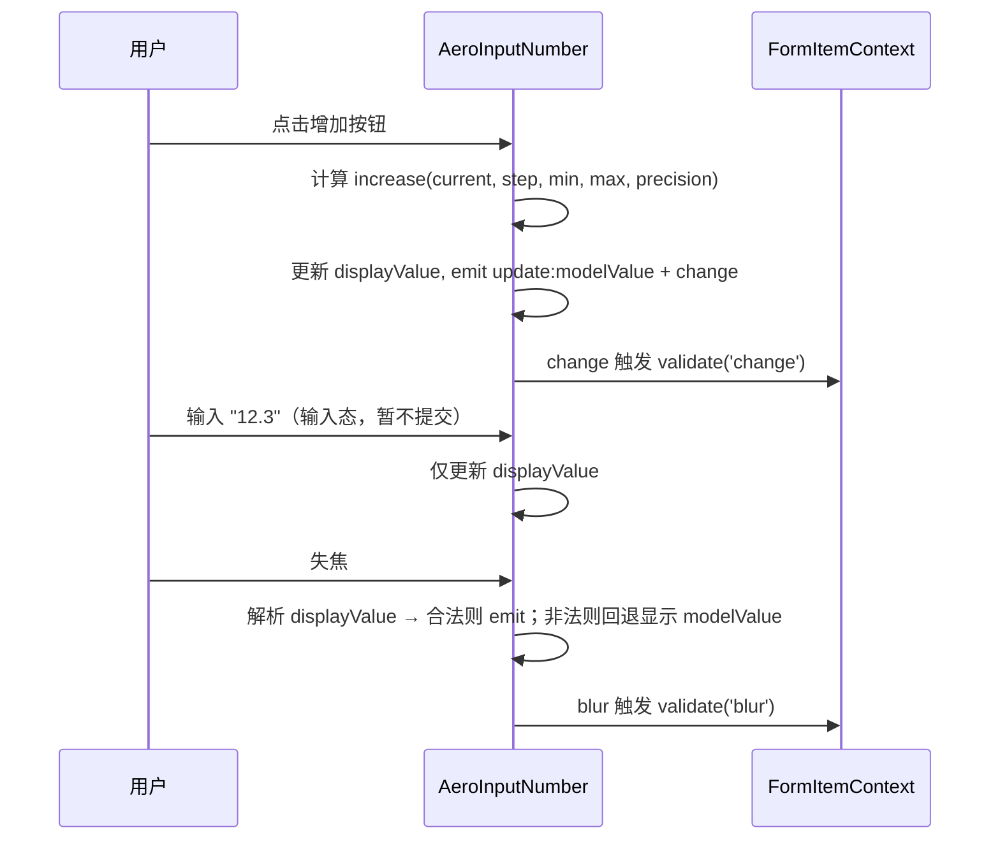

# Design Document

## Overview

本特性为 aero-ui 组件库新增**数字输入框**能力，交付 `AeroInputNumber` 组件，使下游应用能以受控方式录入数值（数量、价格、评分、步进参数等），支持右侧上下步进按钮、步长（`step`）、边界约束（`min`/`max`）、小数精度（`precision`）、严格步进（`step-strictly`）、禁用/尺寸/只读与占位文案。

**Users**：组件库消费者在表单、配置、筛选等场景使用 `aero-input-number` 组织「有数值语义的输入」。

**Impact**：作为又一个真实表单控件，`AeroInputNumber` 复用 `form` spec 已确立的 `formItemContext` 契约（`size`/`disabled` 继承 + blur/change 触发即时校验），与 `AeroInput`/`AeroSelect` 同一路径；数值语义（步进/精度/边界）收敛在本组件内部，不污染 `AeroInput` 的纯文本语义。

### Goals
- 提供 `AeroInputNumber`，API 对齐 element-plus `el-input-number` 核心与边缘能力（`step`/`min`/`max`/`precision`/`step-strictly`/`controls`/`placeholder`/`name`/`readonly`）。
- 右侧上下步进按钮（`controls` 控制显隐），不实现 `controls-position="outer"`。
- 作为表单控件接入 form 上下文，自动继承 `size`/`disabled` 并触发 blur/change 即时校验。
- 样式仅消费语义 `--aero-*` token，BEM 命名，明暗主题自动生效。

### Non-Goals
- `controls-position="outer"`（步进按钮在输入框两侧外侧布局）。
- 字符串/大数高精度值（仅 `number` 类型）。
- 自定义步进按钮模板插槽、远程数值来源。
- 其它表单控件（Checkbox/Radio/Switch）。

## Boundary Commitments

### This Spec Owns
- `AeroInputNumber` 组件的实现、类型、样式与测试。
- 受控数值绑定、步进/边界/精度/严格步进、禁用/尺寸/只读/占位/name 透传的用户可见行为。
- 作为表单控件的上下文消费：`size`/`disabled` 继承 + blur/change 触发字段即时校验。
- `AeroInputNumber` 的公开类型契约（`types.ts`）。
- 组件 barrel 与根 barrel 聚合、`AeroUI` 全局注册、docs-site 中英双语文档。

### Out of Boundary
- `controls-position="outer"` 布局、字符串/大数高精度值、自定义步进模板、远程数值来源 —— 后续 spec。
- 其它表单控件（Checkbox/Radio/Switch）。
- `AeroInput` 的 floating 占位（数字输入保持普通 placeholder，不引入 floating）。

### Allowed Dependencies
- `form`：复用 `useFormSize`/`useFormDisabled`（`packages/components/form/src/use-form.ts`）与 `FormSize` 类型，消费 `formItemContextKey`。
- `theme`：仅消费 `--aero-*` 语义 token。
- 步进三角：CSS 绘制（对齐 `AeroSelect` 的 `.aero-select__arrow` 做法），**不**扩 `AeroIcon` 图标集。

### Revalidation Triggers
- `form` 的 `formItemContext`/`useFormSize`/`useFormDisabled` 契约形状变化。
- `FormSize` 枚举值增删。
- `--aero-*` 语义 token 增删或改名。

## Architecture

### Existing Architecture Analysis

`AeroInput` 与 `AeroSelect` 已确立「表单控件消费 form 上下文」的完整范式，`AeroInputNumber` 严格复用同一路径：
- `inject(formItemContextKey)` 获取字段级上下文；
- `useFormSize(props.size)` / `useFormDisabled(props.disabled)` 解析尺寸与禁用（自身 → 表单项 → 表单 → 默认）；
- blur/change 时调用 `formItemContext?.validate('blur' | 'change')` 触发即时校验。

`AeroInputNumber` 不重造这些能力，直接 import `form` 的 hook，保持依赖方向「控件 → form」与 Input/Select 一致。

### Architecture Pattern & Boundary Map



**Architecture Integration**:
- 选中值受控：`modelValue`（`number`）由父组件驱动；组件内部仅维护**输入态** `displayValue`（字符串），避免输入过程被强制格式化打断（如输入 `-`、`1.`）。
- 数值逻辑：抽为同文件夹内的纯函数模块 `src/number.ts`（clamp / toPrecision / alignStep / increase / decrease），组件不内联算法，便于单测与复用。
- 依赖方向：`input-number` → `form` → `theme`，单向无环。

### Technology Stack

| Layer | Choice / Version | Role in Feature | Notes |
|-------|------------------|-----------------|-------|
| Frontend | Vue 3.4 `<script setup lang="ts">` | 组件实现 | 与既有组件一致 |
| Types | TypeScript strict | 类型契约 | no-any |
| Styles | SCSS + `--aero-*` token | 输入框/步进按钮样式 | BEM |

无新增第三方依赖。

## File Structure Plan

### Directory Structure

```
packages/components/input-number/
├── index.ts                     # 导出 AeroInputNumber（带 install）+ re-export types
├── src/
│   ├── InputNumber.vue          # 触发器（输入框 + 右侧步进按钮）+ 数值状态 + 表单集成
│   └── number.ts                # 纯数值逻辑：clamp/toPrecision/alignStep/increase/decrease
├── style/index.scss             # BEM 类 + --aero-* token
├── types.ts                     # InputNumberProps/InputNumberEmits/InputNumberSize
└── __tests__/
    ├── InputNumber.test.ts      # 组件行为：步进/边界/精度/严格步进/禁用/只读/事件/表单集成
    └── number.test.ts           # 纯函数：clamp/toPrecision/alignStep 边界与精度
```

### Modified Files

- `packages/components/index.ts` — 追加 `export * from './input-number'`。
- `packages/index.ts` — 追加 `AeroInputNumber` 到 `AeroUI.install`。
- `docs/.vitepress/config.mts` — 双语侧边栏新增 input-number 入口。
- `docs/.vitepress/theme/index.ts` — 注册 `AeroInputNumber` 并引入 `input-number/style/index.scss`。
- `docs/zh-CN/components/input-number.md` / `docs/en-US/components/input-number.md` — 新增双语文档。

## System Flows



Key Decisions：步进立即提交并派发 `change`；键盘输入仅在失焦/Enter 时提交（非法回退）；blur 触发 `validate('blur')`、change 触发 `validate('change')`，均作为 fire-and-forget 副作用（不 await，不产生未处理拒绝）。

## Requirements Traceability

| Requirement | Summary | Components | Interfaces | Flows |
|-------------|---------|------------|------------|-------|
| 1.1–1.5 | 组件目录/导出/注册契约 | index.ts、barrel | InputNumberProps/Emits | — |
| 2.1–2.4 | 基础数值绑定 | AeroInputNumber | modelValue、displayValue | 输入/提交流 |
| 3.1–3.5 | 步进按钮与步长 | AeroInputNumber | step、controls | 步进流 |
| 4.1–4.4 | 边界约束 | number.ts、AeroInputNumber | min、max | 步进流 |
| 5.1–5.4 | 精度与严格步进 | number.ts | precision、stepStrictly | 步进/提交流 |
| 6.1–6.3 | 禁用/尺寸/只读 | AeroInputNumber | disabled、size、readonly | — |
| 7.1–7.2 | 占位与 name 透传 | AeroInputNumber | placeholder、name | — |
| 8.1–8.3 | 事件 | AeroInputNumber | update:modelValue/change/focus/blur | 输入/步进流 |
| 9.1–9.5 | 表单上下文集成 | AeroInputNumber | useFormSize/useFormDisabled、validate | 校验流 |
| 10.1–10.5 | 样式与 token | style/index.scss | BEM + `--aero-*` | — |
| 11.1–11.4 | 类型安全与测试 | types.ts、__tests__ | — | — |

## Components and Interfaces

| Component | Domain/Layer | Intent | Req Coverage | Key Dependencies (P0/P1) | Contracts |
|-----------|--------------|--------|--------------|--------------------------|-----------|
| AeroInputNumber | UI/输入控件 | 数字输入框：步进/边界/精度/严格步进 + 表单集成 | 2,3,4,5,6,7,8,9 | form (P0), theme (P1) | State, Event |
| number.ts | 纯逻辑 | 数值计算纯函数：clamp/精度/step 对齐/步进 | 4,5 | — | Service |

### UI / 表单控件层

#### AeroInputNumber

| Field | Detail |
|-------|--------|
| Intent | 数字输入框：受控数值 + 右侧步进按钮 + 数值逻辑 + 表单上下文集成 |
| Requirements | 2.1–2.4, 3.1–3.5, 4.1–4.4, 5.1–5.4, 6.1–6.3, 7.1–7.2, 8.1–8.3, 9.1–9.5 |

**Responsibilities & Constraints**
- 受控组件：值完全由 `props.modelValue` 驱动；单选值类型 `number`。
- 输入态分离：内部维护 `displayValue: string` 承载输入过程临时文本，失焦/Enter 时解析提交，非法（`NaN`/空）则回退显示 `modelValue`。
- 步进：点击增加/减少按钮立即按 `step` 增减并经 `min`/`max` clamp、`precision` 四舍五入，派发 `update:modelValue` + `change`。
- 边界：值到达 `min`/`max` 时对应方向步进按钮进入不可用态。
- 表单集成：`disabled` 显式默认 `undefined`（绕过布尔 prop 强转），经 `useFormDisabled` 折叠；blur/change 触发 `formItemContext?.validate(...)`。

**Dependencies**
- Outbound: `useFormSize`/`useFormDisabled`（form）— size/disabled 继承（P0）
- Outbound: `formItemContextKey`（form）— 触发即时校验（P0）
- Outbound: `number.ts` — 数值计算（P0）

**Contracts**: State [x] / Event [x]

##### State Contract
- `displayValue: string` — 输入框显示文本（输入态与步进后同步）。
- `disabled` / `size` — 由 `useFormSize`/`useFormDisabled` 解析的响应式状态。

##### Event Contract
- `update:modelValue` — 数值变化，载荷 `number | undefined`（清空为 `undefined`）。
- `change` — 数值变化，载荷同上。
- `focus` — 获得焦点，载荷 `FocusEvent`。
- `blur` — 失去焦点，载荷 `FocusEvent`。

**Implementation Notes**
- Integration: 复用 `form` 的 `useFormSize`/`useFormDisabled`，不重造继承逻辑。
- Validation: 步进三角用 CSS 绘制（对齐 `AeroSelect` 的箭头做法），不扩 `AeroIcon` 图标集。
- Risks: 输入态与受控值脱节 → 用 `displayValue` 分离 + 失焦回退，确保非法输入不污染 `modelValue`。

### 纯逻辑层

#### number.ts

| Field | Detail |
|-------|--------|
| Intent | 数值计算纯函数，供组件步进与提交逻辑复用 |
| Requirements | 4.2–4.4, 5.2, 5.4 |

**Responsibilities & Constraints**
- 纯函数、无副作用、无 Vue 依赖，可独立单测。

**Dependencies**
- Inbound: AeroInputNumber — 步进/提交时调用（P0）

**Contracts**: Service [x]

##### Service Interface
```typescript
interface NumberMath {
  clamp(value: number, min: number, max: number): number;
  toPrecision(value: number, precision?: number): number;
  alignStep(value: number, step: number): number;
  increase(value: number | undefined, step: number, min: number, max: number, precision?: number): number;
  decrease(value: number | undefined, step: number, min: number, max: number, precision?: number): number;
}
```
- Preconditions: `step > 0`；`min <= max`。
- Postconditions: 返回值始终落在 `[min, max]`，且（若设 `precision`）保留指定小数位。
- Invariants: `clamp(toPrecision(x))` 与 `toPrecision(clamp(x))` 结果一致。

## Data Models

### Domain Model

- **数值（value）**：`number` 类型。`undefined` 表示空值（清空态）。
- **步进计算**：`increase`/`decrease` 以当前值（空则 `min` 若 `min > -Infinity` 否则 `0`）为基准按 `step` 增减，经 `clamp` + `toPrecision` 归一。
- **严格步进**：`stepStrictly` 时，用户输入值经 `alignStep` 对齐到最近 `step` 倍数。

### 公开类型契约

```typescript
// types.ts（JSDoc @default 齐全，no-any）
export type InputNumberSize = 'large' | 'main' | 'small';

export interface InputNumberProps {
  modelValue?: number;
  step?: number;            // @default 1
  min?: number;             // @default -Infinity
  max?: number;             // @default Infinity
  precision?: number;       // @default undefined
  stepStrictly?: boolean;   // @default false
  controls?: boolean;       // @default true
  disabled?: boolean;       // @default undefined（区分未声明/声明 false）
  size?: InputNumberSize;   // 复用 FormSize 同值语义
  readonly?: boolean;       // @default false
  placeholder?: string;
  name?: string;
}

export interface InputNumberEmits {
  (e: 'update:modelValue', value: number | undefined): void;
  (e: 'change', value: number | undefined): void;
  (e: 'focus', event: FocusEvent): void;
  (e: 'blur', event: FocusEvent): void;
}
```

## Error Handling

### Error Strategy
- 本组件无服务端/异常分支；错误态来自表单校验（由 `formItemContext.validate` 更新字段 `validateState`/`validateMessage`，由 `AeroFormItem` 展示），组件自身不渲染错误消息，只负责触发校验。
- 非法输入（非数值/空）：失焦时回退显示 `modelValue`，不派发 `update:modelValue`，不污染受控值。
- 表单上下文缺失时，`inject` 返回 `undefined`，组件安全降级为独立控件（不报错）。

### Error Categories and Responses
- **用户输入类**：非数值字符不录入（requirement 2.4）；输入态非法文本失焦回退（不抛错）。
- **降级类**：`formItemContext`/`formContext` 缺失 → 静默跳过校验，`size`/`disabled` 回退默认。

## Testing Strategy

### Unit Tests（InputNumber.test.ts / number.test.ts）
- 基础绑定：受控值同步到输入框；空值展示空输入框；非数值字符不录入。
- 步进：点击增加/减少按 `step` 增减；空值以 `min`（或 0）为起点；`controls=false` 不显示按钮。
- 边界：步进/输入越界被 clamp 到 `min`/`max`；到达边界对应步进按钮禁用。
- 精度与严格步进：`precision` 四舍五入；`stepStrictly` 对齐 step 倍数。
- 禁用/只读：`disabled` 不可输入且按钮不可用；`readonly` 禁键盘输入但可步进。
- 事件：数值变化派发 `update:modelValue`/`change`；聚焦/失焦派发 `focus`/`blur`。
- 表单集成：在 `AeroForm`/`AeroFormItem` 内继承 `size`/`disabled`（自身→表单项→表单优先级），blur/change 触发字段校验。
- 纯函数：`clamp`/`toPrecision`/`alignStep` 的边界与精度断言。

### Integration Tests
- 置于 `AeroForm` + `AeroFormItem`（含 `prop` + `rules`）内，步进改变值触发字段级即时校验，校验失败时 `AeroFormItem` 展示错误。

### E2E / 文档验证
- `pnpm docs:build` 成功，中英双语 input-number 页面可访问，内嵌示例渲染正常。
