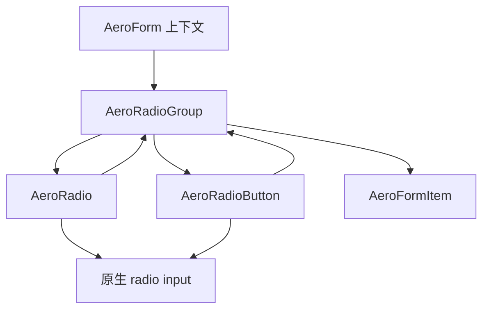
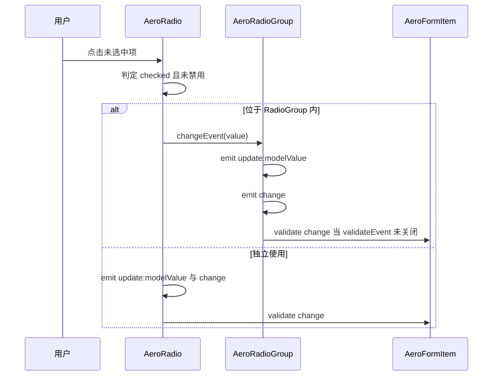

# Design Document: radio

## Overview

本特性为 aero-ui 组件库新增「单选」能力，交付 `AeroRadio`（圆点样式）、`AeroRadioGroup`（分组容器）、`AeroRadioButton`（按钮样式）三个组件，完整对齐 element-plus radio 家族 API。组件消费既有 form 上下文契约（size/disabled 继承、change 触发校验），支持圆点 / 按钮两种视觉样式、原生键盘导航与屏幕阅读器语义，并配套中英双语文档与按需导入。

**用户**：使用 aero-ui 构建 Vue 3 应用的企业开发者，在性别、支付方式、可见范围等互斥选择场景使用本组件。
**影响**：在现有 form / select / input-number / date-picker 表单能力之上，补齐单选这一基础控件，复用而非修改既有契约。

### Goals
- 三个组件完整覆盖 element-plus radio 家族的 API 语义（v-model / value / label / size / disabled / border / name / fill / textColor / validateEvent / change）
- 与 select 的「容器 + 子项」分组模式同构，父子通过 context 解耦
- 无缝接入 form 上下文：size/disabled 继承、change 触发校验、脱离表单安全使用
- 通过透明原生 `<input type="radio">` 提供键盘导航与屏幕阅读器支持

### Non-Goals
- 不实现 checkbox / switch 等其它选择控件
- 不实现多选、级联、自定义渲染插槽之外的高级定制
- 不修改或扩展 form 上下文契约本身
- 不新增 i18n 词典项（radio 无可翻译的用户可见文案）
- 不修改 AeroResolver 的子组件别名映射（见 Boundary Commitments）

## Boundary Commitments

### This Spec Owns
- `AeroRadio` / `AeroRadioGroup` / `AeroRadioButton` 三组件的渲染、值绑定与互斥分组行为
- `RadioValue` / `RadioSize` 等类型契约（`types.ts`），以及父子间 `radioGroupContextKey` 上下文契约（`src/constants.ts`）
- 分组状态（modelValue / size / disabled / name / fill / textColor）的聚合与下发
- 值与选中态的判定规则：`checked = (context.modelValue ?? props.modelValue) === (props.value ?? props.label)`

### Out of Boundary
- form 上下文契约（`formContextKey` / `formItemContextKey` / `useFormSize` / `useFormDisabled`）—— 仅消费，不修改
- AeroResolver 对子组件的别名映射：自动 kebab 映射会把 `AeroRadioGroup` → `radio-group`、`AeroRadioButton` → `radio-button`（非真实目录），与 `AeroOption` → `option` 同属既有限制，属 resolver 职责，不在本 spec 内解决
- 语义 token 与明暗主题映射 —— 仅消费 `--aero-*`，不新增 token

### Allowed Dependencies
- `packages/components/form` —— 注入 form / form-item 上下文，调用 `useFormSize` / `useFormDisabled` 与 `validate('change')`
- `packages/theme` —— 消费语义 `--aero-*` token（边框、背景、主色、文字、圆角、间距、禁用透明度）
- 现有组件导出契约 —— 手写 `install`、`Aero` 前缀、`types.ts` 导出

### Revalidation Triggers
- `RadioValue` / `RadioSize` 类型或上下文契约形态变化
- 导出契约中 `AeroRadioGroup` / `AeroRadioButton` 命名变化（resolver、root barrel、docs 依赖）
- form 上下文契约升级（若 `useFormSize` / `validate` 签名变化，radio 需同步）
- 若未来要求子组件支持真正的按需自动导入，需扩展 AeroResolver 增加别名映射表，届时 radio 不得变更既有导出命名

## Architecture

### Existing Architecture Analysis

- 组件目录契约：`packages/components/{name}/` 内含 `index.ts`（导出 + install）、`types.ts`、`src/*.vue`、`style/index.scss`、`__tests__/`。
- 分组先例：`AeroSelect` 通过 `provide(selectContextKey)` 下发注册/注销方法，`AeroOption` 注入并注册自身数据；radio 沿用「容器 provide context + 子项 inject」的解耦模式，但子项自行渲染（不同于 select 由容器统一渲染下拉面板）。
- 表单接入先例：所有表单控件用 `useFormSize(props.size)` + `useFormDisabled(props.disabled)`（disabled 在 `withDefaults` 中显式 `undefined` 绕过布尔强转），值变化处 fire-and-forget 调 `formItemContext?.validate('change')`。
- 多组件导出先例：`select/index.ts` 同时导出 `AeroSelect` 与 `AeroOption`，radio 导出三个组件。

### Architecture Pattern & Boundary Map



- **Selected pattern**: 容器-子项 context 分组（与 select 同构）；子项自行渲染、容器聚合状态。
- **Domain/feature boundaries**: `RadioGroup` 唯一负责分组状态聚合与下发、change 派发、表单校验触发；`Radio` / `RadioButton` 只负责自身视觉渲染、值/选中判定、点击派发，不直接读写分组状态。
- **Existing patterns preserved**: 组件目录契约、手写 install、`types.ts` 导出、`useFormSize`/`useFormDisabled` 接入模式、BEM + 语义 token。
- **New components rationale**: `types.ts` 唯一定义 `RadioValue` / `RadioSize` 等公共类型，`constants.ts` 承载 `RadioGroupContext` 契约并导入这些类型，避免 Vue 文件间循环依赖；`RadioButton` 与 `Radio` 共享选项基础契约（Generalization，见 research.md），各自独立实现选中判定规则。
- **Steering compliance**: 仅 `<script setup lang="ts">` + `defineProps<T>()`；类型落 `types.ts`；仅语义 `--aero-*` token；明暗由根类切换。

### Technology Stack

| Layer | Choice / Version | Role in Feature | Notes |
|-------|------------------|-----------------|-------|
| Frontend | Vue 3.4 + `<script setup lang="ts">` | 三组件实现 | 无新增依赖 |
| Types | TypeScript strict | Props/Emits/上下文契约 | 禁用 `any`；`RadioValue` 联合类型 |
| Styles | SCSS + `--aero-*` token | 圆点/按钮样式、size/checked/disabled 修饰符 | BEM：`.aero-radio` 等 |
| Testing | vitest + @vue/test-utils | 组件与 form 集成测试 | 复用 `form/__tests__` 的 context 模拟模式 |

无新增运行时依赖；原生 `<input type="radio">` 承担键盘与 a11y，不引入第三方。

## File Structure Plan

### Directory Structure

```
packages/components/radio/
├── index.ts                    # 导出 AeroRadio/AeroRadioGroup/AeroRadioButton（各带 install）+ re-export types
├── types.ts                    # RadioValue/RadioSize/BaseRadioOptionProps/RadioProps/RadioGroupProps/RadioButtonProps + Emits
├── src/
│   ├── constants.ts            # RadioGroupContext 接口 + radioGroupContextKey（RadioValue/RadioSize 复用 types.ts）
│   ├── RadioGroup.vue          # 分组容器：provide 上下文、聚合状态、change 派发、表单校验
│   ├── Radio.vue               # 圆点单选：视觉 + 透明原生 input + 选中/点击逻辑
│   └── RadioButton.vue         # 按钮单选：按钮外观 + fill/textColor 激活态（独立实现与 Radio 相同的选中判定规则）
├── style/index.scss            # .aero-radio / .aero-radio-group / .aero-radio-button + 状态/尺寸修饰符
└── __tests__/
    ├── Radio.test.ts           # 单选项行为
    ├── RadioGroup.test.ts      # 分组互斥/值绑定/校验
    └── RadioButton.test.ts     # 按钮样式与激活态
```

### Modified Files

- `packages/components/index.ts` — 追加 `export * from './radio'`（barrel 登记）
- `packages/index.ts` — import 三组件并在 `AeroUI.install` 中 `app.use(...)`（root 全局安装）
- `docs/.vitepress/theme/index.ts` — import `AeroRadio, { AeroRadioGroup, AeroRadioButton }`、注册 `app.use(...)`、追加 `aero-ui/components/radio/style/index.scss`
- `docs/.vitepress/config.mts` — zh-CN / en-US 两处 sidebar items 各追加 `{ text: 'Radio 单选框', link: '/zh-CN/components/radio' }` 与英文条目
- `docs/zh-CN/components/radio.md` — 新增（中文文档，基础用法 / 禁用 / 尺寸 / 边框 / 按钮样式 / 表单集成）
- `docs/en-US/components/radio.md` — 新增（英文镜像）

> AeroResolver 无需改动：`AeroRadio` 自动映射到 `aero-ui/components/radio`；子组件映射限制见 Boundary Commitments。

## System Flows

用户点击某个单选选项时的事件流：



- 已选中项被点击时，不改变绑定值、不触发 change（1.4）。
- `validate('change')` 仅在 `validateEvent !== false` 且组件位于 AeroFormItem 内时触发（2.8 / 4.2）。

## Requirements Traceability

| Requirement | Summary | Components | Interfaces | Flows |
|-------------|---------|------------|------------|-------|
| 1.1–1.8 | 圆点渲染、选中/取消、disabled/border/size/name | AeroRadio | RadioProps/Emits | 点击流 |
| 1.9 | value/label 兼容语义 | AeroRadio + constants | BaseRadioOptionProps | — |
| 2.1–2.3 | 互斥分组、值绑定、change | AeroRadioGroup | RadioGroupProps/Emits + RadioGroupContext | 点击流 |
| 2.4–2.7 | size/disabled/name/fill/textColor 下发 | AeroRadioGroup | RadioGroupContext | — |
| 2.8 | validateEvent 控制校验 | AeroRadioGroup | RadioGroupProps | 点击流 |
| 3.1–3.4 | 按钮外观、fill/textColor 激活态、disabled | AeroRadioButton | RadioButtonProps | 点击流 |
| 3.5 | 脱离 group 独立可用 | AeroRadioButton | RadioButtonProps.modelValue | 点击流 |
| 4.1–4.2 | 表单 size/disabled 继承、change 校验 | AeroRadioGroup | useFormSize/useFormDisabled + validate | 点击流 |
| 4.3 | 脱离表单不抛错 | 三组件 | inject 安全回退 | — |
| 5.1–5.3 | 原生 radio 语义、方向键/空格键 | AeroRadio + AeroRadioButton | 原生 input + name | — |

## Components and Interfaces

| Component | Layer | Intent | Req Coverage | Key Dependencies (P0/P1) | Contracts |
|-----------|-------|--------|--------------|--------------------------|-----------|
| AeroRadioGroup | UI 容器 | 分组状态聚合、值绑定、change 派发、校验触发 | 2, 4 | form context (P0), constants (P0) | State |
| AeroRadio | UI | 圆点单选渲染与点击 | 1, 5 | constants (P0), form context (P1) | Event |
| AeroRadioButton | UI | 按钮单选渲染与点击 | 3, 5 | constants (P0) | — |
| constants.ts | 契约 | 上下文契约（RadioValue 由 types.ts 定义） | 2 | — | State |

### 单选子项（Radio / RadioButton）

#### BaseRadioOptionProps（共享契约）

```typescript
export type RadioValue = string | number | boolean;
export type RadioSize = 'large' | 'main' | 'small';

/** Radio 与 RadioButton 共享的选项基础契约 */
export interface BaseRadioOptionProps {
  value?: RadioValue;      // 选项值，缺省回退 label
  label?: RadioValue;      // @deprecated 兼容别名，语义同 value
  disabled?: boolean;      // @default false
  name?: string;           // 原生 name，分组键盘导航
}
```

**Responsibilities & Constraints**
- 值解析规则：`optionValue = props.value ?? props.label`
- 选中判定规则：`checked = (groupContext?.modelValue ?? props.modelValue) === optionValue`
- 点击（未禁用且未选中）时，在 group 内调 `groupContext.changeEvent(optionValue)`，独立时自 emit `update:modelValue` + `change` 并 fire-and-forget `formItemContext?.validate('change')`

**Dependencies**
- Inbound: AeroRadioGroup — 提供上下文 (P0)
- Outbound: form context — size/disabled 继承与校验 (P1)
- External: 原生 `<input type="radio">` — 键盘与 a11y (P0)

**Contracts**: Event [x]

##### Event Contract
- Published: `update:modelValue`（独立使用）、`change`（新值）

**Implementation Notes**
- Integration: 透明原生 input 覆盖于视觉层之上，视觉层绘制圆点/按钮；`name` 透传给原生 input
- Validation: `disabled` 用 `withDefaults` 显式 `undefined`；继承 group 的 disabled 时子项自身 disabled 优先
- Risks: value 与 label 皆缺省时按 `undefined` 值处理（与 select Option 同策略）

### 分组容器

#### AeroRadioGroup

| Field | Detail |
|-------|--------|
| Intent | 分组状态聚合与下发、change 派发、表单校验 |
| Requirements | 2.1–2.8, 4.1–4.2 |

**Responsibilities & Constraints**
- `provide(radioGroupContextKey, reactive({...}))` 下发 modelValue / size / disabled / name / fill / textColor / changeEvent
- size 经 `useFormSize(props.size)` 解析（子项自身 size 优先），disabled 经 `useFormDisabled(props.disabled)` 解析
- `changeEvent(value)`：emit `update:modelValue`；值变化时 emit `change`；`validateEvent !== false` 时调 `formItemContext?.validate('change')`

**Dependencies**
- Inbound: AeroRadio / AeroRadioButton — 消费上下文 (P0)
- Outbound: form context — size/disabled/validate (P0)

**Contracts**: State [x]

##### State Management
- State model: `RadioGroupContext`（见下）
- Persistence: 无，纯组件内存态
- Concurrency: 单线程事件派发，无并发问题

```typescript
export interface RadioGroupContext {
  modelValue: RadioValue | undefined;
  size: RadioSize;              // 已解析
  disabled: boolean;            // 已解析
  name: string | undefined;
  fill: string | undefined;
  textColor: string | undefined;
  changeEvent: (value: RadioValue) => void;
}
export const radioGroupContextKey: InjectionKey<RadioGroupContext> =
  Symbol('radioGroupContextKey');
```

**Implementation Notes**
- Integration: 容器不渲染子项，仅包一层承载子项插槽并 provide 上下文
- Validation: `validateEvent` 默认 true
- Risks: 子项动态增删无需注册表（子项不参与容器渲染），故 context 不设 addOption/removeOption，区别于 select

## Data Models

无持久化数据模型。唯一数据契约为 `RadioValue`（string | number | boolean）与上下文快照，已在 Components 中定义。

## Error Handling

### Error Strategy
radio 无可失败操作、无用户可见错误文案。仅需保证两处退化安全：

- **脱离表单**：`inject(formContextKey/formItemContextKey, undefined)` 安全回退，组件正常渲染不抛错（4.3）
- **值缺失**：`value` / `label` 皆缺省时按 `undefined` 值参与比较，不产生运行时异常（与 select Option 同策略）

## Testing Strategy

### Unit Tests（组件行为，映射验收标准）
1. `Radio.test.ts` — 选中态随绑定值切换（1.2）；点击未选中项 emit update:modelValue + change（1.3）；点击已选中项不变化（1.4）；disabled 不响应点击（1.5）；border/size/name 生效（1.6–1.8）
2. `RadioGroup.test.ts` — 组内唯一选中（2.1–2.2）；选择更新 modelValue 并 emit change（2.3）；size/disabled/name 下发子项（2.4–2.6）；fill/textColor 下发（2.7）；validateEvent=false 不触发校验（2.8）
3. `RadioButton.test.ts` — 按钮外观与 fill/textColor 激活态（3.1–3.3）；disabled（3.4）；脱离 group 独立可用（3.5）

### Integration Tests（form 上下文，映射 4.x）
4. 在测试内 `provide(formContextKey/formItemContextKey)` 模拟上下文，断言 size/disabled 继承（4.1）
5. 模拟 formItemContext 的 `validate` spy，断言值变化触发 `validate('change')`（4.2）；无表单上下文时不抛错（4.3）

### A11y / DOM 断言（映射 5.x）
6. 断言渲染原生 `<input type="radio">` 且 `name` 一致（5.1）；键盘方向键 / 空格键由原生语义承载（5.2–5.3，验证 name 分组与 tabindex 透传）
