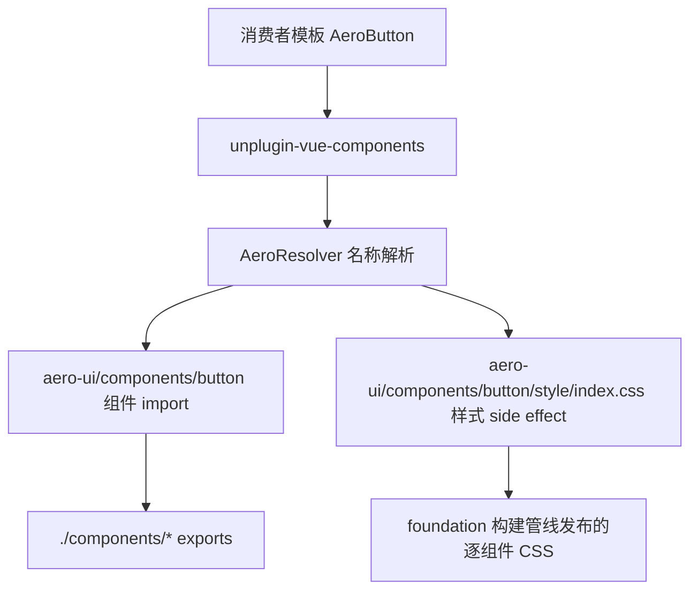

# Design Document

## Overview

**Purpose**: 本特性为 `aero-ui` 重建按需导入能力：实现 `AeroResolver`（`unplugin-vue-components` 的 resolver），使消费者在模板中直接书写 `<AeroButton />` 而无需手动注册，由 resolver 将 `<AeroXxx />` 映射到 `aero-ui/components/x` 并按需附带组件样式，同时提供 `aero-ui/resolver` 子路径导出。

**Users**: 下游消费者（在 Vite/Webpack 中配置 `unplugin-vue-components` 的 `resolvers: [AeroResolver()]`，从而以按需方式使用组件）与组件库维护者（维护 resolver 与组件导出契约的一致性）。

**Impact**: 将当前「无 resolver、消费者需手动导入并注册组件与样式」的现状，改造为「在模板中书写 `AeroXxx` 即自动导入组件 + 按需样式」的按需导入体验。

### Goals
- 实现 `AeroResolver`：名称 → 路径 → 样式 的确定性解析（`AeroXxx` → `aero-ui/components/x` + 逐组件样式 side effect）。
- 提供 `aero-ui/resolver` 子路径导出，对齐 foundation exports 映射 `./resolver`。
- 无缝对接 `unplugin-vue-components`，`Components({ resolvers: [AeroResolver()] })` 即可用。
- 提供 resolver 单元测试，覆盖名称映射、样式路径与未知名称跳过。

### Non-Goals
- 不实现任何新组件或组件样式内容（属 core-components / theme）。
- 不修改 foundation 的构建管线与 exports 映射（本 spec 仅消费契约，必要时通过 Revalidation Triggers 提示重查）。
- 不实现全量样式兜底入口或文档站、`AI_CONTEXT.md`。

## Boundary Commitments

### This Spec Owns
- `packages/resolver/` 的完整实现（`index.ts` / `src/resolver.ts` / `types.ts` / `__tests__/`）。
- `AeroResolver` 的公开签名与解析契约（`AeroXxx → { name, from, sideEffects }`）。
- 名称映射规则（`Aero` 前缀剥离 + PascalCase→kebab-case）与样式 side effect 路径契约。
- `aero-ui/resolver` 子路径导出的对齐（`index.ts` 为入口）。

### Out of Boundary
- 任何新组件、组件样式内容（BEM 类、`--aero-*` 消费）。
- 主题 token、i18n、`AI_CONTEXT.md` 与文档站。
- 构建管线修改（`vite.config.ts` / `package.json` 属 foundation）；逐组件样式 CSS（`aero-ui/components/{x}/style/index.css`）由 foundation 构建管线产出——foundation 负责将 `packages/components/*/style/index.scss` 编译为 `dist/**/components/*/style/index.css`（Vite library mode `cssCodeSplit: true`），并在 exports 中暴露 `./components/*/style/*` 深路径。resolver 是纯消费者，只声明其消费路径契约，不负责产出 CSS。

### Allowed Dependencies
- `unplugin-vue-components` —— 仅类型级依赖（`ComponentResolver` / `ComponentResolveResult`），不引入运行时依赖。
- foundation 的 exports 映射 `./components/*`、`./resolver` —— 作为 `from` 与子路径解析目标。
- core-components 的组件导出契约 —— 作为名称 → 路径映射的依据（概念契约，非代码 import）。
- 约束：resolver 不得 import 任何组件源码或样式源码；不得反向依赖组件内部实现。

### Revalidation Triggers
- 组件导出契约变化（`packages/components/*/index.ts` 的 `install` 形态、组件文件夹命名、导出符号集合）。
- 组件前缀或命名约定变化（`Aero` 前缀、PascalCase→kebab-case 规则）。
- exports 映射 `./components/*` / `./resolver` 的解析目标或产物目录命名变化。
- 依赖 foundation 的 `./components/*/style/*` exports + `cssCodeSplit` 契约（该 CSS 由 foundation 构建管线产出），若该契约变化需重查 resolver。
- `unplugin-vue-components` 的 resolver 接口形态变化。

## Architecture

### Existing Architecture Analysis
上游已就绪：foundation 已建立 `./components/*`、`./components/*/style/*`、`./resolver` exports 与 `aero-ui/*` 别名，并由其构建管线（Vite library mode `cssCodeSplit: true`）将 `packages/components/*/style/index.scss` 编译为 `dist/**/components/*/style/index.css`；core-components 已确立「一个组件一个文件夹」与 `index.ts` 导出带 `install` 的 `AeroXxx` 契约。当前仓库无 `packages/resolver/`（上一版已清空）。本设计在既有契约之上新建薄消费者层，不修改任何上游机制，仅消费其契约。

### Architecture Pattern & Boundary Map



**Architecture Integration**:
- 选定模式：薄消费者层 resolver —— 纯配置工厂，不 import 组件源码，仅依据组件导出契约生成 `{ name, from, sideEffects }`。
- 依赖方向（单向）：`resolver → 组件导出契约（概念）+ exports 映射（./components/*、./resolver）`；resolver 不反向依赖组件/样式实现。
- 既有模式保留：`Aero` 前缀、`aero-ui/components/{kebab}` 子路径、`unplugin-vue-components` 按需导入。
- 新组件必要性：无运行时组件，仅新增 resolver 工厂与类型/测试。
- Steering 合规：严格遵守 `structure.md`（`packages/resolver/`）与 `tech.md`（`unplugin-vue-components` 按需导入、strict 无 `any`）。

### Technology Stack

| Layer | Choice / Version | Role in Feature | Notes |
|-------|------------------|-----------------|-------|
| 语言 | TypeScript ~5.4（strict） | resolver 类型契约 | 无 `any`，类型自 `types.ts` 导出 |
| 依赖 | `unplugin-vue-components` | resolver 接口类型 | 类型级依赖（peer/optional + dev），不打包运行时 |
| 解析 | 字符串转换（前缀剥离 + kebab-case） | 名称 → 路径 → 样式 | 纯函数，无外部运行时 |
| 测试 | Vitest | resolver 单测 | 共置 `__tests__/` |

## File Structure Plan

### Directory Structure

```
packages/resolver/
├── index.ts              # 导出 AeroResolver + 再导出 ResolverOptions（对齐 ./resolver → dist/es/resolver/index.mjs）
├── src/resolver.ts       # AeroResolver 工厂：名称→路径→样式解析逻辑 + kebab-case 工具
├── types.ts              # ResolverOptions 公开类型（JSDoc @default）
└── __tests__/resolver.test.ts  # 名称映射 / 样式路径 / 未知名称跳过 单元测试
```

### Modified Files
- 无既有文件被修改，全部为新建。`vite.config.ts` / `package.json` / `packages/components/**` / `packages/theme/**` 不修改。

### 文件职责说明
- `index.ts` —— 从 `src/resolver.ts` 导出 `AeroResolver`，并再导出 `types.ts` 类型（`export * from './types'`），作为 `aero-ui/resolver` 子路径入口。
- `src/resolver.ts` —— 实现 `AeroResolver(options?)` 工厂，返回 `ComponentResolver[]`；内含 `kebabCase` 工具与 `resolve(name)` 逻辑。
- `types.ts` —— 定义 `ResolverOptions`（`importStyle?: boolean`，默认 `true`）。
- `__tests__/resolver.test.ts` —— 覆盖解析契约的单元测试。

## System Flows

resolver 为纯同步解析函数，无多步骤业务流程，故省略本节。关键行为已由「`Aero` 前缀判定 → 前缀剥离 → kebab-case → 组装 `{ name, from, sideEffects }`」这一确定性子流程表达。

## Requirements Traceability

| Requirement | Summary | Components / 文件 | 契约 |
|-------------|---------|-------------------|------|
| 1.1–1.4 | 名称解析 | `src/resolver.ts`（`resolve`） | 解析契约 |
| 2.1–2.3 | 按需样式 | `src/resolver.ts`（sideEffects）+ `types.ts`（importStyle） | 样式契约 |
| 3.1–3.2 | 子路径导出 | `index.ts`（对齐 `./resolver`） | 导出契约 |
| 4.1–4.3 | unplugin 对接 | `src/resolver.ts`（`ComponentResolver[]`） | 接口契约 |
| 5.1–5.4 | 边界与约束 | 全部文件（范围界定） | 边界契约 |

## Components and Interfaces

| Component | Domain/Layer | Intent | Req Coverage | Key Dependencies | Contracts |
|-----------|--------------|--------|--------------|------------------|-----------|
| AeroResolver | 按需导入 | 名称 → 路径 → 样式解析 | 1.1–1.4, 2.1–2.3, 4.1–4.3 | unplugin-vue-components（类型，P2）、组件导出契约（概念） | Service |
| ResolverOptions | 类型 | 样式导入开关配置 | 2.3 | 无 | API |
| index 入口 | 导出 | `aero-ui/resolver` 子路径入口 | 3.1–3.2 | `./resolver` exports | Service |

### 按需导入层

#### AeroResolver（`packages/resolver/src/resolver.ts`）

| Field | Detail |
|-------|--------|
| Intent | 将 `<AeroXxx />` 映射到 `aero-ui/components/x` 并按需附带样式 |
| Requirements | 1.1, 1.2, 1.3, 1.4, 2.1, 2.2, 2.3, 4.1, 4.3 |

**Responsibilities & Constraints**
- 识别 `Aero` 前缀组件（正则 `/^Aero[A-Z]/`），剥离前缀得到原始名，转为 kebab-case 文件夹名。
- 组装 `{ name, from, sideEffects? }`，`from` 为 `aero-ui/components/{dir}`，`sideEffects` 为 `aero-ui/components/{dir}/style/index.css`（`importStyle` 关闭时不生成）。
- 非 `Aero` 前缀组件返回 `undefined`，交由其它 resolver / 插件默认行为。
- 纯函数、无运行时依赖；不 import 任何组件源码。

**Dependencies**
- Outbound: 无（仅消费概念契约与 exports 映射）。
- External: `unplugin-vue-components` —— 类型定义（P2，类型级）。

**Contracts**: Service [x]

##### Service Interface
```typescript
import type { ComponentResolver, ComponentResolveResult } from 'unplugin-vue-components'

export function AeroResolver(options?: ResolverOptions): ComponentResolver[]

// resolve(name) 返回：
interface Resolved {
  name: string        // 原组件名，如 'AeroButton'
  from: string        // 'aero-ui/components/button'
  sideEffects?: string // 'aero-ui/components/button/style/index.css'
}
```
- Preconditions: 组件导出契约与 `./components/*`、`./resolver` exports 已就绪。
- Postconditions: `AeroResolver()` 返回值可被 `Components({ resolvers: [...] })` 直接使用；`AeroButton` 解析为 `from: aero-ui/components/button` + 样式 side effect。
- Invariants: `from` 恒为 `aero-ui/components/{kebab}`；样式 side effect 路径与 `from` 同根且一一对应；`importStyle: false` 时不产出 `sideEffects`。

**Implementation Notes**
- Integration: 通过 `index.ts` 导出供 `aero-ui/resolver` 消费；kebab-case 采用「小写字母/数字后跟大写」与「连续大写后跟小写」插入连字符的规则。
- Validation: 单测覆盖 `AeroButton` → `button`、`AeroDatePicker` → `date-picker`、`RouterView`/`Aerospace` 跳过、`importStyle: false` 无 side effect。
- Risks: 逐组件样式 CSS 依赖 foundation 的 `./components/*/style/*` exports + `cssCodeSplit` 契约（该 CSS 由 foundation 构建管线产出，resolver 只消费、不产出），若该契约变化需重查 resolver。

### 类型层

#### ResolverOptions（`packages/resolver/types.ts`）

| Field | Detail |
|-------|--------|
| Intent | 提供 resolver 配置项 |
| Requirements | 2.3 |

**Contracts**: API [x]

##### API Contract
```typescript
export interface ResolverOptions {
  /** 是否按需引入组件样式，默认 true */
  importStyle?: boolean
}
```
- Preconditions: 无。
- Postconditions: 传入 `{ importStyle: false }` 时解析结果不含样式 side effect。
- Invariants: 默认 `true`。

### 导出层

#### index 入口（`packages/resolver/index.ts`）

| Field | Detail |
|-------|--------|
| Intent | 作为 `aero-ui/resolver` 子路径入口 |
| Requirements | 3.1, 3.2 |

**Contracts**: Service [x]

##### Service Interface
```typescript
export { AeroResolver } from './src/resolver'
export * from './types'
```
- Preconditions: `src/resolver.ts`、`types.ts` 存在且可解析。
- Postconditions: `import { AeroResolver } from 'aero-ui/resolver'` 可解析，对应 `dist/types/resolver/index.d.ts` / `dist/es/resolver/index.mjs` / `dist/lib/resolver/index.cjs`。
- Invariants: `index.ts` 是 `./resolver` 的唯一入口。

## Error Handling

### Error Strategy
resolver 为纯同步解析函数，无运行时异常路径。错误处理聚焦「未知前缀的安全跳过」与「类型防错」：非 `Aero` 前缀组件返回 `undefined` 不抛错（需求 1.3）；不存在的 `AeroXxx` 生成的 import 会在构建期报出明确的「模块未找到」错误（可诊断）；非法配置在编译期由 `ResolverOptions` 类型约束拒绝。

### Error Categories and Responses
- **未知前缀组件**：返回 `undefined`，交由其它 resolver / 插件处理，不抛错。
- **不存在的 Aero 组件**：生成指向缺失路径的 import，构建期报模块解析错误（清晰可诊断）。
- **非法配置值**：`ResolverOptions` 布尔类型在编译期约束，无需运行时兜底。

### Monitoring
无运行时监控需求；质量以 `pnpm typecheck`、`pnpm test`、`pnpm build`（含 `resolver` 子路径产物）通过为信号。

## Testing Strategy

测试重点落在「名称映射正确、样式路径正确、未知名称安全跳过」的单元验证，逐条对应验收标准。

### 单元测试
- **名称映射（对应 1.1、1.2）**：断言 `AeroButton` → `from: aero-ui/components/button`、`AeroDatePicker` → `from: aero-ui/components/date-picker`（kebab-case）。
- **未知名称跳过（对应 1.3）**：断言 `RouterView`、`ElButton`、`Aerospace` 返回 `undefined` / 空结果。
- **样式 side effect（对应 2.1、2.2）**：断言 `AeroButton` 解析结果含 `sideEffects: aero-ui/components/button/style/index.css`。
- **importStyle 关闭（对应 2.3）**：断言 `AeroResolver({ importStyle: false })` 解析结果不含 `sideEffects`。
- **返回值形态（对应 4.1）**：断言 `AeroResolver()` 返回 `ComponentResolver[]`，含 `type: 'component'` 与 `resolve` 函数。

### 集成 / 构建验证
- **子路径导出（对应 3.1、3.2）**：执行 `pnpm build` 后断言 `dist/es/resolver/index.mjs`、`dist/lib/resolver/index.cjs`、`dist/types/resolver/index.d.ts` 存在，且 `aero-ui/resolver` 可解析。
- **边界校验（对应 5.1、5.2、5.3、4.3）**：断言工作树仅含 resolver、未 import 组件/样式源码、类型无 `any`、产物不含 `unplugin-vue-components` 运行时代码。

## Supporting References
- 组件导出契约，见 `.kiro/specs/core-components/design.md`。
- `./components/*`、`./resolver` exports 映射，见 `.kiro/specs/foundation/design.md`「导出映射」。
- resolver 接口与 kebab-case 权衡，见 `research.md`。
