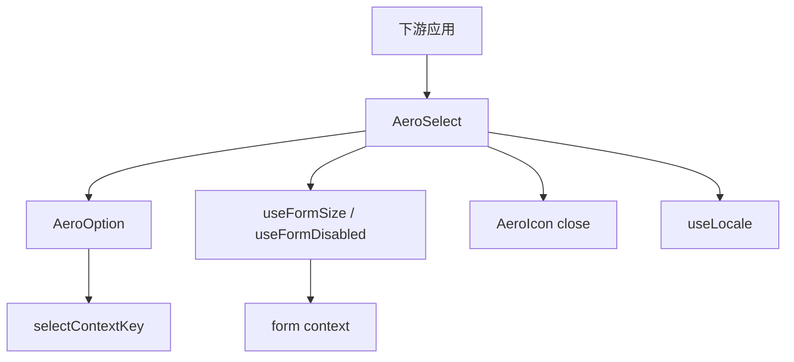
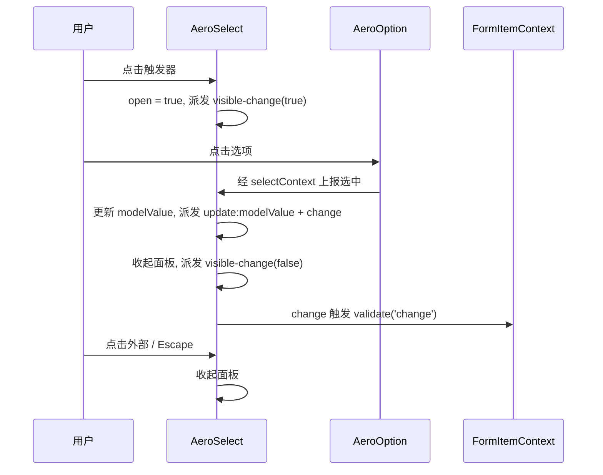

# Design Document

## Overview

本特性为 aero-ui 组件库新增**下拉选择**能力，交付 `AeroSelect`（下拉选择）与 `AeroOption`（选项）两个组件，使下游应用能以声明式方式从一组选项中单选或多选一个/多个值，并支持可清空、可搜索、禁用选项与占位文案。

**Users**：组件库消费者在表单、筛选、配置等场景使用 `aero-select` 组织「从选项中选值」的输入。

**Impact**：作为首个真实表单控件，`AeroSelect` 落地 `form` spec 预留的 `formItemContext` 契约（`size`/`disabled` 继承 + blur/change 触发即时校验），为后续 Checkbox/Radio/Switch 等控件确立参照范式。

### Goals
- 提供 `AeroSelect`/`AeroOption`，API 对齐 element-plus `el-select`/`el-option` 核心面。
- 支持单选、多选、可清空、可搜索（本地过滤）、选项禁用、占位文案。
- 作为表单控件接入 form 上下文，自动继承 `size`/`disabled` 并触发即时校验。
- 样式仅消费语义 `--aero-*` token，BEM 命名，明暗主题自动生效。

### Non-Goals
- 远程搜索（`remote`/`filter-method`）、选项分组（`AeroOptionGroup`）、虚拟滚动、自定义选项模板插槽、`allow-create`。
- 其它表单控件（Checkbox/Radio/Switch）—— 各自后续 spec。
- 交互式 playground。

## Boundary Commitments

### This Spec Owns
- `AeroSelect` 与 `AeroOption` 两个组件的实现、类型、样式与测试。
- 单选/多选/清空/搜索/禁用/占位的用户可见行为，下拉面板展开/收起交互。
- 作为表单控件的上下文消费：`size`/`disabled` 继承 + blur/change 触发字段即时校验。
- `AeroSelect`/`AeroOption` 的公开类型契约（`types.ts`）。
- 组件 barrel 与根 barrel 聚合、`AeroUI` 全局注册、placeholder locale 文案、docs-site 双语文档。

### Out of Boundary
- 远程搜索、选项分组、虚拟滚动、自定义模板、`allow-create` —— 后续 spec。
- 其它表单控件（Checkbox/Radio/Switch）。
- 交互式 playground、SSR/水合高级定制。

### Allowed Dependencies
- `form`：复用 `useFormSize`/`useFormDisabled`（`packages/components/form/src/use-form.ts`）与 `FormSize` 类型，消费 `formItemContextKey`。
- `core-components`：复用 `AeroIcon`（`close` 图标）。
- `i18n`：`useLocale` + 语言包（新增 select placeholder key）。
- `theme`：仅消费 `--aero-*` 语义 token。

### Revalidation Triggers
- `form` 的 `formItemContext`/`useFormSize`/`useFormDisabled` 契约形状变化。
- `FormSize` 枚举值增删。
- `AeroIcon` 的 `close` 图标 key 改名或移除。

## Architecture

### Existing Architecture Analysis

`AeroInput` 已确立「表单控件消费 form 上下文」的完整范式，Select 严格复用同一路径：
- `inject(formItemContextKey)` 获取字段级上下文；
- `useFormSize(props.size)` / `useFormDisabled(props.disabled)` 解析尺寸与禁用（自身 → 表单项 → 表单 → 默认）；
- blur/change 时调用 `formItemContext?.validate('blur' | 'change')` 触发即时校验。

Select 不重造这些能力，直接 import `form` 的 hook，保持依赖方向「控件 → form」与 Input 一致。

### Architecture Pattern & Boundary Map



**Architecture Integration**:
- 选中值受控：`modelValue` 由父组件驱动，Select 内部通过 computed 派生回显，不复制可变状态（单选值 / 多选数组均以 props 为准）。
- 选项收集：Select provide `selectContextKey`（Symbol），Option 挂载时注册、卸载时注销，父子解耦（Option 不依赖 Select 实例）。
- 弹层：teleport 到 body 下的定位容器，相对触发器绝对定位；click-outside + Escape 关闭。
- 依赖方向：`select` → `form` → `theme`/`i18n`/`core-components`，单向无环。

### Technology Stack

| Layer | Choice / Version | Role in Feature | Notes |
|-------|------------------|-----------------|-------|
| Frontend | Vue 3.4 `<script setup lang="ts">` | 组件实现 | 与既有组件一致 |
| Types | TypeScript strict | 类型契约 | no-any |
| Styles | SCSS + `--aero-*` token | 触发器/面板/选项样式 | BEM |
| Runtime | vue-i18n（现有） | placeholder 文案 | 复用 `useLocale` |

无新增第三方依赖。

## File Structure Plan

### Directory Structure

```
packages/components/select/
├── index.ts                    # 导出 AeroSelect/AeroOption（带 install）+ re-export types
├── src/
│   ├── Select.vue              # 触发器 + 弹层容器 + 选中/清空/搜索/表单集成
│   ├── Option.vue              # 选项声明，注册进 selectContext
│   └── constants.ts            # selectContextKey（Symbol）+ SelectContext 类型
├── style/index.scss            # BEM 类 + --aero-* token
├── types.ts                    # SelectProps/SelectEmits/OptionProps/SelectSize
└── __tests__/
    ├── Select.test.ts          # 选中/清空/搜索/禁用/事件/面板交互/表单集成
    └── Option.test.ts          # 选项注册/禁用/选中态
```

### Modified Files

- `packages/components/index.ts` — 追加 `export * from './select'`。
- `packages/index.ts` — 追加 `AeroSelect`/`AeroOption` 到 `AeroUI.install`。
- `packages/locale/lang/zh-cn.ts` / `en.ts` — 新增 `components.select.placeholder` 文案。
- `docs/.vitepress/config.mts` — 双语侧边栏追加 Form 之后新增 Select 入口。
- `docs/.vitepress/theme/index.ts` — 注册 `AeroSelect`/`AeroOption` 并引入 `select/style/index.scss`。
- `docs/zh-CN/components/select.md` / `docs/en-US/components/select.md` — 新增双语文档。

## System Flows



Key Decisions：blur 触发 `validate('blur')`、change 触发 `validate('change')`，作为 fire-and-forget 副作用（不 await，不产生未处理拒绝）；面板收起与选中值更新解耦（点击选项后收起，点击外部仅收起不改值）。

## Requirements Traceability

| Requirement | Summary | Components | Interfaces | Flows |
|-------------|---------|------------|------------|-------|
| 1.1–1.5 | 组件目录/导出/注册契约 | index.ts、barrel | SelectProps/SelectEmits/OptionProps | — |
| 2.1–2.5 | 基础单选 | AeroSelect、AeroOption | modelValue/option 收集 | 选中流 |
| 3.1–3.5 | 多选 | AeroSelect | multiple、标签回显 | 选中流 |
| 4.1–4.4 | 清空与占位 | AeroSelect | clearable/placeholder | 清空流 |
| 5.1–5.4 | 可搜索 | AeroSelect | filterable、本地过滤 | 过滤流 |
| 6.1–6.3 | 选项与整体禁用 | AeroSelect、AeroOption | disabled | — |
| 7.1–7.4 | 面板交互 | AeroSelect | visible-change、click-outside | 展开/收起流 |
| 8.1–8.5 | 表单上下文集成 | AeroSelect | useFormSize/useFormDisabled、validate | 校验流 |
| 9.1–9.4 | 事件 | AeroSelect | update:modelValue/change/clear/visible-change | — |
| 10.1–10.5 | 样式与 token | style/index.scss | BEM + `--aero-*` | — |
| 11.1–11.4 | 类型安全与测试 | types.ts、__tests__ | — | — |

## Components and Interfaces

| Component | Domain/Layer | Intent | Req Coverage | Key Dependencies (P0/P1) | Contracts |
|-----------|--------------|--------|--------------|--------------------------|-----------|
| AeroSelect | UI/触发器+弹层 | 下拉选择容器，管理选中/清空/搜索/弹层与表单集成 | 2,3,4,5,6,7,8,9 | form (P0), icon (P1), i18n (P1) | State, Event |
| AeroOption | UI/选项 | 声明式选项，注册进 selectContext | 2.2, 6.1, 6.2 | select constants (P0) | State |
| selectContextKey | 内部常量 | 选项注册的注入 key | 2.2 | — | State |

### UI / 表单控件层

#### AeroSelect

| Field | Detail |
|-------|--------|
| Intent | 下拉选择容器：触发器回显、选中/清空/搜索状态、弹层展开收起、表单上下文集成 |
| Requirements | 2.1–2.5, 3.1–3.5, 4.1–4.4, 5.1–5.4, 6.3, 7.1–7.4, 8.1–8.5, 9.1–9.4 |

**Responsibilities & Constraints**
- 受控组件：选中值完全由 `props.modelValue` 驱动；单选为 `string | number`，多选为 `(string | number)[]`。
- 回显：单选匹配选项 `label`；多选渲染标签（含删除入口）；找不到匹配 label 时回退展示 `value` 字符串。
- 弹层：teleport 到 body 定位容器，相对触发器定位；click-outside、Escape、滚动/窗口 resize 时收起。
- 表单集成：`disabled` 显式默认 `undefined`（绕过布尔 prop 强转），经 `useFormDisabled` 折叠；blur/change 触发 `formItemContext?.validate(...)`。

**Dependencies**
- Outbound: `useFormSize`/`useFormDisabled`（form）— size/disabled 继承（P0）
- Outbound: `formItemContextKey`（form）— 触发即时校验（P0）
- Outbound: `AeroIcon`（core-components）— close 图标（P1）
- Outbound: `useLocale`（i18n）— placeholder 文案（P1）

**Contracts**: State [x] / Event [x]

##### State Contract
- `open: boolean` — 面板展开状态。
- `filterQuery: string` — 可搜索时输入的关键词（本地过滤用，仅当 `filterable` 为 true）。
- `selectContext` — 由 `provide(selectContextKey)` 下发：`options`（收集的选项数组）、`isSelected`、`select`、`isDisabled` 等，供 Option 消费。

##### Event Contract
- `update:modelValue` — 选中值变化（单选 `string | number`，多选数组）。
- `change` — 选中值变化（同载荷）。
- `clear` — 点击清空入口。
- `visible-change` — 面板展开/收起，载荷 `(visible: boolean)`。

**Implementation Notes**
- Integration: 复用 `form` 的 `useFormSize`/`useFormDisabled`，不重造继承逻辑。
- Validation: 下拉箭头用 CSS 绘制（`currentColor`），清空/删除复用 `AeroIcon` 的 `close`。
- Risks: 弹层定位偏移 → 打开时按 `getBoundingClientRect` 重新定位，收起时销毁面板。

#### AeroOption

| Field | Detail |
|-------|--------|
| Intent | 声明式选项：上报 label/value/disabled，渲染选项行与选中/禁用态 |
| Requirements | 2.2, 6.1, 6.2 |

**Responsibilities & Constraints**
- 挂载时 `inject(selectContextKey)` 并注册自身（label/value/disabled），卸载时注销。
- 渲染选项行：展示 label，`is-selected`/`is-disabled` 修饰符；点击时经 context 上报选中。
- 不直接依赖 Select 实例，只依赖注入的 key（父子解耦）。

**Dependencies**
- Inbound: `selectContextKey`（constants）— 注册与选中上报（P0）

**Contracts**: State [x]

##### State Contract
- 注册数据：`{ label: string | number, value: string | number | boolean, disabled: boolean }`。
- 选中态：由 context 的 `isSelected(value)` 决定，不本地保存。

**Implementation Notes**
- Integration: 复用现有 provide/inject Symbol key 范式（对齐 form 的 `formContextKey`）。
- Risks: 无。

## Data Models

### Domain Model

- **选项（Option）**：值对象 `{ label, value, disabled }`。`value` 支持 `string | number | boolean`；`label` 支持 `string | number`；`disabled` 布尔。
- **选中值（modelValue）**：单选 `string | number`，多选 `(string | number)[]`。多选时选项的 `value` 与数组元素比较（严格相等）。

### 公开类型契约

```typescript
// types.ts（JSDoc @default 齐全，no-any）
export type SelectSize = 'large' | 'main' | 'small';

export interface SelectProps {
  modelValue?: string | number | (string | number)[];
  multiple?: boolean;       // @default false
  clearable?: boolean;      // @default false
  filterable?: boolean;     // @default false
  placeholder?: string;
  disabled?: boolean;       // @default undefined（区分未声明/声明 false）
  size?: SelectSize;        // 复用 FormSize 同值语义
}

export interface SelectEmits {
  (e: 'update:modelValue', value: string | number | (string | number)[]): void;
  (e: 'change', value: string | number | (string | number)[]): void;
  (e: 'clear'): void;
  (e: 'visible-change', visible: boolean): void;
}

export interface OptionProps {
  label?: string | number;
  value?: string | number | boolean;
  disabled?: boolean;       // @default false
}
```

## Error Handling

### Error Strategy
- 本组件无服务端/异常分支；错误态来自表单校验（由 `formItemContext.validate` 更新字段 `validateState`/`validateMessage`，由 `AeroFormItem` 展示），Select 自身不渲染错误消息，只负责触发校验。
- 找不到匹配 label 时回退展示 `value` 字符串（兜底，不抛错）。
- 表单上下文缺失时，`inject` 返回 `undefined`，Select 安全降级为独立控件（不报错）。

### Error Categories and Responses
- **用户输入类**：过滤无匹配 → 展示空态提示（`is-empty`）。
- **降级类**：`formItemContext`/`formContext` 缺失 → 静默跳过校验，`size`/`disabled` 回退默认。

## Testing Strategy

### Unit Tests（Select.test.ts / Option.test.ts）
- 单选：点击选项更新 `modelValue` 并派发 `update:modelValue`/`change`；空值展示 placeholder；命中选项回显 label。
- 多选：toggle 加入/移出；标签渲染与删除入口移除值。
- 清空：`clearable` 有值时展示入口，点击后清空（单选 `undefined`、多选 `[]`）并派发 `clear`。
- 搜索：`filterable` 输入关键词本地过滤（大小写不敏感）；无匹配展示空态。
- 禁用：选项 `disabled` 不可选、渲染 `is-disabled`；整体 `disabled` 不可展开。
- 面板：点击触发器展开、外部点击/Escape 收起、派发 `visible-change`。
- 表单集成：在 `AeroForm`/`AeroFormItem` 内继承 `size`/`disabled`（自身→表单项→表单优先级），blur/change 触发字段校验。
- 类型/导出：`index.ts` 导出带 install 的组件与类型，barrel 聚合可解析。

### Integration Tests
- Select 置于 `AeroForm` + `AeroFormItem`（含 `prop` + `rules`）内，选中值变化触发字段级即时校验，校验失败时 `AeroFormItem` 展示错误。

### E2E / 文档验证
- `pnpm docs:build` 成功，中英双语 select 页面可访问，内嵌示例渲染正常。
