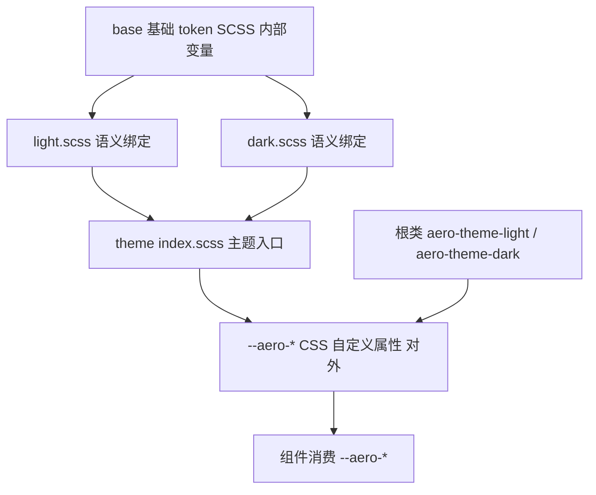

# Design Document

## Overview

**Purpose**: 本特性为 `aero-ui` 建立设计 token 体系：把根目录 `base/` 下暂存的原始 token 迁移到 `packages/theme/base/` 并按类型拆分，其上建立语义 `--aero-*` CSS 变量层，通过 `.aero-theme-light` / `.aero-theme-dark` 提供明暗主题，并暴露统一主题入口。

**Users**: 组件库维护者（编写/维护 token 与主题映射）与下游消费者及组件（通过 `--aero-*` 语义变量消费样式，通过根类切换明暗）。

**Impact**: 将「token 临时存于根目录 `base/` 且内容混杂」的现状，改造为「基础 token（SCSS，内部）+ 语义 token（CSS 自定义属性，对外）+ 明暗主题（根类切换）」的分层主题系统，为 `core-components` 等下游 spec 提供稳定的样式契约。

### Goals
- 完成 `base/` → `packages/theme/base/` 的迁移并按类型拆分（color / number / radius / font / stroke / insets / opacity / typography）。
- 建立语义化 `--aero-*` 变量层，覆盖颜色、中性色与圆角/间距/字体/排版/透明度/描边/内边距。
- 通过 `.aero-theme-light` / `.aero-theme-dark` 提供明暗主题，默认 light。
- 提供主题入口 `packages/theme/index.scss`，并对齐 foundation 的 `./theme/*` exports 契约。

### Non-Goals
- 不实现任何具体组件样式（Button/Input/Icon 等）。
- 不实现国际化字典与 resolver。
- 不搭建 VitePress 文档站与 `AI_CONTEXT.md`。
- 不在运行时以 JS 读取基础 token（基础 token 为 SCSS 内部变量）。

## Boundary Commitments

### This Spec Owns
- `packages/theme/base/` 下全部基础 token 文件（SCSS `$变量`）及其聚合入口 `base/index.scss`。
- 语义 `--aero-*` 变量名契约（含品牌色、中性色、非颜色语义变量的命名与含义）。
- `light.scss` / `dark.scss` 的明暗绑定与默认主题（`:root` 默认 light）。
- 主题入口 `packages/theme/index.scss`。
- 根目录 `base/` 的迁移与最终移除。

### Out of Boundary
- 组件样式实现（`packages/components/**` 的 `.scss`/`.vue` 样式）。
- 国际化（`packages/locale/**`）。
- resolver、文档站、`AI_CONTEXT.md`。
- 构建管线本身的修改（`vite.config.ts`/`package.json` 属于 foundation；本 spec 仅消费其契约）。

### Allowed Dependencies
- `sass`（SCSS 编译，已在 foundation 声明）。
- foundation 提供的 `aero-ui` 路径别名与 `./theme/*` exports 直通子路径。
- 上游迁移源：根目录 `base/color.scss`、`base/number.scss`（只读引用后移除）。
- 约束：不得依赖任何组件、国际化或 resolver 模块；基础 token 仅被 `light.scss`/`dark.scss` 引用，不得被组件直接引用。

### Revalidation Triggers
- 语义变量名集合变化（新增/移除/重命名 `--aero-*`，尤其影响 `core-components`）。
- 语义变量的取值映射（明暗绑定）变化。
- 主题切换类名变化（`.aero-theme-light` / `.aero-theme-dark`）。
- 基础 token 文件拆分方式或命名变化。
- 主题入口 `index.scss` 的聚合内容变化。
- `./theme/*` exports 子路径的解析目标变化（foundation 侧）。

## Architecture

### Existing Architecture Analysis
当前 `base/` 是唯一与主题相关的现存资产，位于根目录、内容混杂（`color.scss` 纯色板；`number.scss` 混杂间距/字体/排版/透明度）。foundation 已建立 `aero-ui` 别名与 `./theme/*` exports 直通，但尚未创建 `packages/theme/` 目录。本 spec 在 foundation 契约之上新建 `packages/theme/`，将 `base/` 迁入并重构，同时修复 `number.scss` 中字重 token 的重复定义与命名不一致（不改变取值语义）。

### Architecture Pattern & Boundary Map



**Architecture Integration**:
- 选定模式：分层 token 体系 —— 基础 token（SCSS 内部）→ 语义 token（CSS 自定义属性）→ 主题入口 → 组件消费。与 steering `structure.md` / `tech.md` 一致。
- 依赖方向（单向，从右到左消费）：`组件 → --aero-*（语义）→ index.scss → light.scss/dark.scss → base/*.scss（基础）`。基础 token 只能被语义层引用，组件不得越过语义层引用基础 token；明暗映射只在 `light.scss`/`dark.scss` 中，绝不泄漏进组件。
- 既有模式保留：`--aero-{语义}-{阶}` 命名、`.aero-theme-light`/`.aero-theme-dark` 切换、SCSS 作为样式载体。
- 新组件必要性：无运行时组件，仅新增 SCSS 模块（base/light/dark/index）。
- Steering 合规：严格遵守 `structure.md`（`base/` 基础 + `light.scss`/`dark.scss` + `index.scss`）与 `tech.md`（组件只用 `--aero-*`，禁用 `.dark`）。

### Technology Stack

| Layer | Choice / Version | Role in Feature | Notes |
|-------|------------------|-----------------|-------|
| 样式 | SCSS（`sass`，foundation 已声明） | 基础 token 与语义绑定 | 使用 `@use` / `@forward` 模块化 |
| 对外契约 | CSS 自定义属性（`--aero-*`） | 语义变量运行时载体 | 由 `light.scss`/`dark.scss` 输出 |
| 主题切换 | 根类 `.aero-theme-light` / `.aero-theme-dark` | 明暗模式切换 | `:root` 默认 light |
| 目录 | `packages/theme/` | token 与主题源码 | 与 foundation `./theme/*` exports 对齐 |

## File Structure Plan

### Directory Structure

```
packages/theme/
├── base/
│   ├── color.scss       # 色板：灰阶/黑白/opac/彩色系 + *-opac（由 base/color.scss 迁入）
│   ├── number.scss      # 间距/尺寸数字尺度（$number-n0…$number-nFull）
│   ├── radius.scss      # 圆角档位（$radius-0/2/4/8/16/full）
│   ├── font.scss        # 字体族（数字/中文/英文字体栈）
│   ├── stroke.scss      # 描边/边框宽度档位（$stroke-0/1/2/3/4）
│   ├── insets.scss      # 内边距档位（$insets-0/2/4/8/12/16/20/24）
│   ├── opacity.scss     # 透明度档位（$opacity-*）
│   ├── typography.scss  # 字号/行高/字重尺度（$typography-*，规范化去重）
│   └── index.scss       # base 聚合：@forward 全部基础 token
├── light.scss           # 语义层 light 绑定（:root 默认 + .aero-theme-light）
├── dark.scss            # 语义层 dark 绑定（.aero-theme-dark）
└── index.scss           # 主题入口：@use base + light + dark
```

### Modified Files
- 根目录 `base/color.scss`、`base/number.scss` —— 迁入 `packages/theme/base/` 后删除（需求 1.5）。
- 其余文件均为新建。`vite.config.ts` / `package.json` 不修改（属于 foundation）。

### 文件职责说明
- `base/*.scss` —— 单一类型的基础 token（SCSS `$变量`），编译期被语义层引用，不对外输出。
- `base/index.scss` —— 用 `@forward` 聚合转发全部基础 token，供 `light.scss`/`dark.scss` 一次 `@use` 引入。
- `light.scss` / `dark.scss` —— 各输出一套完整的 `--aero-*` 语义变量（同名、不同值），分别挂载到 `:root` + `.aero-theme-light` 与 `.aero-theme-dark`。
- `index.scss` —— 主题入口，聚合 base + light + dark，一次引入即可获得全部 token 与主题。

## System Flows

主题解析为纯声明式 CSS 级联，无多步骤流程，故省略本节。关键行为已由「明暗映射表 + 根类选择器」表达：未指定主题类时命中 `:root`（light 默认），指定 `.aero-theme-dark` 时同名语义变量被 dark 值覆盖。

## Requirements Traceability

| Requirement | Summary | Components / 文件 | 契约 |
|-------------|---------|-------------------|------|
| 1.1 | 迁移色板 | `base/color.scss` | 基础 token |
| 1.2 | 拆分 number.scss | `base/number.scss`、`font.scss`、`typography.scss`、`opacity.scss` | 基础 token |
| 1.3 | 八类基础文件 | `base/{color,number,radius,font,stroke,insets,opacity,typography}.scss` | 基础 token |
| 1.4 | 基础聚合 | `base/index.scss` | 聚合契约 |
| 1.5 | 移除根目录 base/ | 根目录 `base/`（删除） | 迁移契约 |
| 2.1 | 语义品牌色 | `light.scss`、`dark.scss`（`--aero-primary/success/warning/danger/link-1..10`） | 语义变量契约 |
| 2.2 | 语义中性色 | `light.scss`、`dark.scss`（`--aero-text/bg/border/fill-*`） | 语义变量契约 |
| 2.3 | 语义非颜色 | `light.scss`、`dark.scss`（`--aero-radius/space/font/typography/opacity/stroke/insets-*`） | 语义变量契约 |
| 2.4 | CSS 自定义属性 | `light.scss`、`dark.scss`（输出 `--aero-*`） | 对外契约 |
| 3.1 | light 主题 | `light.scss`（`:root` + `.aero-theme-light`） | 主题契约 |
| 3.2 | dark 主题 | `dark.scss`（`.aero-theme-dark`） | 主题契约 |
| 3.3 | 默认主题 | `light.scss`（`:root`） | 主题契约 |
| 3.4 | 禁用 `.dark` | `light.scss`、`dark.scss`（只产出 `.aero-theme-*`） | 主题契约 |
| 4.1–4.3 | 组件消费约束 | 全部文件（仅语义层对外） | 边界契约 |
| 5.1 | 主题入口 | `index.scss` | 入口契约 |
| 5.2 | exports 对齐 | `packages/theme/` 目录（对齐 `./theme/*`） | 解析契约 |
| 5.3 | 不实现组件/国际化 | 全部文件（范围界定） | 边界契约 |

## Components and Interfaces

本 spec 无运行时组件，本节「组件」指构成主题系统的 SCSS 模块与语义变量契约。

| Component | Domain/Layer | Intent | Req Coverage | Key Dependencies | Contracts |
|-----------|--------------|--------|--------------|------------------|-----------|
| 基础 token | 基础层 | 单一职责的 SCSS `$变量` 集 | 1.1, 1.2, 1.3 | 无（迁移源 `base/`） | Service |
| base 聚合 | 基础层 | `@forward` 全部基础 token | 1.4 | 各 base 文件 | Service |
| light 绑定 | 语义层 | 输出 light 语义变量（默认） | 2.1–2.4, 3.1, 3.3, 3.4 | base 聚合 | API |
| dark 绑定 | 语义层 | 输出 dark 语义变量 | 2.1–2.4, 3.2, 3.4 | base 聚合 | API |
| 主题入口 | 入口层 | 聚合 base + light + dark | 5.1, 5.2 | light/dark/base | Service |

### 基础层

#### base 基础 token 文件

| Field | Detail |
|-------|--------|
| Intent | 提供按类型拆分的单一职责基础 token（SCSS `$变量`，内部） |
| Requirements | 1.1, 1.2, 1.3 |

**Responsibilities & Constraints**
- `color.scss` 平移 `base/color.scss` 全部色值，不改值。
- `number.scss` 仅保留间距数字尺度；`font.scss` 归集字体族；`typography.scss` 归集字号/行高/字重（去重、统一 `Italic` 命名）；`opacity.scss` 归集透明度。
- `radius.scss` / `stroke.scss` / `insets.scss` 为新增基础档位，取值对齐既有间距尺度。
- 基础变量不得被组件直接引用，仅供语义层 `@use`。

**Contracts**: Service [x]

##### Service Interface
```scss
// base/index.scss —— 聚合契约
@forward './color';
@forward './number';
@forward './radius';
@forward './font';
@forward './stroke';
@forward './insets';
@forward './opacity';
@forward './typography';
```
- Preconditions: 八个 base 文件均存在且可被 `sass` 解析。
- Postconditions: `@use './base'` 可访问全部基础 `$变量`。
- Invariants: 基础 token 始终为 SCSS `$变量`，编译后不输出为 CSS 自定义属性。

### 语义层

#### light.scss / dark.scss 语义绑定

| Field | Detail |
|-------|--------|
| Intent | 输出完整的 `--aero-*` 语义变量，分别绑定 light / dark 取值 |
| Requirements | 2.1, 2.2, 2.3, 2.4, 3.1, 3.2, 3.3, 3.4 |

**Responsibilities & Constraints**
- `light.scss` 输出 `:root, .aero-theme-light { ... }`；`dark.scss` 输出 `.aero-theme-dark { ... }`。
- 两文件输出的 `--aero-*` 变量名集合完全一致（契约），仅取值不同。
- 品牌色（primary/success/warning/danger/link）映射到各自色系，跨模式不变；中性色（text/bg/border/fill）在明暗间反转。
- 只产出 `.aero-theme-light` / `.aero-theme-dark`，绝不产出 `.dark`。

##### 语义变量契约（API）

品牌色（各 1–10 阶，映射到基础色系）：
| 语义 | light 映射 | dark 映射 |
|------|-----------|-----------|
| `--aero-primary-{1..10}` | `$blue-{1..10}` | `$blue-{1..10}` |
| `--aero-success-{1..10}` | `$green-{1..10}` | `$green-{1..10}` |
| `--aero-warning-{1..10}` | `$orange-{1..10}` | `$orange-{1..10}` |
| `--aero-danger-{1..10}` | `$red-{1..10}` | `$red-{1..10}` |
| `--aero-link-{1..10}` | `$blue-{1..10}` | `$blue-{1..10}` |

中性色（文本/背景/边框/填充，明暗反转）：
| 语义 | light 映射 | dark 映射 |
|------|-----------|-----------|
| `--aero-text-main` / `-secondary` / `-tertiary` / `-disabled` | `$neutralgrey-9/7/6/5` | `$neutralgrey-1/4/5/7` |
| `--aero-bg-main` / `-subtle` | `$base-white` / `$neutralgrey-1` | `$neutralgrey-10` / `$neutralgrey-9` |
| `--aero-border-main` / `-light` | `$neutralgrey-3` / `$neutralgrey-4` | `$neutralgrey-8` / `$neutralgrey-7` |
| `--aero-fill-main` / `-light` | `$neutralgrey-2` / `$neutralgrey-1` | `$neutralgrey-9` / `$neutralgrey-8` |

非颜色语义（跨模式一致，映射到基础尺度）：
| 语义 | 映射 |
|------|------|
| `--aero-radius-{small, main, large, full}` | `$radius-2/4/8/full` |
| `--aero-space-{0..60, full}` | `$number-n{...}` |
| `--aero-font-family-{number, chinese, english}` | `$font-*` |
| `--aero-typography-{size, line-height, weight}-*` | `$typography-*` |
| `--aero-opacity-{zero, disabled, dimmer, overlay, main, backdrop}` | `$opacity-*` |
| `--aero-stroke-{0..4}` | `$stroke-{...}` |
| `--aero-insets-{0..24}` | `$insets-{...}` |

> 上表给出语义变量类别与映射关系；每一阶的精确枚举按所引用的基础尺度展开（如 `--aero-space-*` 覆盖 `$number-n0…n60/full` 的对应档位）。brand 色 1–10 阶与基础色系 1–10 阶一一对应。

**Implementation Notes**
- Integration: `light.scss`/`dark.scss` 以 `@use './base' as *` 引入基础变量后输出自定义属性。
- Validation: 语义变量名集合一致性、无基础色板泄漏、无 `.dark`。
- Risks: light/dark 变量名漂移 —— 以契约为准，验证任务比对。

### 入口层

#### 主题入口 index.scss

| Field | Detail |
|-------|--------|
| Intent | 聚合 base + light + dark，一次引入即可获得全部 token 与主题 |
| Requirements | 5.1, 5.2 |

**Responsibilities & Constraints**
- `@use './base'`、`@use './light'`、`@use './dark'`。
- 使 `aero-ui/theme/index.scss` 可被消费者解析（对齐 foundation `./theme/*` exports 直通）。
- 不实现任何组件样式。

**Contracts**: Service [x]

## Error Handling

### Error Strategy
主题为声明式样式，无运行时业务逻辑。错误集中在**编译与契约校验的可诊断失败**：`sass` 编译失败（语法/`@use` 目标缺失/变量未定义）、语义变量名不一致、基础色板泄漏、出现禁用类名 `.dark`。上述任一情况即判定门禁失败，输出定位到具体文件与变量名。

### Error Categories and Responses
- **编译错误**：`sass` 报告缺失的 `@use` 目标、未定义变量或语法错误，指向文件与行号。
- **契约漂移**：light/dark 输出的 `--aero-*` 变量名集合不一致，比对工具报出差集。
- **越界泄漏**：产物中出现 `--aero-blue-6` 等基础色板变量，或出现 `.dark` 选择器，判定违反约束。

### Monitoring
无运行时监控；以「编译退出码 + 产物比对」作为门禁信号。

## Testing Strategy

主题为纯 SCSS/CSS，测试以「编译冒烟 + 产物契约比对」为主，逐条对应验收标准。

### 编译冒烟（对应 1.1–1.5, 5.1）
- 执行 `sass` 编译 `packages/theme/index.scss`，退出码 0，产物非空。
- 断言产物包含 `.aero-theme-light`、`.aero-theme-dark` 选择器与 `:root` 默认主题。

### 语义变量存在性（对应 2.1–2.4）
- 断言产物包含 `--aero-primary-6`、`--aero-text-main`、`--aero-radius-main` 等代表变量，且全部为 `--aero-*` 形式。
- 断言 light 与 dark 的 `--aero-*` 变量名集合一致（无漂移）。

### 明暗切换（对应 3.1–3.4）
- 断言 `.aero-theme-light` 与 `.aero-theme-dark` 对同一语义变量（如 `--aero-text-main`）给出不同取值。
- 断言产物中不出现 `.dark` 选择器。

### 消费约束（对应 4.1–4.3）
- 断言产物中不出现 `--aero-blue-6` 等基础色板自定义属性（基础 token 不输出）。
- 通过扫描本 spec 产出的样式文件，确认无硬编码视觉值（颜色/间距/圆角字面量仅出现在基础 token 定义内，语义层只做变量映射）。

## Supporting References
- 语义变量完整映射表与基础尺度精确枚举，见 `research.md`「基础 token 存量盘点」与「Design Decisions」。
- `./theme/*` exports 直通子路径定义，见 `.kiro/specs/foundation/design.md`「导出映射」。
- 迁移源 token 原始取值，见根目录 `base/color.scss`、`base/number.scss`（迁移后删除）。
